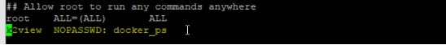

## FABRIC v6.5.3_100 DOCKER INSTALLATION 

### PREREQUISITES 

These pre-requisites are for a development, training, demo, or a small Proof-of-Concept installation. You can use one of the following environments:  

- **Docker CE/EE** over **CentOs/RedHat 7.7** or higher 
   or 
- **Docker-Desktop** for Windows or Mac 

More detailed requiremenets for each are described below: 

#### Docker over CentOs/RedHat

1. CentOS/RedHat 7.7 (or higher) Operating System with latest patches, for each: 

   - Modern Xeon Processor. 
   - 8 Physical Cores. 
   - 16 GB RAM. 
   - HDD, 200GB must be available 

    **Note**: Minimum 10G RAM is required for running 1x Fabric, 1x Cassandra. We recommend that the Docker host be a physical server and not a virtual machine.  

2.	Install the latest Docker CE/EE version (https://docs.docker.com/engine/install/centos/ ) 

    **Note**: The /var/lib/docker should have at list 200GB of free memory
   
3.	Docker-compose must also be installed (see Docker documentation online https://docs.docker.com/compose/install/ ).  

4.	Enable NTP/chronyc (see https://access.redhat.com/documentation/enus/red_hat_enterprise_linux/7/html/system_administrators_guide/sect-using_chrony ) 

5.	Assign appropriate privileges to the k2view user, and allot to this user at least 50GB of space as follows: 

      ~~~bash
      ## update the k2view user home directory and password!! 
      useradd -m -d /<update the path>/k2view/ k2view passwd k2view 
      ~~~
6. Give the k2view user privileges to run docker & docker-compose via **SUDO** 

   


####  For Docker-Desktop 

1. Windows or Mac machine with an 8 core CPU 
2. Windows or Mac machine with a minimum of 16G RAM 
3. Windows or Mac machine with minimum 120G of hard disk space  


### USING THE CONTAINER

#### Load the Container Image 

1. Retrieve the latest versions of Fabric and Cassandra. 
2. Retrieve the latest version of Kafka. The Kafka and configuration files can be retrieved from the following locations:  

   <table style="border-collapse: collapse; width: 100%;">
   <tbody>
   <tr>
   <td style="width: 50%; height: 18px;"><strong>cassandra </strong></td>
   <td style="width: 50%; height: 18px;">https://owncloud-bkp2.s3.amazonaws.com/adminoc/fabricint/cassandra/3.11.6/openjdk/D_k2v_cassandra_3.11.6_2.tar.gz 
   </td>
   </tr>
   <tr>
   <td style="width: 50%; height: 18px;"><strong>kafka </strong></td>
   <td style="width: 50%; height: 18px;">https://owncloud-bkp2.s3.amazonaws.com/adminoc/fabricint/kafka/5.5.1/D_k2view_kafka_5.5.1_2.tar.gz</td>
   </tr>
   <tr>
   <td style="width: 50%; height: 18px;"><strong>fabric </strong></td>
   <td style="width: 50%; height: 18px;">https://owncloud-bkp2.s3.us-east-1.amazonaws.com/adminoc/fabricint/fabric_6.5/6.5.2/Server/fabric-6.5.2_73/D_k2view_fabric_6.5.2_73.tar.gz</td>
   </tr>
   <tr>
   <td style="width: 50%; height: 18px;"><strong>docker-compose </strong></td>
   <td style="width: 50%; height: 18px;">https://owncloud-bkp2.s3.us-east-1.amazonaws.com/adminoc/fabricint/fabric_6.5/6.5.2/Server/fabric-6.5.2_73/compose_fabric_6.5.2_73.zip</td>
   </tr>
   </tbody>
   </table>
   
3. Copy all files to the k2view directory as follows: 

   ~~~bash
   cd ~/ 
   wget https://owncloud-bkp2.s3.amazonaws.com/adminoc/fabricint/cassandra/3.11.6/openjdk/D_k2v_cassandra_3.11.6_2.tar.gz  
   wget https://owncloud-bkp2.s3.amazonaws.com/adminoc/fabricint/kafka/5.5.1/D_k2view_kafka_5.5.1_2.tar.gz  
   wget https://owncloud-bkp2.s3.us-east-1.amazonaws.com/adminoc/fabricint/fabric_6.5/6.5.2/Server/fabric-6.5.2_73/D_k2view_fabric_6.5.2_73.tar.gz
   wget https://owncloud-bkp2.s3.us-east-1.amazonaws.com/adminoc/fabricint/fabric_6.5/6.5.2/Server/fabric-6.5.2_73/compose_fabric_6.5.2_73.zip
   ~~~

   

4. Load the Docker images as follows:
   ~~~bash
    docker load -i D_k2v_cassandra_3.11.6_2.tar.gz 
    docker load -i D_k2view_kafka_5.5.1_2.tar.gz 
    docker load -i D_k2view_fabric_6.5.2_73.tar.gz 
   ~~~
   
   You can see the images names by using the command `docker image`  
   
5. UNZIP the Config archives as follows: 

   ```bash
   unzip compose_fabric_6.5.2_73.zip 
   ```
   Note: open the “.env” file and update the names of the images as needed 


### RUN SINGLE FABRIC, CASSANDRA INSTANCES:

1. Run docker-compose as follows:

   ~~~bash
   cd compose_fabric_6.5.2_73
   # run:  
   docker-compose up -d 
   
   # or  
   sudo /usr/local/bin/docker-compose up -d  
   ~~~

2.	Start Cassandra as follows: 

      ~~~bash
      docker exec -u=cassandra -it cassandra1 bash -l
      # run:
      cassandra
      ~~~

3.	Start Kafka as follows:  
      ~~~bash
      docker exec -it -u=kafka kafka1 bash -l -c '$K2_HOME/kafka/bin/zookeeper-server-start -daemon $K2_HOME/kafka/zookeeper.properties' 
      sleep 3 
      docker exec -it -u=kafka kafka1 bash -l -c '$K2_HOME/kafka/bin/kafka-server-start -daemon $K2_HOME/kafka/server.properties' 
      sleep 3 
      docker exec -it -u=kafka kafka1 bash -l -c '~/kafka/bin/zookeeper-shell localhost:2181 <<< "ls /brokers/ids"'
      ~~~

4.	Start Fabric as follows:  
      ~~~bash
      #run: docker exec -it fabric1 bash -l 
      cp -r fabric/config.template config && \ 
      sed -i 's@#HOSTS=.*@HOSTS=172.29.0.116@'  $K2_HOME/config/config.ini &&    \ 
      sed -i 's@#USER=cassandra@USER=cassandra@'  $K2_HOME/config/config.ini   && \ 
      sed -i 's@#BOOTSTRAP_SERVERS=localhost:9093@BOOTSTRAP_SERVERS=172.29.0. 115:9093@'  $K2_HOME/config/config.ini && \ 
      sed -i  's@#BOOTSTRAP_SERVERS=localhost:9093@BOOTSTRAP_SERVERS=172.29.0.   115:9093@'  $K2_HOME/config/iifConfig.ini && \ 
      k2fabric start && k2fabric cluster-status && exit
      ~~~


## Stopping Services

1.	To stop the Docker-Compose, do the following:  

      ~~~bash
      cd compose_fabric_6.5.2_73 
      #run: 
      docker-compose stop
      ~~~
 
2.	To stop the Cassandra service, do the following:  
 
      ~~~bah
      docker exec -u=root -it cassandra bash su - cassandra 

      ## stop cassandra  
      nodetool -u k2view -pw Q1w2e3r4t5 flush && kill -9 $(ps aux | grep -i $INSLATT_DIR | grep -v "pts/7" |awk {'print $2'})  
      
      ## restart cassandra  
      nodetool -u k2view -pw Q1w2e3r4t5 flush && kill -9 $(ps aux | grep -i $INSLATT_DIR | grep -v "pts/7" |awk {'print $2'}) && $INSLATT_DIR/cassandra/bin/cassandra 

      ~~~
 
 
3.	To stop or restart Fabric, do the following:  
 
      ~~~bash
      docker exec -it fabric1 bash -l  
      k2fabric stop / restart  
      ~~~
 
 
