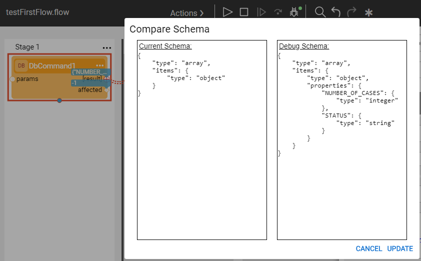
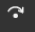
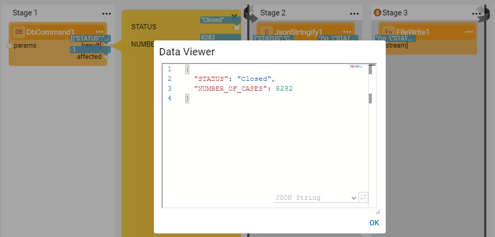

# Example of Creating a Broadway Flow 
### Example - Building a Simple Broadway Flow

Let's create a new Broadway flow that selects data from a DB table and creates a CSV file based on the selected DB records.

#### Step 1 - Create a New Broadway Flow

1. Go to the **Project tree** > **Shared Objects**, right click **Broadway** > **New Flow** to open the Flow Name window.
2. Populate the **Flow Name** and click **OK** to open an empty flow.

#### Step 2 - Populate Stage 1 of the Flow

1. Let's prepare a query that selects the number of cases of each case status from the **CASES** table in the **CRM_DB** interface using the following SQL query:

~~~sql
Select CASES.STATUS, Count(*) AS NUMBER_OF_CASES
From CASES
Group By CASES.STATUS
~~~

2. Add a **DbCommand** Actor to run the above **SELECT statement** in Stage 1: 

   - Read How [Do I Add an Actor to a Stage](/articles/19_Broadway/03_broadway_actor.md#how-do-i-add-actor-to-stage) to learn how to add an Actor to the Broadway flow.
   - Read more about the built-in [DbCommand](/articles/19_Broadway/04_built_in_actor_types.md#db) Actor. 

3. Edit the **DbCommand** Actor in Stage 1. Add the DB interface and the above SQL to the Actor:

   - Select **CRM_DB** as the **Interface**.
- Click **QB** in the **SQL** parameter value to open the [Query Builder window](/articles/11_query_builder/02_query_builder_window.md), populate the **SQL** in the **Query Builder** window and click **OK** to populate the **SQL** parameter: 
  

#### Step 3 - Read the Customer's List and Create a File
1. The SQL query executed by the **DbCommand** returns several records. The next Stages run a loop on the selected records list. For each selected record, do the following:

   - Build a CSV string from map.
   - Write it to an output file.

 **Building a CSV String for Each Selected Record**

2. Click  in the right of the Flow window to create Stage 2 that builds a CSV string for each selected customer record.

3. Add a **CsvBuilder** Actor to Stage 2.

4. Link the **result** output parameter of the **DbCommand** Actor to the **maps** input parameter of the **CsvBuilder** Actor. Click the link and set the **Link Type** to **Iterate** to get the selected records returned by the **DbCommand** by a loop.

   Read [Linking Actors in a Broadway Flow](/articles/19_Broadway/20_broadway_flow_linking_actors.md) to learn how to link Actors in a Broadway flow.

**Writing the String to an Output File of Each Selected Record**

5. Add Stage 3 to the flow. Both Stages 2 and 3 have a grey background since they are included in the loop that has been opened by linking Stages 1 and 2 using the **Iterate** link type. 

   Read [Broadway Iterations](/articles/19_Broadway/21_iterations.md) to learn more about handling loops on Broadway flows. 

6. Open the **LocalFileSystem** interface in the Fabric Project and set the **Working Directory** property of this interface to **C:\k2view\Broadway_Training**. Then create the **C:\k2view\Broadway_Training** directory in your local Windows server.

7. Add a **FileWrite** Actor to **Stage 3** and edit it as follows:

   - Set the **Interface** to **LocalFileSystem**.
   - Set the **path's Population Type** to **Const** and set its value to **customer_list.csv**. This parameter is populated by the file name created by the **FileWrite** Actor.
   - Set the **append** Boolean parameter to **false** to rewrite each flow execution into the file.

     

   Read [Broadway Actor's Window](/articles/19_Broadway/03_broadway_actor_window.md) to learn about the Actor window and setting the Actor's parameters. 

8. The **FileWrite** Actor executes the following activities:

   - Creates a new file named **customer_list.csv** under the working directory defined in the **LocalFileSystem** interface object.
   - Writes each CSV string sent for each selected customer to the file. Note that since the **append** input argument is set to **false**, the data is not appended to the file but overrides the file on each flow run.

9. Link the **CsvBuilder** Actor's **csv** output parameter to the **stream** input parameter of the **FileWrite** Actor.

10. Close the loop after executing Stage 3 by clicking  in the right corner of the **Stage** to open the **Stage context menu**. Select **Iterate Close** to close the loop after the execution of the Stage. 

    Read [Stage Context Menu](/articles/19_Broadway/18_broadway_flow_window.md#stage-context-menu) to learn more about editing this Stage's settings.

You are ready to run your flow! Note that you must deploy the interfaces before running the flow. This can be done by deploying one of the Logical Units in your project.

#### Step 4 - Flow Execution, Debug and Update the Output Schema

The **DbCommand** Actor returns  a complex schema.  The Broadway Debug process *learns* the Schema of the complex output parameters and can suggest how to update it based on a parameter's value. To update the output parameter of the **DbCommand**, do the following:

   - Run the flow in Debug mode when Debug is set to  ON.
   - Click the red port next to the **[result]** output of the **DbCommand**.  The **Compare Schema** window is opened. Click **UPDATE** to update the schema.

        

   - Click  adjacent to the Actor's output argument to open the Data Inspection and to display the Schema on the left and the data values on the right.

   - Add a  **Breakpoint** to **Stage 3** and run the debug again. Click  to execute the steps after the breakpoint step. The input and output values are displayed for each iteration in the flow.

   - Click each of the debug values (marked blue) to open the **Data Viewer** window of the selected parameter as shown in the example below:

     

     

For more information, read [Run and Debug Broadway Flow](/articles/19_Broadway/25_broadway_flow_window_run_and_debug_flow.md) and the [Broadway Data Inspector](/articles/19_Broadway/27_broadway_data_inspection.md).
   #### Step 5 - Check the Flow's Execution Results

Check the local directory (C:\k2view\Broadway_Training) and open the new CSV file that contains the list of cases selected from the CASE table.

  

Congratulations! You've just created your first Broadway flow. 

Let's continue to the next item to learn more about adding loops and conditions to a Broadway flow.

