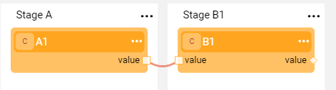
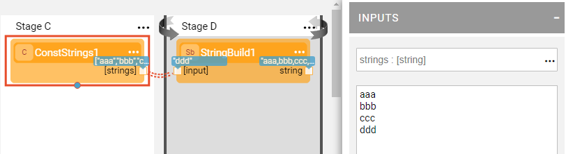
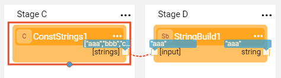
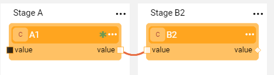

# Example of Using Actors in Flows

### Setting and Updating Links Between Actors, Remarks and Population Types

1. Create a new Broadway flow as explained in the [Building a Simple Broadway Flow](05a_create_broadway_flow_example.md#example---building-a-simple-broadway-flow) example. 

2. Add two **Const** Actors named **A1** and **B1** to two different Stages of the flow. Set the input of **A1** to a value and change the input of **B1** to the **Link**  population type. Then draw a link between the Actors as explained in [Linking Actors](/articles/19_Broadway/07_broadway_flow_linking_actors.md). Verify that the connection's **Link Type** = **Value** (default). 

3. Click the connection line to set the **Varargs** to **ON**, add **Const** Actor **A2**, connect it to the input of **B1** and run the flow to check the impact.

4. Create another flow by adding the **ConstStrings** Actor and **StringBuild** Actor  to two different Stages. Populate the input of the  **ConstStrings** Actor using the array of strings. Set the Link Type between the Actors to **Iterate** and run the flow.

   

5. Then change the Link Type to **First** and run the flow again to check the impact. 

   

   For more information about handling loops in Broadway, refer to [Broadway Iterations](/articles/19_Broadway/21_iterations.md). 

6. Delete the link's connection line.  

7. To add a connection, click  in the source Actor's context menu > **Link**. For more information, refer to the [Actor Context Menu](/articles/19_Broadway/18_broadway_flow_window.md#actor-context-menu).

8. Click the **A1** Actor and then click  in the Actor's context menu > **Show only connected** to display only the Actors linked to **A1**. For more information, refer to [Show Only Connected](/articles/19_Broadway/08_show_only_connected_actors.md). Click **Show only connected** again to return the links.

9. Click  in the Actor's context menu > **Remark** and add a remark.

10. Click  in the Actor's right corner to open the Remark pop-up, remove the text and close it to delete the remark.

11. Change the population type of the **A1** and **A2** Actors input arguments from **Const** to **External** and then update the argument's external name to **a1_value** and **a2_value**. For more information about Actor's population types, refer to [Actor Inputs and Outputs](/articles/19_Broadway/03_broadway_actor_window.md#actors-inputs-and-outputs).

12. Run the flow in Debug mode when Debug is set to  ON. The Debug / Run Arguments window pops up to insert the flow input arguments.

    

13. Populate the values and click OK to run the flow. 

14. To run the flow with different input arguments, click Actions > Debug / Run Arguments in the main menu toolbar and insert other argument for  **a1_value** and **a2_value**. Then run the flow.

Let's continue to the next item and learn about frequently used built-in Actors.

