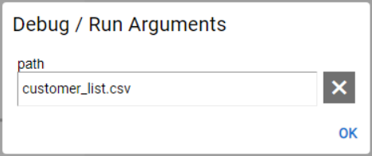
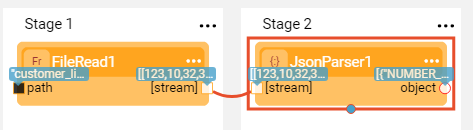
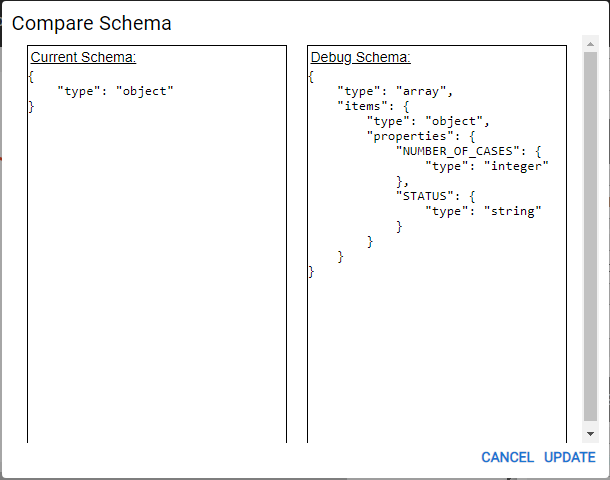
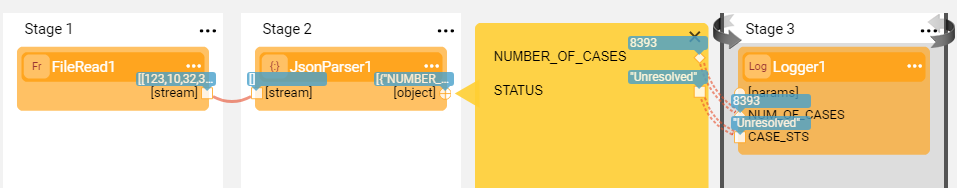
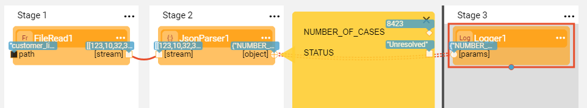

# Example of Frequently Used Actors

### Reading and Parsing a File

Let's create a new Broadway flow that reads data from a JSON file, parses it and prints it into a log. Use the JSON file you created in the [Building a Simple Broadway Flow](05a_create_broadway_flow_example.md#example---building-a-simple-broadway-flow) example as an input file.

1. Create a new Broadway flow as explained in the [Building a Simple Broadway Flow](05a_create_broadway_flow_example.md#example---building-a-simple-broadway-flow) example.

2. Add a **FileRead** Actor to Stage 1 of the flow and populate its input arguments as follows:

   * Set **Interface** to **LocalFileSystem**. If this Interface has not been defined in Fabric, follow the instructions in the [Building a Simple Broadway Flow](05a_create_broadway_flow_example.md#example---building-a-simple-broadway-flow) example.

   * Change the **path** population type to **External**. 

   * To populate the **path** value, click **Actions** > **Debug / Run Arguments** in the [Main menu toolbar](/articles/19_Broadway/18_broadway_flow_window.md#main-menu). 

     

     To learn more, refer to [Setting Run and Debug Arguments](/articles/19_Broadway/25_broadway_flow_window_run_and_debug_flow.md#setting-run-and-debug-arguments).

3. Add a **JsonParser** Actor to Stage 2 of the flow and connect its input argument to the previous Actor's output. 

   * Set the **single** input argument to **false**.
   * The **single** input argument must correspond with the input JSON file. If the input file includes a valid JSON file, keep the value as **true**. However, if the input file includes an array of JSON objects, set the value to **false**.

4. Make sure the input file exists in the designated working directory and run the flow in Debug mode when Debug is set to  ON.

   * **JsonParser** Actor's output datatype is object. However after running the flow in the Debug mode, Broadway learns the output structure and enables updating the schema. 

   

   * Note the red circle mark of the **JsonParser** Actor's output. Click the red circle to open Compare Schema window.

     

   * Then click **Update**.

5. Click  that appears now adjacent to the **JsonParser** Actor's output argument to open the yellow Data Inspection segment and display the Schema on the left and the data values on the right. 

6. Add a **Logger** Actor to Stage 3 and populate its input arguments as follows:

   * Change the **message** population type to **Const**. 
   * Set the **message** value to: *There are ${NUM_OF_CASES} cases with Status = ${CASE_STS}*.
   * Check that the new input arguments are added to the Actor: NUM_OF_CASES and CASE_STS.

7. Connect the fields in the yellow segment to the **Logger** Actor's new input arguments and set their **Link Type** to **Iterate**. 

   * Note that since Stage 3 is the last Stage in the flow, it's not mandatory to close the loop. If however there are additional Stages in the flow, you need to close the loop explicitly by clicking   in the Stage context menu > **Iterate Close**.

8. The flow is ready! Run the flow in Debug mode when Debug is set to  ON.

   

    To learn more about Debug options, refer to [Run and Debug Broadway Flow](/articles/19_Broadway/25_broadway_flow_window_run_and_debug_flow.md).

9. Check the output log area to see the printed results.

10. Change the following:

   * Set the **message** value of  the **Logger** Actor to: *There are ${0} cases with Status = ${1}*.
   * Connect the **[object]** output argument of the **JsonParser** Actor directly to the **[params]** input argument of the **Logger** Actor. 
   * Set the **Link Type** to **Iterate**.

11. Run the flow again and verify that the result is identical.

    

