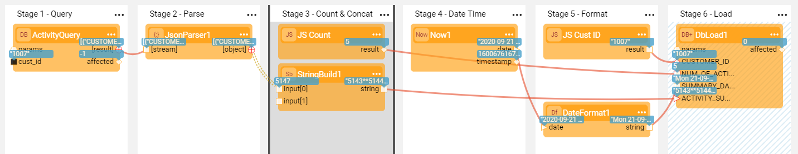

# Using Actors in a Flow

###  Exercise - Create a Flow Using Built-In Actors

In this exercise you will create a Broadway flow using built-in Broadway Actors. 
The flows will include the following steps:

* Selecting the data from an ACTIVITY table using a given CUSTOMER_ID.
* Parsing the data.
* Performing manipulations:
  * Calculating the number of iterations.
  * Concatenating activity IDs into a string.
  * Capturing the current date / time and formatting it.
* Loading the calculated data into a DB table.

**Exercise Steps**:

1. Create a new Broadway flow.

2. Add a **DbCommand** Actor to Stage 1 to select the data from the DB:

   * Set the **interface** to **CRM_DB**.

   * Populate the **sql** with the following SQL statement:

     ~~~sql
     Select * From ACTIVITY Where CUSTOMER_ID = ${cust_id}
     ~~~
   
     Note that a new **cust_id** input argument is added to the Actor.
   
   * Set its population type to **External**.

3. Add a **JsonParser** Actor to Stage 2 and connect it to the **DbCommand** Actor.

   * Set the **single** input argument to **false**.

4. Add a **StringBuild** Actor to Stage 3 and connect its input to the ACTIVITY_ID of the  **JsonParser** Actor in Stage 2 to concatenate all the activity IDs into one string. 

   * Update the **delimiter** to '**'. 
   * Set the link type to **Iterate**. 

5. Close the iteration by clicking > **Iterate Close** in the Stage 3 context menu . 

6. Add a **JavaScript** Actor to Stage 3 and write a script to calculate the number of times the Actor is called:

   * Use the **self** keyword to access the Actor's state across script executions.
   * Add an IF condition to the script. 
   * When the Actor is called more than 3 times, exit the loop using the **contextLoop.stop()** function.
   * The return value of a **JavaScript** Actor is the last expression of the script. The **return** keyword should not be written in the script whereby the **result** output parameter is used to return the Actor's result.

   ~~~javascript
      self.count += 1;
      if (self.count >= 3) {
         contextLoop.stop();
      }
      self.count;
   ~~~

   To learn more about special keywords and conventions, refer to [JavaScript Actor](/articles/19_Broadway/actors/01_javascript_actor.md).

7. Add a **Now** Actor to Stage 4 to get the current date timestamp. 

8. Add a **DateFormat** Actor to Stage 5 and connect it to the output of **Now**.

9. Add a **JavaScript** Actor to Stage 5 to get the value of the **cust_id** argument using the **flowArgs** keyword as follows:

   ~~~javascript
   flowArgs["cust_id"];
   ~~~

   * **flowArgs** can be used to read data from the flow's arguments (all input arguments defined as **External**).
   * You can also use **flowArgs** to write data to the flow's context and refer to it in other Actors. 

     To learn more about special keywords and conventions, refer to [JavaScript Actor](/articles/19_Broadway/actors/01_javascript_actor.md).

10. Add a **DbLoad** Actor to Stage 6 to load the data to the DB.

    * Set the **interface** input argument to **fabric** and the **command** to **insert**. 
    * Create a  **ACT_SUM** common table in Fabric with the following columns: CUSTOMER_ID, NUM_OF_ACTIVITIES, SUMMARY_DATE, ACTIVITY_SUMMARY. 
    * Deploy the References LU to debug.
    * Set this table in the **table** input argument. After the table is selected, its columns are added to the Actor's input arguments.
    *  Rename the Actor to the **ACT_SUM** Actor.

11. Connect the **ACT_SUM** Actor's input arguments to the output of the Actors in previous stages.

    * Connect the CUSTOMER_ID to the output of **JavaScript** Actor in Stage 5.
    * Connect the NUM_OF_ACTIVITIES to the output of **JavaScript** Actor in Stage 3.
    * Connect the SUMMARY_DATE to the output of **DateFormat** Actor in Stage 5.
    * Connect the ACTIVITY_SUMMARY to the output of **StringBuild** Actor in Stage 3.

12. Mark Stage 6 as a Transaction by clicking > **Transaction** in the Stage 6 context menu. Note that working with transactions in Broadway is explained in more detail later in this training.

Your flow is now ready! Run the flow in Debug mode to see the results. 

**Questions**:

<ul>
<pre><code>
1. Which screen pops-up when you run the flow for the first time?
2. What happens if you change the <strong>single</strong> input argument of the <strong>JsonParser</strong> Actor to <strong>true</strong>?
3. With which Actor can the <strong>JavaScript</strong> Actor in Stage 3 be replaced to calculate the number of times the Actor is called?
4. Update the <strong>format</strong> input argument of the <strong>DateFormat</strong> Actor in Stage 5 to <strong>E dd-MM-yy K:m a</strong>. How does it impact the output?
5. How does a <strong>JavaScript</strong> Actor return its value?
6. How can you refer to a flow argument?
</code></pre>
</ul>

