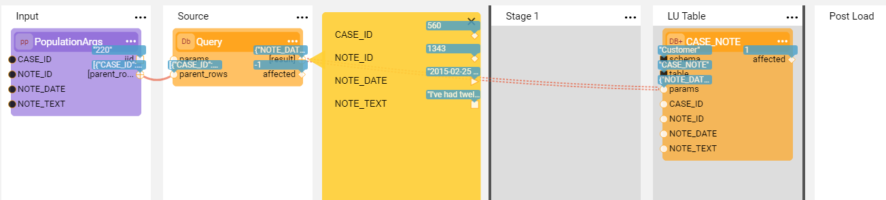
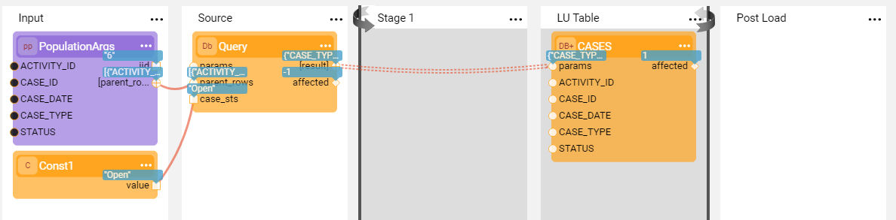

# Broadway Flow as a Population

### Exercise 1 - Creating a Broadway Flow Based Population

In this exercise you will do the following:

* Create a new population for the CASES table in the Customer LU based on a Broadway flow.
* Filter the retrieved cases by the status = Open.
* Load the data into Fabric.

##### Exercise Steps 

1. Go to the **Project Tree** > **Logical Units** > **Customer** and delete the CASES table with its population from both the tables list and the LU Schema of the Customer LU.

2. Drag the CASES table from the **DB Objects tab** of the LU Schema window to the LU Schema main area and click the **Table Based Broadway Flow** in the context menu. The CASES table and the population flow are created.

3. Connect the CASES  table to its parent ACTIVITY table in the LU Schema by ACTIVITY_ID.

4. Connect the CASES  table to the CASE_NOTES table by CASE_ID and save the LU Schema.

5. Save the population and deploy the Customer LU.

   To learn how to deploy the Logical Unit, refer to [Deploy from Fabric Studio](/articles/16_deploy_fabric/02_deploy_from_Fabric_Studio.md). 
   Note that if you are working the on debug server, the **Auto Deploy** is performed automatically when running the flow in the debug mode. 

   

Your flow is now ready! Run the Data viewer to sync a customer instance and verify the population results.   

6. Now modify the flow by adding a filter. To do so, open the **population.flow** of the CASES table. 

7. In the CASES population flow, click the **Query** Actor to edit the **sql** input argument. 

   * To filter the cases by their status, edit the SQL statement to be:

     ~~~sql
     Select * From CASES where STATUS = ${case_sts}
     ~~~

   * Note that a new input argument **case_sts** is added to the **Query** Actor.

8. Add a **Const** Actor to the **Input** Stage and populate its value as **Open**. Connect the output of the  **Const** Actor to the **case_sts** input argument of the **Query** Actor.

9. Save the population and deploy the Customer LU again before running the sync.

   

**Questions**:

<ul>
<pre><code>
1. Which values are populated in the output arguments of the <strong>PopulationArgs</strong> Actor?
2. Which SQL statement is executed on the DB Interface by the <strong>Query</strong> Actor?
3. If you need to edit the data before loading it to the target DB, how do you do it?
</code></pre>
</ul>

