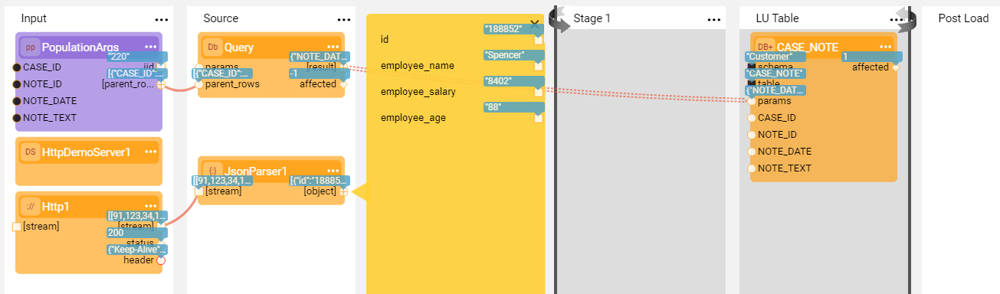

# A Broadway Flow as a Population

### Exercise 2 - Populate an LU Table Using a DB Query and an HTTP Call

This exercise demonstrates how to combine the data from different sources (such as a source DB and an HTTP server) and load it into one target table. In this exercise you will do the following:

* Create a new population for the CASE_NOTE table in the Customer LU based on a Broadway flow.
* Retrieve the case notes from the source DB.
* Invoke an HTTP call using a demo HTTP server to get additional information.
* Concatenate the NOTE_TEXT retrieved by the source DB query with the employee ID and name from the HTTP call and populate it into the LU table.

**Exercise Steps** 

**Step 1 - Create a Broadway Flow Based Population**

1. Go to the **Project Tree** > **Logical Units** > **Customer** and delete the CASE_NOTE table with its population from both the tables list and the LU Schema of the Customer LU.

2. Drag the CASE_NOTE table from the **DB Objects tab** of the LU Schema window to the LU Schema main area and click **Table Based Broadway Flow** in the context menu. The CASE_NOTE table and the population flow are created.

3. Connect the CASES table to the CASE_NOTES table using the CASE_ID and save the LU Schema.

4. Deploy the Customer LU.

5. Open the CASE_NOTE **population.flow** and run the flow.

   

   Your initial flow is ready and you can now retrieve the data from the HTTP server!

**Step 2 - Retrieve the Data from the HTTP** 

1. Add the **HttpDemoServer** and **Http** Actors to the Input Stage.

   * Populate the **Http** Actor's input arguments: **interface** = http://127.0.0.1:8841/api/v1 and **path** = /employees.
   * Note that the **HttpDemoServer** Actor is a web server that exposes a REST API for demo purposes.

2. Add a **JsonParser** Actor to the Source Stage and connect it to the Http Actor's output. The **JsonParser** Actor analyzes an input stream and outputs the JSON objects found in the stream.

3. Save the flow, deploy the Customer LU and run the flow.

   

**Step 3 - Concatenate Inputs from Two Sources before Loading them to the Target**

1. Add a Stage condition to Stage 1 using the **JavaScript** Actor and do the following:

   * Add a new **input1** argument and connect it to the CASE_ID column of the **Query** Actor output using the **Iterate** link type.

   * Add the **script** :

     ~~~javascript
     input1 != null
     ~~~

   Note that the condition is added since the number of rows returned from the HTTP call is different from the number of CASE_NOTE table rows. The condition enables skipping the empty rows.

2. Add a **Concat** Actor to the same Stage to concatenate the following:

   * id and employee_name from the **JsonParser** output and NOTE_TEXT from the  **Query** Actor output using the **Iterate** link type.
   * Connect the **Concat** Actor's output to the NOTE_TEXT column of the **DbLoad** Actor.

3. Connect other CASE_NOTE table outputs to the **DbLoad** Actor using the **Iterate** link type.

4. Save the flow, deploy the **Customer** LU and sync an instance.

