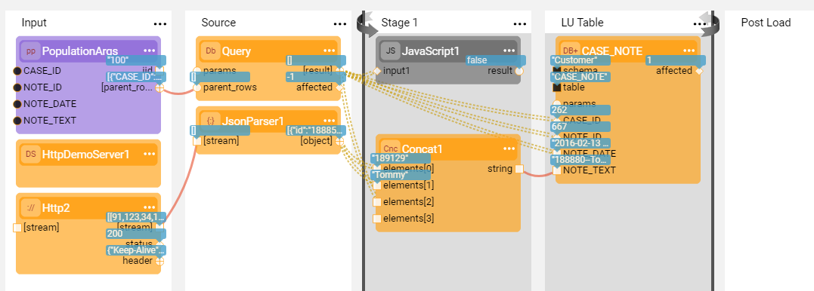

# Broadway Flow as a Population

### Exercise 2 - Populate an LU Table Using a DB Query and an HTTP Call via a Broadway Flow

In this exercise you will do the following:

* Create a new population for the CASE_NOTE table in the Customer LU based on a Broadway flow.
* Invoke an HTTP call using a demo HTTP server.
* Concatenate the NOTE_TEXT retrieved by the DB query with the employee ID and name from the HTTP call and populate it into the LU table.

**Exercise Steps** 

1. Go to the **Project Tree** > **Logical Units** > **Customer** and delete the CASE_NOTE table with its population from both the tables list and the LU Schema of the Customer LU.

2. Drag the CASE_NOTE table from the **DB Objects tab** of the LU Schema window to the LU Schema main area and click the **Table Based Broadway Flow** in the context menu. The CASE_NOTE table and the population flow are created.

3. Connect the CASES table to the CASE_NOTES table using the CASE_ID and save the LU Schema.

4. Open the CASE_NOTE **population.flow**. 

5. Split the **Source** Stage and add the **HttpDemoServer** and **Http** Actors to the new Stage.

6. Insert two new Stages by clicking > **Insert After** twice.

7. Split the Stage and add a **JsonParser** Actor to the HTTP Actors branch. 

8. Move the **Query** Actor above the **JsonParser** so that the iteration begins directly after.

9. Add a Stage condition to the next Stage using the **JavaScript** Actor and do the following:

   * Add a new **input1** argument and connect it to the CASE_ID column of the **Query** Actor output using the **Iterate** link type.

   * Add the **script** :

     ~~~javascript
     input1 != null
     ~~~

10. Add a **Concat** Actor to the same Stage to concatenate the following:

    * id and employee_name from the **JsonParser** output and NOTE_TEXT from the  **Query** Actor output using the **Iterate** link type.
    * Connect the **Concat** Actor's output to the NOTE_TEXT column of the **DbLoad** Actor.

11. Save the flow, deploy the **Customer** LU and sync an instance.

