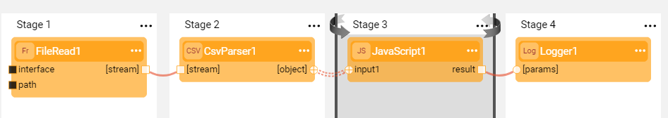
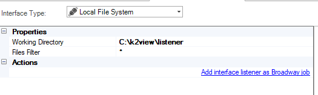
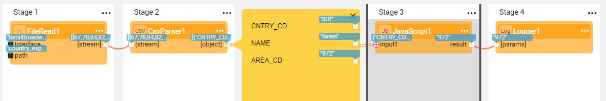

# Handling a Stream by a Broadway Flow 

### Exercise - Create a Flow and Trigger it Using an Interface Listener 

To learn about the Interface Listener, please refer to:

- [Interface Listener For Broadway Flows](/articles/19_Broadway/09_broadway_integration_with_Fabric.md#interface-listener-for-broadway-flows).
- [Example of Using a Local File System Interface](/articles/24_non_DB_interfaces/06_local_file_sys.md#example-of-using-a-local-file-system-interface).

In this exercise you will do the following:

* Create a flow that reads a CSV file, parses it, searches for a specific value in the file, and prints this value into the log.
* Define an Interface Listener for the above flow that is triggered each time a new file arrives to the directory defined in the interface.

For this exercise you will need a CSV file with CNTRY_CD, NAME and AREA_CD columns. The file should be populated with the relevant codes, for example:

<table>
<tbody>
<tr>
<td>&nbsp;CNTRY_CD</td>
<td>&nbsp;NAME</td>
<td>&nbsp;AREA_CD</td>
</tr>
<tr>
<td>&nbsp;FIN</td>
<td>&nbsp;Finland</td>
<td>&nbsp;358</td>
</tr>
<tr>
<td>&nbsp;GIB</td>
<td>&nbsp;Gibraltar</td> 
<td>&nbsp;350</td>
</tr>
<tr>
<td>&nbsp;HKG</td>
<td>&nbsp;Hong Kong</td> 
<td>&nbsp;852</td>
</tr>
<tr>
<td>&nbsp;IND</td>
<td>&nbsp;India</td>
<td>&nbsp;91</td>
</tr>
<tr>
<td>&nbsp;ISR</td>
<td>&nbsp;Israel</td>
<td>&nbsp;972</td>
</tr>
<tr>
<td>&nbsp;ITA</td>
<td>&nbsp;Italy</td>
<td>&nbsp;39</td>
</tr>
</tbody>
</table>

##### Exercise Steps:

1. Create a new Broadway flow.

2. Add a **FileRead** Actor to Stage 1 to read the input file.

   * Set the **interface** and **path** input arguments to External.

3. Add a **CsvParser** Actor to Stage 2 and connect it to the **FileRead** Actor.

4. Add a **JavaScript** Actor to Stage 3 and add an **input1** input argument to it.

   * Connect **input1** to the output of the **CsvParser** Actor.
   * Set the **Link Type** to **Iterate**.
   * Click  in the Stage context menu > **Iterate Close**. 
   * Write the following JavaScript code in the **script** input argument of the Actor:

   ~~~javascript
   if (input1.CNTRY_CD == "ISR") {
       contextLoop.stop();
       input1.AREA_CD;
   }
   ~~~

5. Add a **Logger** Actor to Stage 4: 

   * Set the **message** value of the **Logger** Actor to: *The required area code is: ${0}*.
   * Connect the **result** output argument of the **JavaScript** Actor to the **[params]** input argument of the **Logger** Actor. 

6. Save the flow. The flow is ready and you can now define the Interface Listener.

   

7. Start by defining the Interface. 

   * Go to the **Project Tree** > **Shared Objects** > **Interfaces** and click **New Interface**. 
   * Set **Interface Type** = **Local File System**.
   * Write **C:\k2view\listener** in the **Working Directory** and * in the **Files Filter**.
   * Set the Interface name and save it.

   

8. Now create an Interface Listener.

   * In the Interface window click **Add interface listener as Broadway job** and select CRM - the LU for which the job should be created. The **Interface Listener** tab of the **Jobs (CRM)** window opens.
   * Select the above flow from the **Broadway Flow** dropdown and the above Interface from the **Interface Name** dropdown and save the Jobs. 
   * Keep the **Execution Mode** = **Automatically**. 

9. Deploy the CRM LU.

   To learn how to deploy the Logical Unit, refer to [Deploy from Fabric Studio](/articles/16_deploy_fabric/02_deploy_from_Fabric_Studio.md).

   

The Interface Listener is now ready!  

Create the **C:\k2view\listener** folder in your local file system and copy a CSV file with the above format and data into it. 

The Interface Listener will pick up the file and run the flow.

Note that if you edit the Broadway flow, you must redeploy the LU so that the updated flow is picked up by the Interface Listener.

