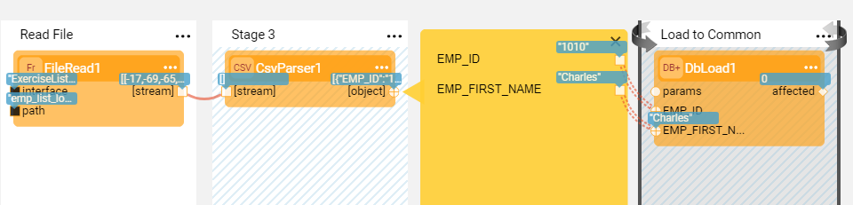
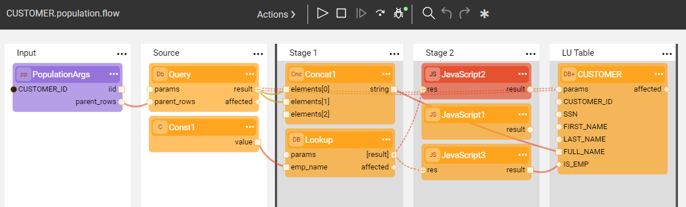
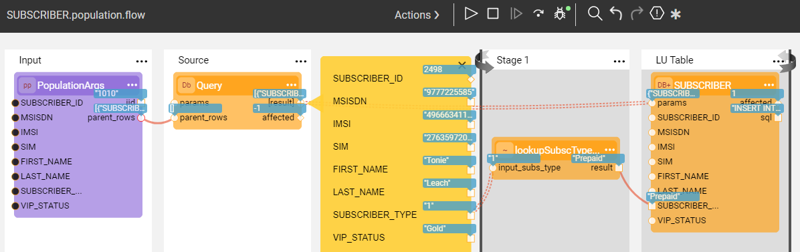
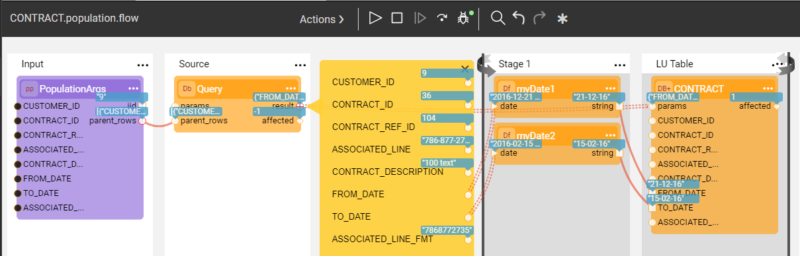
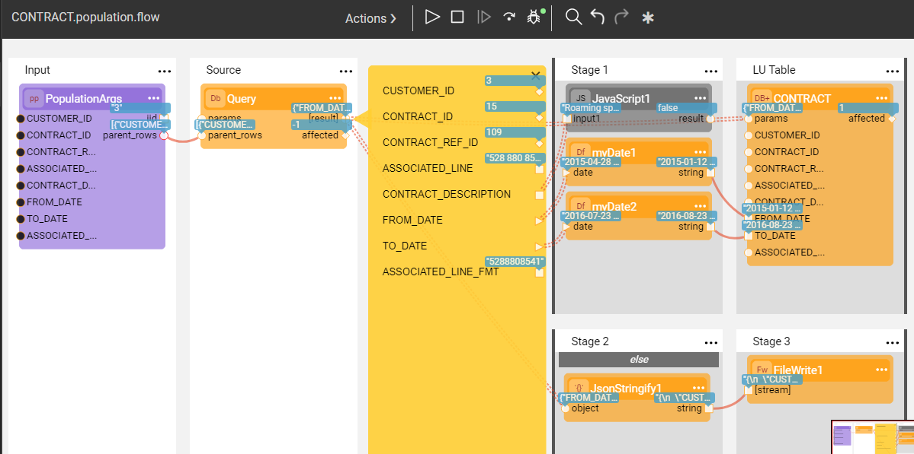
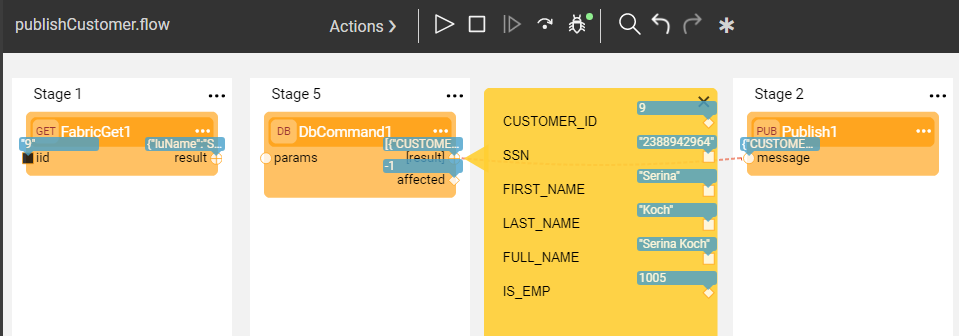

# Broadway Summary Exercise - Solution

**Step 1 - Create a Reference Table and Populate it Using a Broadway Flow**

**Question 1:**

In order to support an automatic file upload, you need to define an Interface Listener on an interface and attach a Broadway flow to it. Do the following:

a. Modify the input arguments of the **FileRead** Actor to make them **External** link type.

b. Create an Interface Listener in the **Local File System** Interface for the **SummaryExercise** Logical Unit and attach it to the **EmployeeLookupPopulation** flow.

Note that an Interface Listener handles the file only once. 

**Step 2 - Create an LU and Make the Data Modifications a Customer Population**

**Question 2a:**

a. Modify the SQL statement in the **Lookup** Actor to:

~~~sql
select COUNT(*) AS IS_EMP, EMP_ID
~~~

b. Modify the **JavaScript** Actor to return **res.EMP_ID** if IS_EMP > 0, otherwise **0**.

**Question 2b:**

a. Add an Error Handler **JavaScript** Actor to Stage 2 with the following script:

~~~javascript
res != null 
~~~

b. Add another **JavaScript** Actor with the following error message:

~~~javascript
throw "Not in EMPLOYEE table!!!"
~~~

c. Modify the script in the **JavaScript** Actor that connects between the **Lookup** Actor and the CUSTOMER **DbLoad** Actor as follows:

~~~javascript
res.EMP_ID
~~~

**Step 3 - Create a Flow that Reads Data from the File and Searches for a Value**

**Question 3:**

The **JavaScript** Actor exits the loop once the required value is found due to the following script line:

~~~javascript
contextLoop.stop();
~~~

**Step 4 - Create an Inner Flow and Add it to the Subscriber Population**

**Question 4:**

In the target Subscriber LU table, the value of the SUBSCRIBER_TYPE (such as 1, 2, 3...) is replaced with the value of the SUBSCRIBER_DESCRIPTION from the CSV file.

If the value is not found in the CSV file, the original value of the SUBSCRIBER_TYPE (such as 1, 2, 3...) will be set in the target table.

**Step 5 - Use Actor Inheritance in the Contract Population**

**Question 5:**

If the inherited Actor needs to be modified, use the **Export Actor** again with the **Override current** option. The change impacts all existing instances of the inherited Actor.

**Step 6 - Split the Stages, Set the Condition and Write Data into the File**

**Question 6**:

The purpose is to split the data based on the condition. **Roaming special** contracts types are written into the file and all other contracts are populated in the LU target table.

**Step 7 - Publish the Customer Data to Kafka Topic**

**Question 7a:**

a. Save the **publishCustomer** flow as an Actor.

b. Add **publishCustomer_Actor** to the end of the **Customer.population** flow and connect its **iid** input argument with the **PopulationArgs** output. 

c. Save all the changes, deploy the LU and sync an instance. 

**Question 7b:**

a. Create an Instance Group that will define the list of customers.

b. Deploy the LU.

c. In the Fabric Console, run the **BATCH** command providing the LUT, the Instance Group and the Fabric command as follows:

~~~
batch SummaryExercise.ig_CUST_ID_LIST fabric_command="broadway SummaryExercise.publishCustomer iid=?" with async=true;
~~~

d. Connect to the Kafka bootstrap server and check the messages:

~~~
kafka-console-consumer.bat --bootstrap-server localhost:9092 --topic <topic_name>
~~~

