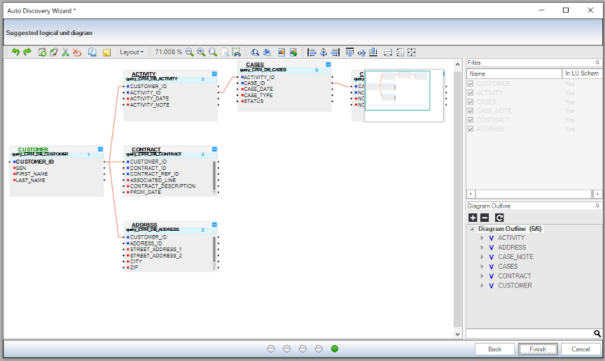

#   Logical Unit Flow

                                                     

You have just set up your Fabric project, configured its components and interfaces. Based on the business requirements, let’s look at your next steps:

- Defining the Digital Entity based on data consumption requirements.
- Modeling the LU based on the defined Digital Entity. 

 

### LU and Digital Entity Considerations

Please read the [LU Overview](/articles/03_logical_units/01_LU_overview.md) and [Create LU Overview](/articles/03_logical_units/02_create_a_logical_unit_flow.md) articles. 

Let’s look at the considerations needed to accommodate requests to view the data using a specific Digital Entity together with LU modelling.  

You may  remember that the main business requirement is to create a *360 Customer view* with the following key data information:

- How many lines does the customer subscribe to? 
- What is the current balance on a specific line? Or on all the lines? 
- When is the next invoice due? 
- How much does the customer owe? 
- Are all the private details of the customer up-to-date? 

Based on the above, the Digital Entity should be a **Customer** and the LU should be defined using various databases. 

Let’s start from the **CRM_DB** interface which holds the Customer entity and create the LU using Auto Discovery.

### Creating a New LU 
Please read the [Create New Logical Unit](/articles/03_logical_units/05_create_a_new_LU_object.md) article. 

We have already acknowledged that the Digital Entity should be the Customer ID that uses the CRM_DB.Customer table as the root of the LU’s modelling. You can use the [Auto Discovery Wizard](/articles/03_logical_units/06_auto_discovery_wizard.md) to create the LU.

### Example – Auto Discovering an LU

Following the Auto Discovery Tutorial, you can generate the **Customer** using the Fabric Studio Wizard. 

Open your Fabric project and do the following:

1. Start the Wizard by doing one of the following: 
   - Right-click on **Logical Units**, select **New Logical Unit**, and in the **Logical Unit** window that appears, type the name of the new unit (call it "Customer"). Select the **Open LU auto discovery** box. Click OK.
or
   - Select an existing Logical Unit by right-clicking on it, then select **Auto Discovery Wizard**. 
2. In the Auto Discovery Wizard window, set the **DB Connection** as **CRM_DB** and click **Next**.
3. Open the **CRM_DB -> main** tree (left side of window). 
4. Double-click on **CUSTOMER**, then double-click **CUSTOMER_ID**.  **Column Name** and **Table Name** will be populated. Note that you can uncheck the **Add Schema Name** option.
5. Click **Next**
6. Under Select auto discovery type, select **Fast (Foreign Keys)**.
7. Click **Next** , and review the suggested **ERD**. 
8. If you are satisfied, click **Next** to see the final **ERD**, then click  **Finish**.

Note that the **Root Table** and **InstanceID** are created automatically.

Your **Customer** LU is now defined:

 

`Question: Are all the tables in the CRM_DB Schema part of the Customer? Why?`

Let’s review some Logical Unit Schema properties:

-  [Logical Unit Schema Window](/articles/03_logical_units/03_LU_schema_window.md)

-  [LU Properties](/articles/03_logical_units/04_LU_properties.md)

   

There are other options for using theAuto Discovery Wizard, like overriding or enhancing a Logical Unit. Please read   [Auto Discovery Build or Update LU](/articles/03_logical_units/07_build__or_update_an_LU_schema.md).

 

 If you are not using the Auto Discovery Wizard, make sure that your Root Table and Instance ID are defined. Please read [Set Root Table and Instance ID](/articles/03_logical_units/08_define_root_table_and_instance_ID_LU_schema.md).

### Editing an LU

You may have noticed that although the Auto Discovery Wizard is quick, it doesn’t necessarily construct an LU that has all the required source Schema tables for the implementation. Source tables can be added to an implementation as part of the LU Schema or can be created manually as part of the implementation. Please read the [LU Table Overview](/articles/06_LU_tables/01_LU_tables_overview.md) article.

The following articles describe how to manually create an LU table with its properties and indexes:

-  [Create New LU Table](/articles/06_LU_tables/02_create_an_LU_table.md)

-  [Table Indexes](/articles/06_LU_tables/03_table_indexes.md)

-  [Table Properties](/articles/06_LU_tables/04_table_properties.md)

To add another table to the LU Schema, follow the steps in [Add a Table to a Schema](/articles/03_logical_units/09_add_table_to_a_schema.md).

To remove a specific table from an LU, follow the steps in [Delete Table from LU schema](/articles/03_logical_units/10_delete_table_from_a_schema.md).

### How Do I View and Review an LU?

You have created your first LU in a few clicks and understood its components and how to edit it. However, does it really fit the basic requirements? How do you know that the Schema you have just modeled retrieves the data the way you would like to view it? Can you validate the implementation and view at least one LUI’s data?

Fabric Studio can do this using its built-in Data Viewer. Let’s look at the Data Viewer, see how it is used and learn about its options. Please read the 
[Data Viewer Capabilities](/articles/13_LUDB_viewer_and_studio_debug_capabilities/01_data_viewer.md) article.

 

 

 

 

 

 

------

