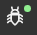

# Broadway Tutorial Flow

You are now familiar with Broadway and its main components. 

Broadway has various example flows that you can explore and use as templates. 

### What Will You Experience In This Learning Item?

By the end of the Broadway Tutorial Flows learning item you will:

- Know how to open and use Broadway flow examples.
- View, run and debug Broadway Tutorial flows to have a better understanding of Broadway.

To learn more about a Broadway flow, please refer to the [Broadway Flow Overview](/articles/19_Broadway/02a_broadway_flow_overview.md), [Broadway Flow Window](/articles/19_Broadway/18_broadway_flow_window.md) and the [Broadway Flow Examples](/articles/19_Broadway/17_tutorial_and_flow_examples.md).

### How Do I Open The Broadway Tutorial Flow  

Broadway Tutorials flows can be opened in the Broadway Flow window.

1. Download and open the [Demo Project](/articles/demo_project) in the **Fabric Studio**. 
2. Go to the **project tree** > **Shared Objects**, right click **Broadway** > **New Flow** to open the Flow Name window.
3. Populate the **Flow Name** and click **OK** to open an empty flow.
4. In the flow window: select **Actions > Examples** > **a-broadway-tutorial** to open the **Broadway Tutorial flow**.

### Debugging The Broadway Tutorials Flow

The Broadway Tutorial flow runs manipulations on the **Hello Broadway** string and returns the **Hello Broadway** result.

In the following exercise you will run and debug the flow to view the input and the output of each [Stage](/articles/19_Broadway/19_broadway_flow_stages.md) and each [Actor](/articles/19_Broadway/03_broadway_actor.md) in the flow.

Before you start the exercise, please read [Run and Debug Broadway Flow](/articles/19_Broadway/25_broadway_flow_window_run_and_debug_flow.md) to debug the Broadway Tutorial flow steps.

###   **Exercise – Run and Debug Broadway Tutorial Flow**

#### Step 1 - Open the Broadway Tutorial Flow

1. Open the  **a-broadway-tutorial**  flow as [explained above](#how-do-i-open-the-broadway-tutorial-flow).

#### Step 2 - Run and Debug the Broadway Tutorial Flow
1. Click the Debug ON  to set it to Debug OFF. Click  to run the flow.

  <ul>
  <pre><code>A. What is the result of the flow?</code></pre>
  </ul>

2. Add a  **Breakpoint** to **for each** Stage, click the Debug OFF  to set it back to Debug ON , and then click the  to execute the flow in a debug mode till the breakpoint.

3. Click the Step  or the Resume  to execute the next steps after the breakpoint step.

  <ul>
  <pre><code>
  A. How many iterations run on the <strong>StringBuilder</strong> Actor of the <strong>for each Stage</strong>? 
  B. Which input value is sent to the <strong>StringBuilder</strong> Actor on each iteration? 
  C. What is the output of the <strong>StringBuilder</strong> Actor?
  D. How many outputs are returned by the <strong>StringBuilder</strong> Actor? Please explain.
  E. Which Stage is executed after the <strong>Splitting the flow</strong> Stage? Why?
  </code></pre>
  </ul>

   Click the green asterisk in **Splitting the flow** to read its remarks and check the value of the Actor in the **Paradox** Stage to help you answer this question.

  #### Step 3 - Edit the Flow to Test a Conditinal Stage

1. Add **Now** Actor to **Stage 3**: click **Stage 3** in the flow and select the **Now** Actor in the popup window to add an Actor to **Stage 3**.
2. Click the Step  or the Resume  to execute the flow's steps in **Debug mode**. 

  <ul>
  <pre><code>A. Has the new <strong>Now</strong> Actor of <strong>Stage 3</strong> been executed? Why?</code></pre>
  </ul>

  Read more about [Stage Condition](/articles/19_Broadway/02_broadway_high_level_components.md#stage-conditions) to help you answer this question.

3. Click  to stop the **Debug process**. 
4. Edit the **Const** Actor in the **Hello Broadway** Stage:  click the **Const** Actor in the **Hello Broadway** Stage. The [Actor window](/articles/19_Broadway/03_broadway_actor_window.md) is displayed.
5. Edit the value of the first input variable from **Hello Broadway** to **Broadway Training**.
6. Run the flow. 

  <ul><pre><code>A. What is the flow's result?</code></pre></ul> 

 #### Step 4 - Add the Flow to the Project Tree in the Fabric Studio

1. Close the Broadway Tutorial flow and check the list of Broadway flows under the <strong>project tree.</strong>

<ul><pre><code>A. How may flows do you have now?</code></pre></ul>

2. Reopen the **Broadway Tutorial flow** and click the **Const** Actor in the <strong>Hello Broadway</strong> Stage.

<ul><pre><code>A. Which value is set for the input parameter?</code></pre></ul> 

###  Solution - Run and Debug Broadway Tutorial Flow Exercise 

 <ul>
 <pre><code> 
<strong>Step 2.1</strong>
A. The flow's result is "Hello Broadway"</code></pre>
 </ul>
<ul>
<pre><code>
<strong>Step 2.3</strong>
A and B, The flow executes two iteration runs on the <strong>StringBuilder</strong> Actor. 
The first iteration runs on **Hello** and the second iteration runs on **Broadway**.
C. The <strong>StringBuilder</strong> returns the following output: <strong>Hello Broadway</strong>.
D. The <strong>StringBuilder</strong> Actor returns one output. It gets its inputs by a loop and builds the string. 
The <strong>for each</strong> Stage is marked as <strong>Iterate Close</strong>. 
As a result, the StringBuilder in this Stage closes the loop and only then returns its output.
E. The next Stage executed after the <strong>Splitting the flow</strong> Stage is the <strong>Dynamic Logic Actors</strong> Stage, 
since this Stage is on the same level as the <strong>else</strong> of the condition, and the condition returns <strong>false</strong>. 
See <a href="/articles/19_Broadway/02a_broadway_flow_overview.md#flow-with-condition">Flow with Conditions</a>.
</code></pre>
</ul>

 <ul>
<pre><code>
<strong>Step 3.2</strong>
A. The <strong>Now</strong> Actor added to <strong>Stage 3</strong> has not been exectued since this Stage runs only if the <strong>Paradox</strong> condition is fulfilled.</code></pre>
</ul>

<ul>
 <pre><code>
<strong>Step 3.6</strong> 
A. The flow result is <strong>Broadway Training</strong>.</code></pre>
</ul> 

<ul><pre><code>
<strong>Step 4.1</strong>
A. There are two flows. A local copy of the Tutorial flow has been saved in the Fabric project during its execution.</code></pre></ul>
<ul><pre><code>
<strong>Step 4.2</strong>
A. The value of the input parameter is <strong>Broadway Training</strong>. You can edit the flow and save the changes or execute the flow. 
A local copy of the flow is saved in the Fabric project. 
</code></pre></ul> 

