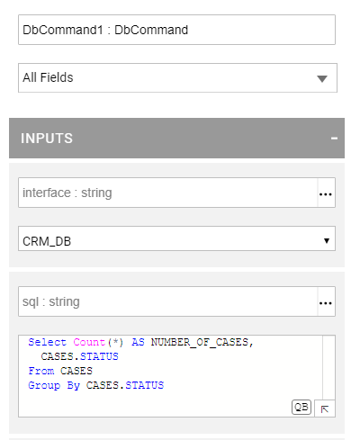

# Creating a Broadway Flow 

Now you are now familiar with Broadway and its main components and have checked out and executed the Broadway Tutorial flow, you are ready to create your first Broadway flow. 


### What Will You Experience In This Learning Item?

By the end of the Broadway Flow learning item you will:

- Know how to create your first Broadway flow.
- View, run and debug a Broadway flow.


A Broadway flow:
-  Represents a business process that binds other objects into the same flow. 
-  Acts as a graph or a tree that has several [Stages](/articles/19_Broadway/19_broadway_flow_stages.md) where each Stage includes one or more [Actors](/articles/19_Broadway/03_broadway_actor.md). Stages are executed consecutively from left to right, where the Actors in each Stage of the flow are executed top-down.


To learn more about a Broadway flow, please refer to the [Broadway Flow Overview](/articles/19_Broadway/02a_broadway_flow_overview.md).

### Example - Building a Simple Broadway Flow

Let's create a new Broadway flow that selects data from a DB table and creates a JSON file based on the selected records. 

Note that in this exercise you will use Broadway capabilities like built-in Actors and linking between Actors that are explained in more detail later in this training.


#### Step 1 - Create a New Broadway Flow

1. Download and open the [Demo Project](/articles/demo_project) in the Fabric Studio. 
2. Go to the **project tree** > **Shared Objects**, right click **Broadway** > **New Flow** to open the Flow Name window.
3. Populate the **Flow Name** and click **OK** to open an empty flow.


#### Step 2 - Populate Stage 1 of the Flow

1. Prepare the SELECT statement to retrieve the data. For example, select the number of cases for each case status from the **CASES** table in the **CRM_DB**  interface. Use the following SQL query:

```sql
Select Count(*) AS NUMBER_OF_CASES, CASES.STATUS
From CASES
Group By CASES.STATUS
```

2. Add a **DbCommand** Actor to run the above SELECT statement in Stage 1. 

To learn how to add an Actor to a Broadway flow, refer to [How Do I Add Actor to Stage](/articles/19_Broadway/03_broadway_actor.md#how-do-i-add-actor-to-stage).

3. Populate the **interface** and **sql** input arguments of the **DbCommand** Actor in Stage 1. 

   - Select **CRM_DB** as the **Interface**.
   - Populate the SELECT statement in the **sql** input argument. To validate your query, click the **QB** button to open the [Query Builder window](/articles/11_query_builder/02_query_builder_window.md), then click **Execute Query**. When done, click **OK** to close the Query Builder. 




#### Step 3 - Read the Customer's List and Create a File

The SQL query executed by the **DbCommand** returns several records. The next Stages iterate on the list of selected records. For each selected record, do the following:

- Build a JSON object.
- Write the JSON object to an output file.

##### Building a JSON Object for Each Selected Record

1. Click  in the right of the Flow window to create Stage 2 that builds a JSON object for each selected customer record.

2. Add a **JsonStringify** Actor to Stage 2.

3. Link the **result** output parameter of the **DbCommand** Actor to the **object** input parameter of the **JsonStringify** Actor. Click the link and set the **Link Type** to **Iterate** to get the selected records returned by the **DbCommand** by a loop.

 To learn how to link Actors in a Broadway flow, read [linking Actors in a Broadway Flow](/articles/19_Broadway/07_broadway_flow_linking_actors.md). 

   ##### Writing the JSON Object to an Output File for Each Selected Record

4. Add Stage 3 to the flow. Both Stages 2 and 3 are marked in grey since they are included in the loop that has been opened by linking Stages 1 and 2. 

 To learn more about handling loops on Broadway flows, read [Broadway Iterations](/articles/19_Broadway/21_iterations.md).

5. Open the **LocalFileSystem** interface in the Fabric Project. The **Working Directory** property of this interface is **C:\k2view\Broadway_Training**.

6. Create the **C:\k2view\Broadway_Training** directory in your local Windows server.

7. Add a **FileWrite** Actor to **Stage 3** and edit it as follows:

   - Set **Interface** to **LocalFileSystem**.
   - Change the **path** population type to **Const**.
   - Set the value of the **path** to **customer_list.json**. This parameter is populated by the new filename created by the **FileWrite** Actor.
   - Set the **Append** Boolean parameter to **false** to rewrite each flow execution into the file.

     

8.  The **FileWrite** Actor executes the following activities:

   - Creates a new file named **customer_list.json** under the working directory defined in the **LocalFileSystem** interface object.
   - Appends each JSON object sent for each selected customer to the file.

9. Link the **JsonStringify** Actor's **string** output parameter to the **stream** input parameter of the **FileWrite** Actor.

10. Close the iteration after executing Stage 3: 

   - Click  in the right corner of the **Stage** to open the **Stage context menu**. Select **Iterate Close** to close the loop after the execution of the Stage.


 Read [Stage Context Menu](/articles/19_Broadway/18_broadway_flow_window.md#stage-context-menu) to learn more about editing this Stage's settings.


#### Step 4 - Flow Execution and Debug

##### Updating the Output Schema of the DbCommand Actor

The **DbCommand** Actor returns  a complex Schema. The Broadway Debug process *learns* the Schema and its complex output parameters and can suggest how to update it based on a parameter's value. To update the output parameter of the **DbCommand**, do the following:

   - Run the flow in Debug mode when Debug is set to ON .

   - Click the red port next to the **[result]** output of the **DbCommand** to open the **Compare Schema** window and then click **UPDATE** to update the Schema.

    
   

   - Click  adjacent to the Actor's output argument to open the yellow Data Inspection segment and display the Schema on the left and the data values on the right.

   - Add a  **Breakpoint** to **Stage 1** and run the debug again. Click  to execute the next steps after the breakpoint step.

   - You can now see the input and output values displayed for each iteration in the flow.

   - Click each Debug value (marked by blue) to open the **Data Viewer** window for the selected parameter. See the example below:

   


 Read about [Run and Debug Broadway Flow](/articles/19_Broadway/25_broadway_flow_window_run_and_debug_flow.md) and [Broadway Data Inspector](/articles/19_Broadway/27_broadway_data_inspection.md).

   ##### Checking the Flow's Execution Results

* Check your local directory (C:\k2view\Broadway_Training) and open the new JSON file that contains the list of cases selected from the CASE table.

   

Congratulations! You've just created your first Broadway flow. 

Let's continue to the next item to learn more about adding iteration and conditions to the Broadway flow.

[](04_broadway_tutorials.md)[](06_broadway_flow_adding_loops_and_conditions.md)
