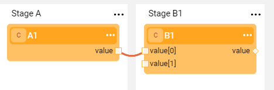

# Using Actors in Broadway Flows

Now that you know how to create and run a Broadway flow, let's learn more about Actors and how they can be used in various scenarios.

### What Will You Experience In This Learning Item?

By the end of this learning item you will:

- Know about the different types of links between Actors.
- Know how to edit input and output arguments and add remarks.
- Be familiar with the most used built-in Actor types.

### Actors Overview

A Broadway Actor represents an action that is executed on a [Stage](/articles/19_Broadway/19_broadway_flow_stages.md) in the [Broadway flow](/articles/19_Broadway/02a_broadway_flow_overview.md) to get input parameters and return output parameters. 

To learn more about Broadway Actors, their properties and how to link them in a Broadway flow, please refer to:

* [Actors Overview](/articles/19_Broadway/03_broadway_actor.md).
* [Actor Properties Window](/articles/19_Broadway/03_broadway_actor_window.md).
* [Broadway Data Types](/articles/19_Broadway/05_data_types.md).

### Example - Setting and Updating Links Between Actors, Remarks and Population Types

In this exercise you will use a flow that you created in a previous exercise and connect two Actors to it. 

1. Add Actors **A1** and **B1** to two different Stages of the flow. For more information, refer to [How Do I Edit Links in a Flow](/articles/19_Broadway/07_broadway_flow_linking_actors.md#how-do-i-edit-links-in-the-flow).

2. Draw a link between the Stages. Verify that the connection's **Link Type** = **Value** (default). For more information, refer to [Linking Actors](/articles/19_Broadway/07_broadway_flow_linking_actors.md).

3. Click the connection line to set the Varargs to OFF and check the impact on the flow.

4. Change the Link Type to **Iterate** / **First** and check the impact on the flow. For more information, refer to [Broadway Iterations](/articles/19_Broadway/21_iterations.md). 

5. Delete the link's connection line.

6. To add a connection, click **Source Actor** > **Link**. For more information, refer to [Actor's Context Menu](/articles/19_Broadway/18_broadway_flow_window.md#actor-context-menu).

7. In a flow with many connection lines, click **Actor** > **Show only connected** to display only the Actors linked to the selected Actor. For more information, refer to [Show Only Connected](/articles/19_Broadway/08_show_only_connected_actors.md).

8. Click **Actor** > **Remark** and add a remark.

9. Change the **A1** Actor's population type input argument from **Const** to **External** and then update the argument's external name. For more information, refer to [Actor Inputs and Outputs](/articles/19_Broadway/03_broadway_actor_window.md#actors-inputs-and-outputs).

Let's continue to the next item and learn more about built-in and frequently used Actors.

