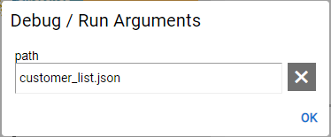
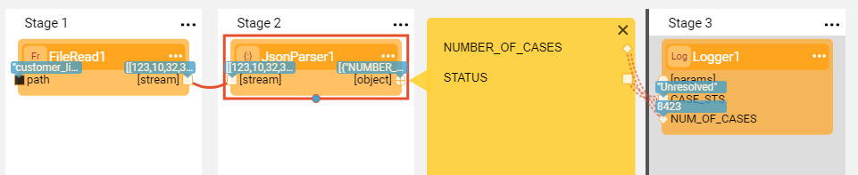

# Built-In Actor Types

After you have understood how to work with Actors, let's explore which built-in Actor types are available in Broadway and learn about some of the most frequently used ones.

Read [Built-in Actor Types](/articles/19_Broadway/04_built_in_actor_types.md) to get the overview of the available built-in Actors. 

Now we can take a closer look at some of the most useful Actors.

* **Dynamic Logic Actors** are the Actors which include dynamic logic as one of their input parameters. The most frequently used dynamic logic Actors are:
  * **JavaScript** Actor that can be used to simplify a flow by writing JavaScript business logic or validation code in the **script** input parameter.
  * **DB Commands** Actors that are used for performing DB commands and actions like creating a new table, loading data, etc.

* Other Actors for handling the most useful activities are:
  * **Stream** Actors that handle streams such as reading from and writing to a file or compressing and decompressing data.
  * **Parser** Actors that parse input stream into different formats like JSON, CSV and XML.
  * **Queue** Actors that manage Pub / Sub asynchronous message handling.

Read [Actors Specifications and Examples](/articles/19_Broadway/actors/README.md) to learn more about the specifications and examples of each of the above Actor type.

### Example - Reading and Parsing the File

Let's create a new Broadway flow that reads data from a JSON file, parses it and prints it into log. 

1. Create a new Broadway flow as explained in the [Building a Simple Broadway Flow](05_create_broadway_flow.md#example---building-a-simple-broadway-flow) example.

2. Add a **FileRead** Actor to Stage 1 of the flow and populate its input arguments as follows:

   * Set **Interface** to **LocalFileSystem**. If this Interface has not been defined in the Fabric yet, follow the instructions in the [Building a Simple Broadway Flow](05_create_broadway_flow.md#example---building-a-simple-broadway-flow) example.

   * Change the Population Type of **path** to  **External**. 

   * Populate the **path** value by opening **Actions** > **Debug / Run Arguments** from the Main menu toolbar. You can use the same JSON file that you have created in the [Building a Simple Broadway Flow](05_create_broadway_flow.md#example---building-a-simple-broadway-flow) example.

     

      To learn more refer to [Setting Run and Debug Arguments](/articles/19_Broadway/25_broadway_flow_window_run_and_debug_flow.md#setting-run-and-debug-arguments) and the [Main menu toolbar](/articles/19_Broadway/18_broadway_flow_window.md#main-menu).

3. Add a **JsonParser** Actor to Stage 2 of the flow and connect its input argument to the previous Actor's output. 

   * Set **single** input argument to correspond the input JSON file. For example, if the input file includes a valid JSON, keep the value as **true**. However if the input file includes an array of JSON objects, set the value to **false**.

4. Add a **Logger** Actor to Stage 3  and populate its input arguments as follows:

   * Change the Population Type of **message** to **Const**. 
   * Set the value of **message** to: *Num of cases = ${NUM_OF_CASES}, Status is ${CASE_STS}*
   * Note that new input arguments are added to the Actor: NUM_OF_CASES and CASE_STS.

5. Click  adjacent to the Actor's output argument to open the Data Inspection yellow segment and display the Schema on the left and the data values on the right. 

   * Connect the fields in the yellow segment with the new input arguments of the **Logger** Actor.

   * Set the **Link Type** of each one of them to **Iterate**. 

      Read about [Broadway Data Inspector](/articles/19_Broadway/27_broadway_data_inspection.md). To learn more about Link Types refer to [Linking Actors](/articles/19_Broadway/07_broadway_flow_linking_actors.md).

6. The flow is ready! Make sure the input file exists in the designated working directory and run the flow. 

   * Run the flow in a debug mode when the debug is set to ON .

     

      To learn more about debug options refer to [Run and Debug Broadway Flow](/articles/19_Broadway/25_broadway_flow_window_run_and_debug_flow.md).

7. Check the output log area to see the print results.

   

