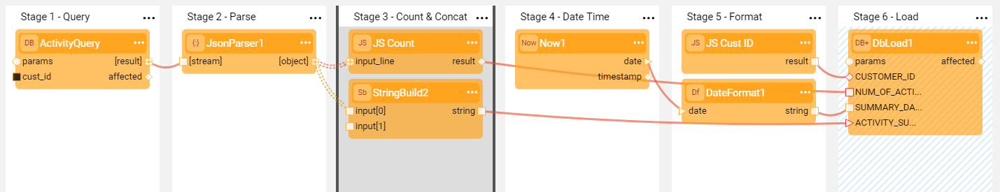

#  Exercise - Using Various Actors in a Flow

The purpose of this exercise is to use various built-in Actors in a flow that you create.

Let's create a new Broadway flow that selects data from a DB table ACTIVITY by given CUSTOMER_ID, parses it, performs some data manipulations and loads the data into a DB table.

The data manipulations are:

* Calculate how many activities exist 
* Concatenate the activity IDs 
* Capture the current date / time and format it

At the end, populate the data into a table.

1. Create a new Broadway flow.

2. Add a **DbCommand** Actor to Stage 1 to select the data from the DB:

   * Set **interface** to **CRM_DB**.

   * Populate **sql** with the following SQL statement:

     ~~~sql
     Select * From ACTIVITY Where CUSTOMER_ID = ${cust_id}
     ~~~
     
* Note that a new input argument **cust_id** is added to the Actor.
   
* Set its population type to **External**.
   
3. Add a **JsonParser** Actor to Stage 2 and connect it with the **DbCommand** Actor.

   * Set **single** input argument to **false**.

4. Add a **JavaScript** Actor to Stage 3, connect it with the  **JsonParser** Actor using **Iterate** link type and write a script to calculate the number of times the Actor is called.

   ~~~javascript
   self.count += 1;
   ~~~

   To learn more, refer to [JavaScript Actor](/articles/19_Broadway/actors/01_javascript_actor.md).

5. Add a **StringBuild** Actor to Stage 3 as well and connect its input with ACTIVITY_ID of the  **JsonParser** Actor in Stage 2 to concatenate all the activity IDs into one string. Update the **delimiter** to '||'. 

6. Close the iteration by clicking > **Iterate Close** in the Stage 3 context menu . 

7. Add a **Now** Actor to Stage 4 to get the current date-time stamp. 

8. Add a **DateFormat** Actor to Stage 5 and connect it with the output of **Now**.

9. Add  **JavaScript** Actor to Stage 5 to get the value of the **cust_id** argument by using **flowArgs**: 

   ~~~javascript
   flowArgs["cust_id"];
   ~~~

10. Add a **DbLoad** Actor to Stage 6 to load the data to the DB.

   * Set the **interface** input argument to **fabric** and the **command** to **insert**. 
   * Create a common table **ACT_SUM** in the Fabric with the following columns: CUSTOMER_ID, NUM_OF_ACTIVITIES, SUMMARY_DATE, ACTIVITY_SUMMARY. Set this table in the **table** input argument. After the table is selected, its columns are added to the Actor's input arguments.
   *  Connect **DbLoad** Actor's input arguments with the output of the Actors in previous stages.
   * Mark Stage 6 as a Transaction by clicking > **Transaction** in the Stage 6 context menu. Note that working with transactions in Broadway is explained in more detail later in this training.

Your flow is ready now! Run the flow in the Debug mode. 

**Questions**:

<ul>
<pre><code>
1. What happens when you run the flow for the first time?
2. What happens if you change <strong>single</strong> input argument of the <strong>JsonParser</strong> Actor to <strong>true</strong>?
3. With which Actor can the <strong>JavaScript</strong> Actor in Stage 3 be replaced to calculate the number of times the Actor is called?
4. Update the <strong>format</strong> input argument of the <strong>DateFormat</strong> Actor in Stage 5 to <strong>E dd-MM-yy K:m a</strong>. How does it impact the output?
</code></pre>
</ul>

**Answers:**

<ul>
<pre><code>
1. When running the flow for the first time, Debug / Run Arguments window pops-up to set the value of cust_id external input argument. The next time this window will not pop-up, using the same value until it is reset by the user.
2. When <strong>single</strong> input argument of the <strong>JsonParser</strong> Actor is set to <strong>true</strong>, the Actor expects only a single object in the input stream.
3. It can be replaced with the <strong>Count</strong> Actor.
4. The date format will be changed.
</code></pre>
</ul>

