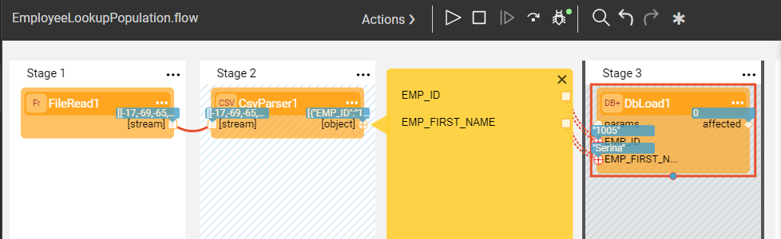
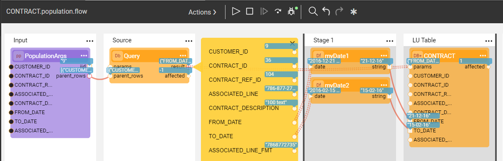

# Broadway Summary Exercise - Solution

**Step 1 - Create a Common Table and Commit the Data.**

**Step 2 - Create an LU, Lookup Data & Add It Into a Population**

**Question 1:**

a. Modify the SQL statement in the **Lookup** Actor to:

~~~sql
select COUNT(*) AS IS_EMP, EMP_ID
~~~

b. Modify the **JavaScript** Actor to return **res.EMP_ID** if IS_EMP > 0, otherwise **0**.

**Question 2:**

a. Add an Error Handler **JavaScript** Actor to Stage 2 with the following script:

~~~javascript
res != null 
~~~

b. Add another JavaScript Actor with the error message:

~~~javascript
throw "Not in EMPLOYEE table!!!"
~~~

c. In the existing **JavaScript** Actor which connects between the **Lookup** Actor and the CUSTOMER **DbLoad** Actor, modify the script to the following:

~~~javascript
res.EMP_ID
~~~

**Step 3 - Read Data from File**

**Question 3:**

The JavaScript Actor exists the loop once the required value is found. This is due to the following script line:

~~~javascript
contextLoop.stop();
~~~

**Step 4 - Add an Inner Flow to the Population**

**Step 5 - Use Actor Inheritance in the Flow**

**Question 4:**

Yes, if the inherited Actor needs to be modifies, do **Export Actor** again and use **Override current** option. The change then will impact all the existing instances of the inherited Actor.

**Step 6 - Split the Stages and Write into File**

**Question 5**:

The purpose is to split the data based on the condition. The contracts with type "Roaming special" will be written into the file, while all other contracts will be populated in the LU.

