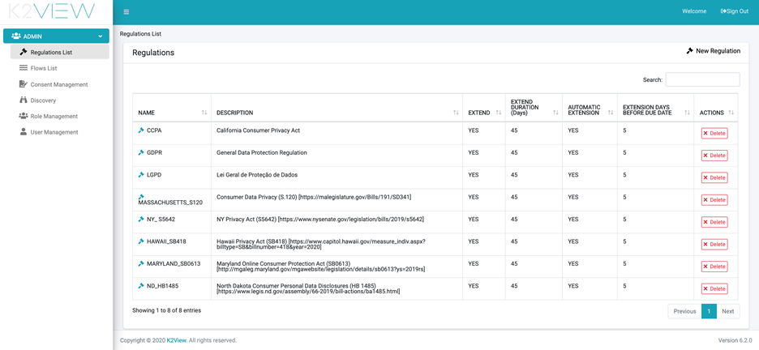

# Admin Module

**Overview**

The Admin module controls the definitions of which regulations are covered by the DPM, the Activities that are supported for each regulation, the Flows that are executed, user and role management, consent management, and more.

**Admin Menu options**

Once a user logs into the DPM system as Administrator, the Admin menu options are presented on the left side of the screen, and the list of Regulations is presented in the center. 

                           

Figure 2. Admin Module

By using the Menu on the left side of the window, the Administrator can access any of the DPM configuration options. The details for each of those options is described in this chapter.

Figure 3. Admin Menu

# DPM Configuration
**Overview**
As described in the first chapter, the Admin module is where the DPM Administrator can define the support for the different Privacy Regulations and their respective Activities.
The configuration is comprised of:

•	Define Flows: The Flows specify the set of tasks that are required for the fulfillment of a customer request.
•	Define Regulation and Activities: Configure the Regulation and Activities that the DPM supports. Once an Activity is defined, then map the Activity to the corresponding Flow.

