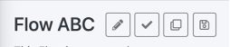
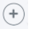

# Flows, Stages, Tasks

A Flow is an entity that defines the sequence of actions to be executed in order to fulfill a specific DPM request type. For example, the actions to fulfil the request to “get my data” or “forget me”. 
Flow is the main component in the DPM request definition and can be viewed as the “brain” of a DPM request. 

A Flow is composed of Stages, and Stages include one or multiple tasks in them. 

Once a Flow’s configuration is complete, it can be linked to a DPM Activity. From that moment on, any time a customer request for this Activity is processed, the execution will follow the stages and tasks defined in this Flow.  

The Admin can view the list of existing flows by selecting the “Flows List” menu option at the left side of the application screen. 
The screen that is presented allows the Admin to search for a specific Flow, review any of the Flows, and create a new Flow.

## Flows List

The list of existing Flows provides the high-level information about each of the configured Flows. 

 

In this screen, the information about each Flow includes: 

- Name: The Flow name.
- Description: describes the purpose of this Flow.
- Version: A Flow may have more than one version. All versions are presented.
- Status: A Flow is created as a Draft, and then changed into Completed. Only Draft Flows can be altered.

Only Completed Flows can be assigned to Activities.

- Regulation/Activity: List of all the Activities that uses this Flow.
- Actions: provide the option to delete a Flow. 

The following sections provide some additional information about the options and data in the “Flows List” screen. 

### View Flow Details

To view the details of a specific Flow, select the table line of the Flow, and the Flow details screen will be presented.

### Delete a Flow

To delete a Flow, click on the delete (x) button under the Action column. Only Flows that are not linked to an Activity can be deleted.

### Flow Status

Flow Status - When a new Flow is created, its status is defined as Draft. In this status, the DPM Administrator can perform any configuration on this Flow, such as creating new stages, adding new tasks, etc.  
Once the Administrator completes the configuration, the Flow is marked as Completed. Marking the Flow as Completed blocks further changes to the Flow. Afterward, this Flow can be linked to a DPM Activity so that it can be executed as part of a DPM fulfillment process. The same Flow can be linked to more than one DPM Activity. 

### Flow Version

Any Flow can have multiple versions. A new version should be created when a change to an existing Completed Flow is required. The version number is determined by the Administrator when the new Flow version is created. Creating a new version of a Flow is described in the sub-chapter about the “Flow Details” screen.

### Create New Flow

The Administrator can create a new Flow by using the “Add a Flow” button on the top-right corner of the screen. 
The Administrator is then prompted to define the Flow name, version, and description:

 

<table>
<tbody>
<tr>
<td width="85">

<strong>Property</strong>

</td>
<td width="30">

<strong>M/O</strong>

</td>
<td width="785">

<strong>Description</strong>

</td>
</tr>
<tr>
<td width="85">

Flow Name

</td>
<td width="30">

M

</td>
<td width="785">

The name of this Flow.

</td>
</tr>
<tr>
<td width="85">

Flow Version

</td>
<td width="30">

O

</td>
<td width="785">

The Flow version field is optional, and the system will assign it automatically if it is not filled in by the user. The logic for the automatic version number allocation is as follows:

&middot;&nbsp;&nbsp;&nbsp;&nbsp;&nbsp;&nbsp; If there is no other Flow with the same name, the system will automatically set it to 1.

&middot;&nbsp;&nbsp;&nbsp;&nbsp;&nbsp;&nbsp; If there is a Flow with the same name, the system will set the Flow version of the new Flow to one higher than the version number of the Flow with the same name.

The system will not allow the creation of two Flows with the same name and the same version.

</td>
</tr>
<tr>
<td width="85">

Flow Description

</td>
<td width="30">

O

</td>
<td width="785">

Description of the Flow&rsquo;s purpose.

</td>
</tr>
</tbody>
</table>

Once the Flow information is defined and the new Flow is saved, the system presents the Flow Editing screen, where the Administrator can add Stages and Tasks under those Stages. 
The Flow name and the Flow description can be updated at any  time, by using the edit icon next to the Flow name.

 

## Flow Level Actions

The set of icons next to the Flow name are Activities at Flow level:

 

<table>
<tbody>
<tr>
<td width="100">

<strong>Icon</strong>

</td>
<td width="800">

<strong>Description</strong>

</td>
</tr>
<tr>
<td width="100"> </td>
<td width="800">

Edit this Flow: Edit Flow Name and Description. The Flow name and the Flow description can be updated as long as the Flow is not marked as <em>Completed</em>.

</td>
</tr>
<tr>
<td width="100"> 
</td>
<td width="800">

Mark as Complete: Once the Flow configuration is complete, use this icon in order to mark the Flow as <em>Completed</em>. No further changes to the Flow are allowed after a Flow was marked as complete, and the Flow is made available to be associated with an Activity in the Activity configuration screens.

</td>
</tr>
<tr>
<td width="100"> </td>
<td width="800">

Duplicate this Flow: this button is used in order to create a new version of the Flow. The new version is created in <em>Draft</em> status and allows the user to change the details of the Flow in the new version.

</td>
</tr>
<tr>
<td width="100"> </td>
<td width="800">

Save Flow As: Use the &ldquo;save as&rdquo; button to create a new Flow in <em>Draft</em> status, that initially has the same details of the original Flow. The new Flow that is created as a result is independent from the source Flow.

</td>
</tr>
</tbody>
</table>

At the upper-right corner of the Flow screen, the system shows general Flow information: 

 

<table>
<tbody>
<tr>
<td width="100">

<strong>Information</strong>

</td>
<td width="800">

<strong>Description</strong>

</td>
</tr>
<tr>
<td width="100">

Version

</td>
<td width="800">

The Flow Version.

</td>
</tr>
<tr>
<td width="100">

Status

</td>
<td width="800">

The Flow Status can be &ldquo;Draft&rdquo; or &ldquo;Completed&rdquo;.

</td>
</tr>
<tr>
<td width="100">

Business Days

</td>
<td width="800">

The total Flow duration &ndash; how many business days are required in order to perform all the tasks of the Flow. This number is based on the deadlines of the Tasks included in the Flow and is rounded up to present a whole number of days.

</td>
</tr>
<tr>
<td width="100">

(x business Hours)

</td>
<td width="800">

This indicates the total number of hours that the Flow is expected to take, according to the deadline information of all its Tasks. The unit of the information can be changed by configuration from Hours to Minutes. Note that changing the configuration from Hours to Minutes alters the expected duration of the Flow, and not only the units. For example: a Task with the deadline set to 1 would be considered as 1 hour long when the configuration is &ldquo;Hours&rdquo; and as 1 minute long when the configuration is set to &ldquo;Minutes&rdquo;. The option of &ldquo;Minutes&rdquo; is usually utilized for testing purposes, when the tester would like to have the Flows executed faster.

</td>
</tr>
</tbody>
</table>

### Add a Stage

Use the   button on the left side of the Flow screen in order to add a new Stage. As a result, the user is prompted to define the Stage name and description:

 

<table>
<tbody>
<tr>
<td width="85">

<strong>Property</strong>

</td>
<td width="30">

<strong>M/O</strong>

</td>
<td width="785">

<strong>Description</strong>

</td>
</tr>
<tr>
<td width="85">

Stage Name

</td>
<td width="30">

M

</td>
<td width="785">

The name of this Stage.

</td>
</tr>
<tr>
<td width="85">

Stage Description

</td>
<td width="30">

O

</td>
<td width="785">

The Stage description

</td>
</tr>
</tbody>
</table>

Saving the new Stage will open the screen to define tasks in this stage. 

 

As long as the Flow is not marked  Completed, additional Stages can be added, and Tasks under them can be added or modified. 

### Stages Management

The Stages comprising a Flow are shown in the bar below the Flow header: 

 

- Use the + buttons to add more Stages
- Use the x buttons to delete a Stage

The duration of each Stage is marked in the yellow tag at the top of the Stage arrow. This duration is based on the SLAs of the tasks within the Stage and also takes into consideration their order and dependencies. 
The Stage name and description can be changed as long as the Flow is not marked as Completed. Edit this information by using the    button, located at the right side of the Stage header section. 

### Add/Edit a Task

A Stage is composed of one or more Tasks. Each Task performs a specific action in the Request Fulfilment process, for example: 

- Validate the customer request.
- Send an e-mail to the customer acknowledging the request was registered.
- Gather the required customer data.
- Review the gathered data.

To add a new Task under a specific Stage, select the Stage by clicking the Stage name on the Stage bar and use the   option that appears on the right side. 
The Task Configuration screen will be shown. This screen includes several tabs, each configuring a different aspect of the Task.

The Task configuration includes the following tabs: Tasks, Reminders, Operations, and Associated Tasks. 

Tasks can be divided into two primary categories: Tasks that are designed to be executed manually, and Tasks that are configured to run automatically. An automatic Task is performed by the DPM system, while a manual Task will be allocated to the Stewards and their teams. 

The following sections describe the properties that should be configured when defining a Task, and the different execution configurations of automatic and manual tasks. 

### “Tasks” tab

The Tasks tab includes the configuration of parameters, such as the following:

- Task Name
- Task owner
- Define if the Task is mandatory
- Tasks execution order
- Dependencies on other Tasks
- Task expected execution time
- Task execution timing

 

The following table describes in detail the options in this tab:

<table>
<tbody>
<tr>
<td width="90">

<strong>Property</strong>

</td>
<td width="35">

<strong>M/O</strong>

</td>
<td width="775">

<strong>Description</strong>

</td>
</tr>
<tr>
<td width="90">

Task Name

</td>
<td width="35">

M

</td>
<td width="775">

The Task name is used to identify the Task anywhere it will appear in the system.

</td>
</tr>
<tr>
<td width="90">

Role

</td>
<td width="35">

M

</td>
<td width="775">

The role that this Task should be assigned to. For manual Tasks, this is the Role that represents the Data Stewards&rsquo; group that should handle it. For automatic Tasks, the DPM system will inform an assigned role if the process fails or if the deadline of the Task was missed.

</td>
</tr>
<tr>
<td width="90">

Mandatory

</td>
<td width="35">

M

</td>
<td width="775">

Marking a Task as mandatory means that the flow will not move forward until this Task is completed.

&nbsp;

If the Mandatory property is not marked, then the flow will move forward when the deadline is reached, even if the Task has not been completed.&nbsp; In this case, the system will mark the Task as &ldquo;waived&rdquo;.&nbsp; If there are no further Tasks in the Request, the Request will be marked as &ldquo;completed&rdquo;.

</td>
</tr>
<tr>
<td width="90">

Task Start Time

</td>
<td width="35">

M

</td>
<td width="775">

This property allows for defining whether the task should be initiated immediately after the predecessor task is completed, or to initiate it only after a configurable time lag.

The time lag configuration:

 

&nbsp;

The configuration depends on the selected time unit:

If &ldquo;hour&rdquo; was selected, then the user should define at what minute the task should start. Once the preceding task was completed, then this task will start in the defined minute of the following hour.

If &ldquo;day&rdquo; was selected then the hour of the day should be defined.

The configuration of other time unit choices of &ldquo;week&rdquo;, &ldquo;month&rdquo; and &ldquo;year&rdquo; follow the same logic.

</td>
</tr>
<tr>
<td width="90">

Task Order

</td>
<td width="35">

O

</td>
<td width="775">

This defines the order of the task within the Stage it was defined. In order to execute multiple parallel tasks, assign&nbsp; them to the same order number.&nbsp; The default value is 1

</td>
</tr>
<tr>
<td width="90">

Task Deadline

</td>
<td width="35">

M

</td>
<td width="775">

The task deadline defines the maximum duration that this task is expected to take. If the task execution exceeds this deadline, then this task is defined as &ldquo;past due&rdquo;.

If a Task reaches its Deadline, a mail will be sent to the e-mail address that is registered for the Role of the task. The configuration of the e-mail used for this purpose is done in the Role Management screen of the Admin module.

</td>
</tr>
<tr>
<td width="90">

Push Succeeding Tasks

</td>
<td width="35">

O

</td>
<td width="775">

This property is related to the overall order definitions of the tasks in the Stage. It is useful when creating a new Task in an already existing Stage and configuring this new Task to be executed before Tasks that were previously defined (&ldquo;push succeeding Tasks&rdquo; should be switched on), or without changing the other tasks (&ldquo;push succeeding Tasks&rdquo; should be switched off).

When a task is defined to be in an order number that was already assigned to another Task, then the &ldquo;push succeeding Tasks&rdquo; property defines whether to push the task that has the same order to be set to after the new task (pushing succeeding tasks as well), or if to only add the new Task to the same order as Tasks that are already in place.&nbsp;&nbsp;

</td>
</tr>
<tr>
<td width="90">

Conditional Dependent Task

</td>
<td width="35">

O

</td>
<td width="775">

When a task is marked as &ldquo;Conditional Dependent Task&rdquo;, it means this task is dependent on a previous task and should be executed only if the task it depends on was not completed within predefined time period. When this property is switched to &ldquo;on&rdquo;, the DPM will prompt the user to define the Task it depends on and after how many hours from the parent Task start execution, should the dependent Task start.

The parent Task can be any other task from the same Stage.

This property is presented only if there are more than one Tasks in the current Stage. When this property is switched &ldquo;on&rdquo;, the property of &ldquo;order&rdquo; and &ldquo;Deadline&rdquo; are not relevant. Instead, the user should populate two additional properties: &ldquo;Conditional Parent Task&rdquo; and: Start Task After X Hours&rdquo; (See details in next section).

</td>
</tr>
</tbody>
</table>

##### Conditional Dependent Task: 

When the “Conditional Dependent Task” is switched on, the Tasks Tab changes to present the properties that should be configured in this case:

 

The additional properties that can be configured when the “Conditional Dependent Task is switched on are:

<table>
<tbody>
<tr>
<td width="85">

<strong>Property</strong>

</td>
<td width="35">

<strong>M/O</strong>

</td>
<td width="780">

<strong>Description</strong>

</td>
</tr>
<tr>
<td width="85">

Conditional Parent Task

</td>
<td width="35">

M

</td>
<td width="780">

This property is presented only when the Conditional Dependent Task is switched on. It defines the parent Task that this current Task depends on. It can be any other task from the same Stage that is earlier in its order than the dependent task.

</td>
</tr>
<tr>
<td width="85">

Start Task After X Hours

</td>
<td width="35">

M

</td>
<td width="780">

This property is presented only when the Conditional Dependent Task is switched on. It indicates after how many hours should the dependent Task start executing, after the parent task start time.

</td>
</tr>
</tbody>
</table>

When a Flow that includes a conditional Task is executed, the conditional Task will only be executed if the Task it depends on has been “in progress” for a longer duration than is defined for the conditional Task to start. If the parent Task was completed before the determined duration, then the conditional Task is marked as “skipped” and is not executed.

#### “Reminders” Tab:

Reminders are used in order to preemptively call attention to Tasks that might not be progressing at the expected pace. 
In the Reminders tab, the user can define one or more reminders that should be sent after a predetermined time.

 

Use the    control in order to add more than one reminder or remove unwanted reminder. 

<table>
<tbody>
<tr>
<td width="85">

<strong>Property</strong>

</td>
<td width="35">

<strong>M/O</strong>

</td>
<td width="780">

<strong>Description</strong>

</td>
</tr>
<tr>
<td width="85">

Reminder timing

</td>
<td width="35">

M

</td>
<td width="780">

Defines after how many hours after the Task had started a reminder should be sent. The reminder mail is sent only if by that time the task was not yet completed.

</td>
</tr>
<tr>
<td width="85">

Reminder Audience

</td>
<td width="35">

M

</td>
<td width="780">

Defines to whom the reminder should be sent. The reminder can be sent to the email address of either one of the Roles or to one of the users that are defined in the system.

In the dropdown only roles and users that has email configured to them are presented.

</td>
</tr>
</tbody>
</table>

Reminders are always sent to the current mail of the user or Role. This means that if the mail of a user or Role is changed, reminders that are generated by DPM from that point on will be sent to the new address.
The e-mail addresses used by the Reminders can be configured by the Administrator in the Role Management and User Management screens.

In addition to the reminders that are configured in this tab, the system also has an automatic reminder that is sent if the Task reaches its deadline and was not yet completed. This automatic Reminder mail is sent to the mail address of the “Task Owner” (that is configured in the “Task” tab). As this is an automatic e-mail and there is no need to configure a Reminder explicitly for this purpose. 

#### “Operations” Tab:

The Operations tab allows the Admin to add an automated Activity that should be executed to perform the Task. 

The user selects an Operation from the operation dropdown list. As a result, the list of parameters that should be defined for the selected Operation are dynamically presented in the “inputs” section of the tab. Some operations may not need any parameters. 

As an example, for a Task that should execute the Operation “SendMail” the system expects the parameters “Message”, “Subject” and “to” to be configured.

 

Configuring operation’s parameters: 
When an operation requires the configuration of one or more parameters, the value of those parameters can be defined in several different ways. Each parameter can be one of the following types: 

- Value
- Link
- Input

 

Each of those types allows the user to define a different way to obtain the information that is needed for the execution of the operation. The following table describes the different options:

<table>
<tbody>
<tr>
<td width="100">

<strong>Input Type</strong>

</td>
<td width="800">

<strong>Description</strong>

</td>
</tr>
<tr>
<td width="100">

Value

</td>
<td width="800">

This input option should be used when the value that you want to use is fixed value for the given operation. Meaning, a value that is known at the time of the Task configuration and does not depend on the customer that makes the request.

The value should be specified in the &ldquo;value&rdquo; field that the system presents to the user when this option is selected.

</td>
</tr>
<tr>
<td width="100">

Link

</td>
<td width="800">

This option enables you to use a value that is determined as a result of the execution of a previous Task. The previous Task can come from the same Stage of the current Task or from any of the previous Stages of the Flow. When selecting this option, the system enables the user to define which is the Stage, Task and Task-output that will be used. &nbsp;

</td>
</tr>
<tr>
<td width="100">

Input

</td>
<td width="800">

Use the &ldquo;input&rdquo; option when the Task requires a specific input from the user at the moment of opening a new DPM Request.

The system requires that you define the label of the field that the user will be requested to fill.

When a new DPM Request is submitted by a representative or customer, the system will present the list of parameters that were defined as &ldquo;input&rdquo; and the label you defined here will appear as the label of the field that should be populated.

For example, if the input parameter is the email address of the customer, then the label can be &ldquo;email address&rdquo; or &ldquo;Please provide your email address&rdquo;

</td>
</tr>
</tbody>
</table>

The following image demonstrates the information that the DPM requests the Administrator to fill for each one of those input options. 

