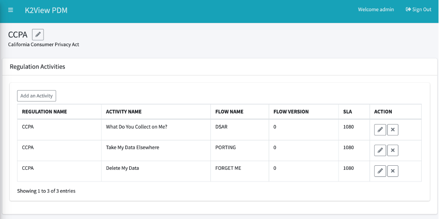

# Regulations and Activities 

The Regulation menu option is used in order to define and maintain the list of Privacy-related Regulations which are handled by the DPM system and the Activities each of the Regulations includes.
Click the Regulations List menu option on the menu in order to access the list of Regulations.

## Regulations list

The Regulations screen presents the list of Data Privacy Regulations that the company is committed to comply with. 

 

From this screen, the user can:

- View the details of a specific regulation by clicking the line of this regulation in the table.
- Add a Regulation by clicking the Add a Regulation button or by using the left bar menu option.
- Remove a regulation by clicking the remove button under the “Action” column.

## View Regulation Details

When selecting one of the regulations, a screen in presented with the list of Activities that are already defined for this regulation.

 

In this screen the user can:

- View the list of Activities for the selected Regulation. For each Activity, the high-level information about the Activity is presented, including the name of the Flow that is used to fulfill the Activity, the version of this flow that is in use, as well as the SLA of this Activity, indicated as number of hours.
- Access the “Edit Activity” screen of the selected Activity or remove the selected Activity, by using the “Edit” and “Delete” icons under the “Action” column
- Add an Activity, using the button on the left upper side of the table.
- Edit the Regulation name and description by using the Edit icon next to the regulation name. 

## Activity Details

When selecting one of the lines in the Activities table, or by using the “Edit” icon, the system presents the “Edit Activity” pop-up screen. 

 

In this screen the user can:

- Change the name of the Activity.
- Change the flow that is used to fulfill the request, by selecting from the drop-down list of the available flows (only flows that were finalized are presented).
- Add a new flow – using this button the user is taken the “Create a new flow” screen. 
- Update the flow version. If the option “latest” is selected, then every time a new version of the selected flow is marked as “finalized” the Activity will be automatically updated to use this latest flow.
- Update the Activity SLA, in hours.

Any update done on the Activity impacts only requests from the update moment forward. Requests that were already submitted will maintain the previous parameters. 

## Add an Activity

In order to add a new Activity to a Regulation, Select the Regulation from the Regulation screen, and then click the “Add an Activity” button on the “Regulation Activities” screen. 
The pop-up screen that is presented is the same as the one used for “Edit and Activity” in the chapter above. 

