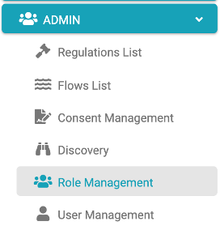
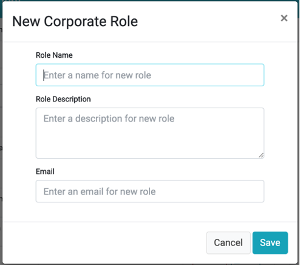
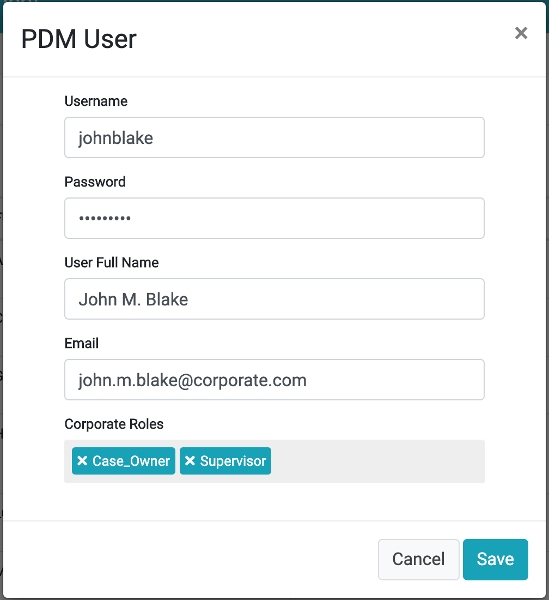

# Roles management

## Roles management Overview

The DPM is a role-based application. Each user is associated with one or more roles. The role determines the Activities the user can perform in the system.
The roles are structured in two layers: 

- DPM Application Roles – each application role includes a set of DPM functionality that a user can perform.
- Corporate Roles – Configurable roles defined by the corporate to represent the corporate organizational structure for the DPM users. Each user that should take part in one of the DPM Activities, should be first assigned to a Corporate role. 

For a user to be able to perform a specific Activity in the DPM, the user should be assigned to a Corporate Role that has enabled the Application Role where this Activity is included. 

 

Upon login, the system identifies the user’s corporate role and the DPM Application Role associated with it. The user will get access only to the functionality allowed for his role.
The Admin module allows the DPM Administrator to define the relation between the users, corporate defined roles and the functions they assume in the DPM system. 

## DPM Roles

### Overview

The DPM roles define the functions within the DPM which are enabled for each user:

- Admin users: Those are the users responsible to configure the flows that should be executed in each Data Subject Request. An Admin user can perform all the Activities that are part of the Admin module, such as:

  - Define Regulation and the Activities it includes.
  - Create or update flows, including their stages and tasks.
  - Manage corporate roles and assign users to corporate roles.
  - Map between corporate roles and the DPM functions.

- Customer Service Representative (CSR): a CSR is a call center representative attending customer requests by submitting a Data Privacy related request on their behalf. A CSR can:

  - Submit a new request.
  - Inspect the details of an existing request, without changing its details. 

- Data Steward: data stewards are users that are a part of the Request fulfilment process and are responsible to execute a specific task in the request flow. Data steward can:

  - View the list of open tasks that should be handled by the group of stewards he is a part of.
  - Mark a task as assigned to him to avoid other stewards from working on the same task
  - Review, Update, or approve a task in order to move it to the next step
  - Release a task that is assigned to him

- Case Owner: Each customer request that is submitted in the DPM is assigned to a specific case owner. The role of the case owner is to follow up on the request progress and assure it is being completed within the expected SLA. A case owner can:

  - View the list of requests and filter them to identify risks of missing the SLA
  - Open a specific request and view or complete its stages, tasks. 

- Supervisor: The supervisor is a user that is responsible to manage the allocation of requests to the case owners.

  - Access the dashboard menu and review overall view of the requests
  - Define the criteria for the allocation of requests to Case owners.  

- Customer: Data Subject Requests can be submitted directly by a customer. A customer can:

  - Create a new request
  - Search for his requests 
  - Check the status of his requests
  - Review the data provided as an output of a completed request

  The DPM roles are predefined in the system. Each of them includes the set of screens and actions that are relevant for the role it represents. DPM roles are used by the Administrator in order to grant a specific corporate group the ability to view or execute actions in the DPM system. The way those roles are used is explained in the next section about the Corporate roles. 

## Corporate Roles

### Overview

Corporate Roles represent the roles defined by the company. Those roles represent the different groups that take part in the DPM processes. Corporate roles are fully configurable, and each corporate defines them according to its own organizational structure. 
Corporate roles are configured by the DPM Administrator by accessing the Role Management menu option.

 

The “Corporate Roles” screen is displayed. It presents the list of the corporate role in the screen center. 
When selecting one of the corporate roles, the right side of the screen displays the DPM Application Roles that are enabled for this Corporate Role. 
For example – take a user that belongs to the “Legal Fulfilment” group and is responsible to work on Tasks as part of the fulfilment process. Performing a Task is defined as part of the Steward Application Roles. So, for the user to be able to perform a Task, the DPM Administrator should:

1. Create a Corporate Role to represent the Legal team, called “Legal” in the below example
2. Mark that this Role can perform the actions that are grouped under the “Steward” DPM Application Role (on the right side of the screen).
3. Assign the user to the corporate Role “Legal” (user management is detailed in the next section).

 

If a more detailed authorization definition is required, the Administrator can expand the options that appear under the selected Application Role, and specify with more details what are the actions that the users from this corporate role can perform:

 

In the screen example above, the Corporate Role called “Marketing” was assigned the “Steward” Application Role but will not be allowed to add a note to a Task or Release Ownership of a Task.
Each Corporate Role can have multiple Application Roles enabled. This means that the users assigned to this Corporate Role will be able to perform actions or view information that were defined as part of all of the enabled Application Roles. 
The main menu on the left side of the screen is constructed based on the list of Application Roles that are enabled for the Corporate Roles the user belongs to. You can find more details about the menu options that are presented to each user in the DPM Main Menu chapter below. 

### Add a new Corporate Role

To create a new Corporate Role, use the    option at the top of the Role Management screen.
The “New Corporate Role” screen is presented:

 

<table>
<tbody>
<tr>
<td width="85">

<strong>Property</strong>

</td>
<td width="30">

<strong>M/O</strong>

</td>
<td width="785">

<strong>Description</strong>

</td>
</tr>
<tr>
<td width="85">

Role Name

</td>
<td width="30">

M

</td>
<td width="785">

The Corporate Role name.

</td>
</tr>
<tr>
<td width="85">

Role Description

</td>
<td width="30">

O

</td>
<td width="785">

The Corporate Role description.

</td>
</tr>
<tr>
<td width="85">

Email

</td>
<td width="30">

O

</td>
<td width="785">

The mail or distribution list for the corporate role. This email address is used when a Task reminder is being configured and the user selects the corporate role as the reminder target mail. &nbsp;

</td>
</tr>
</tbody>
</table>

Once the user completed and saved the new Corporate Role, the new Role appears in the list of roles at the center of the screen. 

## Mapping Configuration Role to Application Role

The next step after creating a Corporate Role is to define the mapping to GDPR Application Roles assigned to it, and under each Application Role, what screens and actions this Corporate Role can view or perform. 
In order to perform this configuration:

1.	Select the Corporate Role line on the central part of the screen. As a result, the right side of the screen will present a tree of options that allows the mapping to the application roles this group should have
2.	Define the configuration by ticking or unticking the check-boxes options on this tree. 
3.	Save the configuration using the Save button at the bottom of the screen.

 

In the example above, the “Backend” Corporate Role is selected from the list of Corporate Roles. The right side of the screen presents the mapping of this “Backend” Corporate Role to the list of Application Roles it can use. 
At the highest level (first level of the tree), the checkboxes of “Representative” and “Steward” are ticked. This means that the “Backend” Corporate Role is configured to have the functionality of Representative and of Steward. A user that belongs to the “Backend” Corporate Role will have only those two options on the main menu on the left side of the screen (more about that in the Main Menu chapter). 
As you can see, the tree of permissions has multiple levels, which allows controlling the Activities a user can or cannot perform. For example, at the screen above, the option “Submit a new Request” under the “Representative” branch was unticked. This means that though the user will have the option to use Representative functionality such as View the request list, or view specific request, he will not be able to submit a new request.  

## Edit or Delete a Corporate Role

Use the    button to delete a Corporate Role. The deletion of the Role will remove it from all the users that has it assigned to them. 

Use the   button to edit the Email address of a Corporate Role.  

## Managing Users in the Admin module

For a person to be able to access and perform Activities in the DPM, a User must be defined for this person in the DPM system, and this user should have a Corporate Role assigned to it. 
Enter the User Management menu option under the Admin menu in order to manage the users and privileges for the DPM system. 

 

The list of existing users is displayed. For each user, the user ID, username and email are presented. In the Corporate Role column, the list of Corporate Roles that were assigned to this user is presented. Each user can have multiple Corporate Roles, and the functionality this user will be able to perform is a sum of all the options that are enabled under each of the roles assigned.

## Create a new user

Use the   button in order to add a user to the system. The system presents the “Create New User”:

 

<table>
<tbody>
<tr>
<td width="85">

<strong>Property</strong>

</td>
<td width="30">

<strong>M/O</strong>

</td>
<td width="785">

<strong>Description</strong>

</td>
</tr>
<tr>
<td width="85">

Username

</td>
<td width="30">

M

</td>
<td width="785">

The User unique identification

</td>
</tr>
<tr>
<td width="85">

Password

</td>
<td width="30">

M

</td>
<td width="785">

Defines the password used to enter the system. This field is presented only in the new user screen.

</td>
</tr>
<tr>
<td width="85">

User Full Name

</td>
<td width="30">

M

</td>
<td width="785">

The name this user will be represented in the system.

</td>
</tr>
<tr>
<td width="85">

Email

</td>
<td width="30">

O

</td>
<td width="785">

The mail of the user. This email address is used when a Task reminder is being configured and the user selects the user itself as the reminder target mail.&nbsp;

</td>
</tr>
<tr>
<td width="85">

Corporate Roles

</td>
<td width="30">

O

</td>
<td width="785">

This field is where the assignment of Corporate Roles is defined for the user. Click on the field to open the drop-down list of all roles and select one or more of those roles.

</td>
</tr>
</tbody>
</table>

## Edit or Delete a User

Use the   button to delete a User. 
Use the   button to edit the name, Email address and Corporate Roles of a User.  

