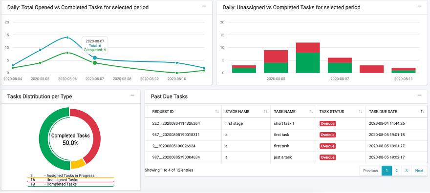

# Steward User Interface

A Steward in the DPM system is a user that is responsible to handle the execution of specific Tasks as part of the fulfillment process. Stewards are assigned a specific Corporate Role, which determines what type of Tasks they will perform.
In high level, the way the system decides which Task should be executed by which Steward is based on the Corporate Role that was selected when a Task is configured, and the Corporate Role of the Steward: each Steward is assigned to a Corporate Role. Each of the Tasks in the definition of a Flow has a Corporate Role defined as well. When a new DPM Request is created, and the Request fulfillment process reaches to a Task that should be handled by a Steward, this Task will appear to the Steward in the Tasks List screen if the role of the Task and the Role of the Steward are matching. 
A user that has Steward privileges will see the following menu options upon login:

Dashboard

Task List

## Steward Dashboard

The Steward Dashboard screen consolidates all the information that is important for a Steward in order to obtain an overview of the current status of the Tasks allocated to his Role, and to take actions accordingly. 

 

### Steward Dashboard Filters:

The graphs in the dashboard can be filtered based on a set of parameters that appear a at the upper part of the screen. The filters can be:

- Regulation – Filter the information presented in the dashboard to Requests of a specific Regulation.
- Activity - Filter the information presented in the dashboard to Requests of a specific Activity.
- Assigned To – Permits the Steward to select if to apply a filter in order to see only the Tasks assigned to this Steward or if to see all Tasks that are allocated to the Role this Steward holds.
- Data Range – this filter defines the date range that is used to filter the Tasks 

 

The selection made in those filters impacts the information presented in the totals and graphs of the rest of the dashboard.

### Steward Dashboard Totals:

The totals in the dashboard reflect the list of Tasks that matches the selection criteria specified by the dashboard filters.

- Total Number of Tasks – the total number of Tasks in the selected period. 
- Completed Tasks – The total number of Tasks that were completed in the selected period
- Assigned Tasks in Progress – Tasks in progress that are already assigned. If the filter “Assigned to” was set to “All Team Tasks” then this total includes all of the assigned Tasks to the corporate role team of the Steward. If this filter is set to “Tasks Assigned to Me” then only the Tasks directly assigned to the Steward are included.
- Unassigned Tasks – total of Tasks in the selected period, that are not assigned to any steward.

 

Clicking on any of those Totals takes the user to the list of Tasks this total represents. 
The total number of Tasks (leftmost total) is the sum of the three totals to its right.

### Steward Graphs:

- Daily: Total Opened Vs. Completed Tasks for selected period – This graph compares, for the filter conditions, the number of the Tasks that were opened in any given day of the selected date range, with the number of Tasks that were closed in the same period.
- Daily: Total Unassigned Vs. Completed Tasks for selected period – This graph compares, for the filter conditions, the number of unassigned Tasks that were opened in any given day of the selected date range, with the number of Tasks that were closed in the same period.
- Open Requests per Selected Date Range – this graph shows the distribution of the open requests according to the request submission date. The graph indicates the number of open Requests, as well as how many of those requests have at least one Task that is overdue.

 

## Tasks List

The Tasks List screen presents the Tasks that are allocated to the Corporate Role of the specific Steward. 

 

At the top of the screen, filters allow the user to search tasks that answer specific criteria.
The filters are:

- Regulation – filter according to a specific Regulation
- Activity Name – filter according to a specific Activity. This filter can be used only if a Regulation was selected in the Regulation filter, and the dropdown list presents the Activity list according to the Activities of the selected regulation.
- Task Status – filter by the Task status, for example – Completed or In progress.
- Role – the name of the Corporate Role that should perform the Tasks.
- Assignment – this filter allows the Steward to view in the list only the Task assigned to him, or to view Tasks assigned to other stewards of the same role, or Tasks that are not yet assigned. 
- Request ID – used in order to search for a specific request ID. 

Once the Tasks List is presented, the Steward can perform the following actions on the task:

- Get – this action assigns the task to the steward. The “Get” action is enabled only if the Task is not yet assigned to any user.
- Release – If a Task is assigned to a Steward, he can release it using this button. The Task then returns to the Unassigned status.

- Open the Task Details screen, by clicking on the Task line itself.

## Executing a Task

A Task can be executed by any of the Stewards sharing the same Corporate Role. 
In order to perform a Task, the Steward should first pick up the Task from the pending task list and assign it to himself by clicking the   button, that is located at the end of this Tasks row in the table.
As a result, the Task Details screen is opened for this Task, and this is where the Steward can perform the actions needed to complete the Task, as explained in the next chapter.
An alternative way for the user to “Get” a Task is by clicking the row of this Task from the list, which opens the Task Details screen (described next). This screen also includes the “Get” buttons and the user can assign the Task to himself directly in this screen.

## Task Details

The Task Details screen is where the Steward can view the task details, add notes and mark a task as complete. 

 

In this screen, the Steward can add notes to the Task, and if the Task is assigned to him, then he can use the “mark as complete” to complete the Task. If the Task is unassigned, he can also use the “Get” button on the top of the screen to take ownership on the Task.  

<table>
<tbody>
<tr>
<td width="100">

<strong>Field</strong>

</td>
<td width="800">

<strong>Description</strong>

</td>
</tr>
<tr>
<td width="100">

Request ID

</td>
<td width="800">

The unique identification of the request.

</td>
</tr>
<tr>
<td width="100">

Regulation

</td>
<td width="800">

The Regulation that this request was created for.

</td>
</tr>
<tr>
<td width="100">

Activity

</td>
<td width="800">

The Activity that this Request executes.

</td>
</tr>
<tr>
<td width="100">

Task Status

</td>
<td width="800">

The Task status.

</td>
</tr>
<tr>
<td width="100">

Assigned To

</td>
<td width="800">

Indicates the user that this Task is assigned to. Filled only for assigned Tasks.

</td>
</tr>
<tr>
<td width="100">

Task Completed On

</td>
<td width="800">

The date and time that the Task was completed. Filled only for a Task that was already completed.

</td>
</tr>
<tr>
<td width="100">

Task Name

</td>
<td width="800">

The name of this Task.

</td>
</tr>
<tr>
<td width="100">

Task Description

</td>
<td width="800">

The Description of the Task.

</td>
</tr>
</tbody>
</table>

The actions that can be done in this screen: 

- Add a Note - The Steward and Case Owner can both add notes to a Task.  To add a note, type the text in the textbox next to the button, and then click the “Add Note” to submit it. The notes appear at the textbox just below the “Add Note” line, in chronological order.
- Get or Release a Task – use the     buttons to either “Get” a Task or “Release a Task. Getting a Task is enabled only if this Task is not yet assigned to another user. Releasing a Task is only enabled if the Task is assigned to the user currently viewing the screen. Both buttons are disabled if the Task is not expecting to be executed (for example, the Task was already completed, waived or not yet ready for execution since the Flow had not yet reached the point where it should be executed).
- Mark a Task as Complete: if the Task is assigned to this user, then this user can mark it as Complete by using the    button. Naturally a Task should be marked as complete after the user had performed the action that is expected in this Task. 
- Close the screen – the button   will close the screen of the Task and present to the user again the Task List screen.

Information about the overall Flow of the Request is provided to the user in the progress bar: 

In this bar, the Stages of the Flow that were already completed appear in green, the current Stage of the Request appears in blue if it is on track and in red if it is past due. The Stage that the specific Task you are looking at makes part, is marked with two black lines. 
In the example above, the Stages of “Case Opening”, “Data Collection” and “Data Review” were already completed. The Flow is currently at one of the Tasks that comprise the “Review and Approve” Stage. The Task which screen the user is viewing makes part of the “Data Review” Stage.

