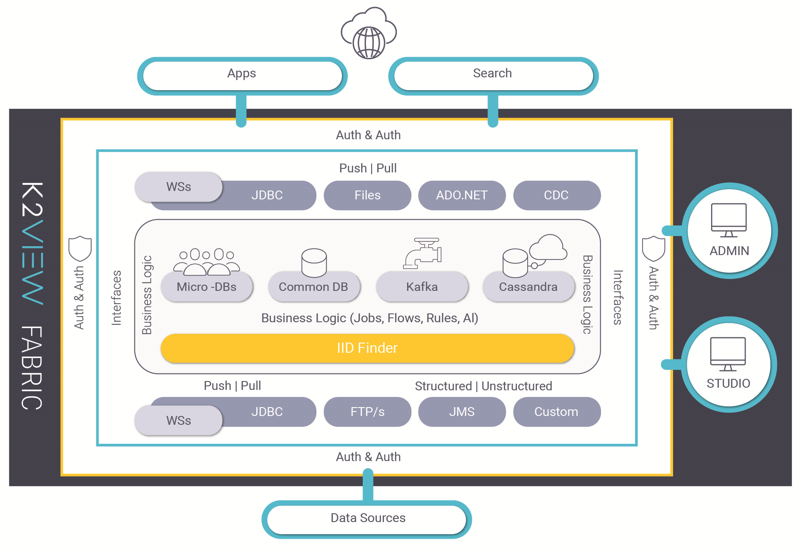
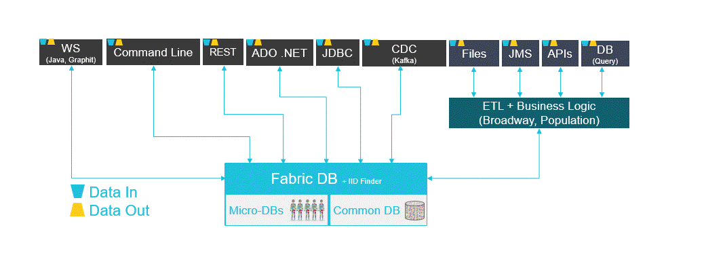

# Fabric Architecture Overview
The following topics are discussed in this section:

1. [Fabric Systems Overview](/articles/02_fabric_architecture/01_fabric_architecture_overview.md#1-fabric-systems-overview).
2. [Fabric Server Main Components](/articles/02_fabric_architecture/01_fabric_architecture_overview.md#2-fabric-server-main-components).
3. [Data Flow](/articles/02_fabric_architecture/01_fabric_architecture_overview.md#3-data-flow).
4. [Search](/articles/02_fabric_architecture/01_fabric_architecture_overview.md#4-search).
5. [Security](/articles/02_fabric_architecture/01_fabric_architecture_overview.md#5-security).
6. [Resiliency](/articles/02_fabric_architecture/01_fabric_architecture_overview.md#6-resiliency).

## 1. Fabric Systems Overview
Fabric can be viewed as a distributed, business-entity-centric data management system, designed to get, store, transform and expose data for real-time operational needs.

Fabric takes ownership of the E2E data lifecycle, including:
- Data discovery, modelling and curation.
- Data acquisition and synchronization.
- Data validation, aggregation, enrichment, matching, masking, cleansing and transformation.
- Data storage, distribution, replication and encryption.
- Data exposure.

By storing the data in Fabric, it becomes more available to its consumers. It also reduces the load on systems of records and removes dependency, costs and time on legacy applications, their vendors and installation. The result is a move from a vendor data structure to a business data structure, freeing the data from application silos and moving to a data-driven architecture.

Data warehouses and data lakes are a good solution for big questions like the average invoice amount of all customers in a specific state over the last 3 months. They also are the right choice for BI, Analytics, ML/AI Training and so on. However, due to amount of data required to be scanned to get the data about one customer which generally resides in different servers, both solutions are  the wrong choice for answering multiple complex questions about one customer in real-time. They are also definitely the wrong technology / architecture to do this for multiple customers simultaneously. 

Fabric solves the following high-level requirements:

- Asking any question on a business entity (e.g. a customer), even if its data resides in tens or hundreds of applications.
- Getting updated data in milliseconds.
- Creating SQL queries.
- Always available data.
- Data that is as close as possible to the data consumers.
- Always secured data.

Fabric does all this using a patented approach for storing, syncing and securing data. For more information, refer to [What is Fabric](/articles/01_fabric_overview/01_what%20is%20fabric.md) and the [Logical Unit Overview](/articles/03_logical_units/01_LU_overview.md). 

## 2. Fabric Server Main Components

Fabric relies on a resilient architecture and a strong set of 3rd party technologies widely used across the industry. To ensure scalability, quality of service and resiliency, Fabric has been engineered as a set of layers, each designed to address a different part of the overall data flow.

### 2.1 Fabric Storage

Fabric uses three types of storage engines:

#### 2.1.1 MicroDB
At the core of Fabric storage, Fabric creates and maintains a MicroDB ([Logical Unit](/articles/03_logical_units/01_LU_overview.md)) for each business entity instance. A MicroDB is an SQLite file that supports everything out-of-the box provided by SQLite.

A MicroDB provides several advantages:

- Encapsulation of ALL data of a single business entity (like a customer) in one place so that consumers can ask any question about data usually residing in many different data sources.
- Holding the data of only one business entity, they are very small and can be stored in RAM and provide unparalleled query performance.
- Individual encryption at MicroDB or field levels.
- Using SQLite, they offer standard SQL operations.
- No business impact whereby providing continued availability of data during major structural modifications.  

    
#### 2.1.2 CommonDB
The CommonDB is an additional SQLite database schema used for storing [reference tables](/articles/22_reference(commonDB)_tables/01_fabric_commonDB_overview.md) common to all MicroDB. For example, a table storing a list of objects to which all MicroDB schemas point to. In a distributed system, one copy of each reference table is stored on each node. Fabric handles their [synchronization](/articles/22_reference(commonDB)_tables/04_fabric_commonDB_sync.md) across nodes. 

The CommonDB is always made available for queries in every Fabric session. This enables writing JOIN clauses between Common tables and any MicroDB using one SQL query only.

#### 2.1.3 Cassandra
Fabric uses Cassandra for three main purposes:

- Storage of all MicroDB (LUI) as compressed blob chunks.
- Fabric application management database.
- General data-store for any project need.

[Click for more information about Cassandra Keyspaces for Fabric.](/articles/02_fabric_architecture/06_cassandra_keyspaces_for_fabric.md)

### 2.2 Fabric Business Logic

This module is responsible for all transformations and data manipulations and is where Fabric solves business functions that are applied on the data imported from external sources and stored locally.

### 2.3 Fabric Studio

Fabric Studio is a development tool for building Fabric projects, designed to enable users to execute the following steps:

- Create interfaces to external sources.
- Design LU and Schemas and create their associated instances.
- Create resources of all types to be used across a project (such as functions, tables, variables).
- Execute data manipulations using the SQL builder or the integrated Java IntelliJ development environments.
- Create REST APIs to access your data model.
- Design data flows.

[Click for more information about Fabric Studio.](/articles/04_fabric_studio/01_UI_components_and_menus.md)

## 3. Data Flow
### 3.1 Overview
Data flows in and out of Fabric via multiple types of interfaces and data formats. Fabric users can use multiple configurations between their data-supplying and data-subscribing systems. Connection flexibility is essential for Fabric to integrate data spread across multiple databases and datacenters, to generate its uniquely patented Digital Entities, to allow any type of data transformations as per required by the business flow design and to expose the data to third-party systems. Both data push and data pull modes are supported between Fabric and any external systems.   

### 3.2 Fabric Data Access Layer

The following discusses the protocols and standard interfaces through which data can be injected from external sources into the Fabric DB (MicroDB or commonDB). Conversely, these same interfaces are used so that Fabric data can be published or accessed by 3rd party systems.

#### 3.2.1 Standard DML via JDBC or ADO.NET
Fabric provides standard JDBC and ADO.NET drivers to execute queries and data manipulation statements (SQL/DML) from any external JVM or .NET process.
A user / application can connect to Fabric via JDBC or ADO.NET, open a transaction and use standard INSERT, UPDATE and DELETE commands to modify data stored in Fabric. This same interface can also be used to run SQL SELECT queries to retrieve data.

#### 3.2.2 REST API and Web Services
External sources can also read and write data using standard [REST Web Services](/articles/15_web_services_and_graphit/01_web_services_overview.md), enabling direct CRUD operations into LUIs and commonDb residing in Fabric storage.
Conversely, Fabric can expose LUI MicroDB or commonDB objects to external queries using a REST API configured, generated and published by the user. These API functions can be invoked either by 3rd party systems or directly from any web browser. A Web Service is defined as a function that needs to be deployed to the K2View Fabric server.

#### 3.2.3  CDC (Change Data Capture) using Queue Messaging
Fabric supports real-time, inbound data updates via Queue Messaging interfaces. Fabric's [Change Data Capture (CDC)](/articles/18_fabric_cdc/01_change_data_capture_overview.md) solution then notifies external systems about any LUI data changes published via the queue messaging interface. 

Any update occurring on the MicroDBs will trigger a [CDC message](/articles/18_fabric_cdc/03_cdc_messages.md) onto the queue, allowing subscribing 3rd-party systems to stream the MicroDB updates.

#### 3.2.4 Manual/Scripted Input
External data can also be injected into the FabricDB via [standard commands](/articles/02_fabric_architecture/04_fabric_commands.md) that are available in the Fabric Console application.

#### 3.2.5 Fabric Triggers

Fabric can activate triggers upon MicroDB change (such as insert, update, or delete) in the following cases once:

- CDC fields have been added to LU tables.
- Trigger functions have been attached to LU tables.

Any change occurring on the LU tables will then activate a trigger and Fabric will either send a CDC message or activate the (trigger) function.

### 3.3 Fabric ETL Layer

When data needs to be processed before being stored or exposed, it goes through the Fabric ETL and business logic engine. Data can be processed and transformed in accordance with the user-defined business requirements using one of the many Fabric flow management systems.
Fabric uses UTF-8 as the default encoding that can be changed in the JVM options (not recommended). 

#### 3.3.1 Protocols
**3.3.1.1 Files:**

Data can be captured via SFTP or any other transfer protocol and/or streaming service. Standard file types such as JSON/XML/CSV can be parsed and injected. Users can also easily introduce new formats.

**3.3.1.2 Queue Messaging Services (QMS):**

Fabric allows subscription to queue messaging systems to stream-in data using services such as Apache Kafka, JMS and RabbitMQ. Fabric can then step-in and apply transformations and logic to incoming events.

**3.3.1.3 APIs:**

Fabric can consume external APIs such as Web Services, Soap and Java Libraries through which data can be obtained and populated into the Fabric storage engine.
APIs can also be invoked as part of flows inside the ETL/Business Logic layer.

**3.3.1.4 DB Query:**

By default, Fabric supports any [connection to any database](/articles/05_DB_interfaces/03_DB_interfaces_overview.md) supporting a JDBC driver. If not supported in Fabric&#39;s standard interface types module, users can define new DB types in accordance with the database and its JDBC driver specifications. Fabric can also be extended programmatically to invoke proprietary drivers or interfaces.

#### 3.3.2 Data-processing & Business Logic
This section discusses the types of transformations used by the business rules and flows created by users depending upon project requirements.

**3.3.2.1 Data Pre-processing:**

Different projects have different data processing needs, for which Fabric offers a range of built-in functions and libraries, that can be invoked either individually or collectively:

- Data anonymization: Fabric provides a [masking process](/articles/02_fabric_architecture/01_fabric_architecture_overview.md#5-security) that can be used to anonymize data for R&amp;D or QA purposes.

- Data cleansing: Fabric can be set up to retrieve (from external sources) only the data necessary to populate LUI while disregarding any data that is not relevant to a project's implementation.

- Data transformation: Fabric provides a large set of functions needed to execute data transformations. This set can be extended by combining existing functions or by adding functions using Java or JavaScript.

- PII discovery: A built-in set of libraries enabling sensitive data discovery such as Personally Identifiable Information, especially useful for enforcing GDPR or CCPA compliancy.

- Data reconciliation, comparing and matching: Fabric analyzes the collected data to decide which data to keep or to discard, depending upon whether the data is trustable. This process can also use Machine Learning algorithms to decide which data set is more trusted when comparing similar entries from multiple tables or DBs.

**3.3.2.2 Data Processing Modules:**

Data can be processed in six different modules:

- Synchronization process: 
As part of on-demand or initial load data synchronization using Fabric&#39;s population object, the [Sync process](/articles/14_sync_LU_instance/01_sync_LUI_overview.md) uses LU schemas defined in the Fabric Studio to create or update the MicroDBs (LUIs). When synchronizing multiple Digital Entities, Fabric invokes a migration process (distributed parallel sync) for a list of LUI.

- IIDFinder:
Since Fabric creates Digital Entities by extracting data from multiple sources and then by populating and transforming the data into [LUI tables](/articles/06_LU_tables/01_LU_tables_overview.md), changes occurring at a source level must be reflected to the LUI tables fields. The iiDFinder process manages the deployment of incremental updates as soon as a change in the data source is detected via notification systems like Oracle Golden Gate and/or queue messaging services.
In environments where source data constantly changes, Fabric enables a lazy mode, whereby the iiDFinder retrieves the delta updates upon explicit demand from the user.

- Data Enrichment:
Users can enrich data using [built-in functions](/articles/07_table_population/07_fabric_built_in_functions.md) or adding to them using Java / JavaScript code designed to transform data according to business requirements.

- Jobs:
Where all async recurring or scheduled actions happen, enabling users to run Fabric functions according to a predefined schedule. Once set up by the user, Fabric  creates asynchronous tasks (running threads) that execute specific commands, Broadway flows or Java code at specific dates and times. Jobs can be used to collect data from structured DB or any files (HTTP), streams, message queues.

- Broadway:
Fabric&#39;s data and business flow management system ([Broadway](/articles/19_Broadway/01_broadway_overview.md)) enables implementers to define, orchestrate and run complete flows of data manipulation and tasks. It provides a work environment that unifies data and execution flows under the same framework. 
Broadway enables you to graphically render your business and data flows and modify them with a set of visual and draggable elements each acting as a function, source or target.

- Graphit&#39;s APIs Generator:
[Graphit](/articles/15_web_services_and_graphit/17_Graphit/01_graphit_overview.md) is a Fabric utility used to dynamically generate CSV, XML and JSON documents. It is useful for the design and generation of [Fabric Web Service](/articles/15_web_services_and_graphit/01_web_services_overview.md) customized responses whose content is formatted during its execution according to specific parameters pertaining to the Web Service calls and the LUI in use.

## 4. Search

### 4.1 Search Engine

Since data is spread across multiple MicroDB, Fabric provides an indexing process that is run during data synchronization phases. This enables users to execute queries on indexed fields across any number of LUIs.

### 4.2 Elastic Search

Via its CDC module, Fabric can use E-S to store its indices and provide a distributed, [multi-tenant](https://en.wikipedia.org/wiki/Multitenancy) capable [full-text search](https://en.wikipedia.org/wiki/Full-text_search) engine for near real-time results across its huge number of LU MicroDB instances.

## 5. Security

Since Digital Entity data encapsulation architecture provides a very strong case for data protection (each LUI lives as a separate entity), Fabric is basically secured by-design. Yet Fabric adds to its arsenal a wide range of security tools, layers and practices to ensure the protection of your data.

### 5.1 Authentication &amp; Authorization Engine

This module manages access rights, authentication and authorization of users, Web Services or any other entities interfacing with Fabric by monitoring all in-bound interface connections and securing external requests with web tokens and decryption capabilities.

### 5.1.1 Fabric Tokens Encryption

Fabric relies on end-to-end encryption for API requests and for generating SSL-based tokens.

Fabric uses secured [tokens](/articles/26_fabric_security/05_fabric_webservices_security.md#tokens) to enable the execution of Web Services requests. Users can also define different roles and assign each role to a specific token. All tokens are encrypted before they are saved into Cassandra. Note that for the purpose of developing or testing , non-secured tokens can be generated.

### 5.1.2 JWT Tokens

For additional security, Fabric can accept JWT (JSON Web Token) signed externally by a shared secret.
[Click for more information about Fabric Credentials.](/articles/17_fabric_credentials/01_fabric_credentials_overview.md)

### 5.1.3 Identification, Authentication and Authorization Management 

Fabric provides user identification and access management (IAM) for web, console and web-services access, either using Fabric local repository or by using your organization's Identify Provider.
To read more about Fabric's Identity Management architecture, flows and systems' configuration (e.g. using Fabric internals, SAML or LDAP protocols), click [here](/articles/26_fabric_security/07_user_IAM_overview.md).

### 5.2 MicroDBs (LUI) Encryption

Fabric secures the schemas and instances generated whenever a new LU is created. The encryption process relies on a combination of the LU type, LUI and the master key generated for each LU.

The master key (AES-256) generated by Fabric is split into multiple bytes. Each byte is stored in a separate record in a dedicated Cassandra table. Using Cassandra distribution data logic, each node stores only part of the master key. In addition, a master key rotation scheme, allows users to regularly change the master key. New LUIs are encrypted with the new key, while previous ones are re-encrypted with the new key during the next synchronization.
Fabric encrypts each LUI using the AES-256 in an OFB mode encryption algorithm and a combination of the LU name, LUI ID and master key. As a result, Fabric creates a different key for each Instance ID, since each Instance ID has a different value. Therefore, in the improbable event that an LUI is breached, other entities  remain safe since they have each been encrypted with their own secret key.
To reduce load and improve compression, specific fields of an LUI can be encrypted rather than the entire instance.

### 5.3 Environment Encryption

Users can define a number of environments for source connectivity according to their specific needs and switch between the environments within the same Fabric session. By default, Fabric encrypts the interfaces details of each environment using the same master key used to encrypt LUI. If necessary, users can re-key all interfaces that belong to a given environment. If the connection details of any interface in an environment are modified, the updated connection details are re-encrypted. Fabric also encrypts the interfaces details of each environment using the same master key used to encrypt LUI. Once the data is store in Fabric it is used for connectivity and is not available for querying by external APIs.

### 5.4 Masking Algorithm

To protect your company&#39;s data, Fabric's masking service creates a structurally similar but  unauthentic version of your data that can be used for development, integration or testing purposes.

## 6. Resiliency

### 6.1 Fabric Cluster

Fabric relies on Cassandra distributed storage to store the massive amount of data pertaining to the LUIs generated by data retrieved from external data sources and potentially transformed by Fabric data processing modules. Fabric also provides strong capabilities to publish data to external third parties. To this effect, Fabric can be configured as a cluster constituted of multiple nodes spread over multiple datacenters and therefore provide boosted accessibility levels to Fabric for any 3rd parties issuing inbound data queries.
These configurations allow unparalleled flexibility whereby the DevOps Manager responsible for Fabric configuration, can decide to adapt the number of Fabric nodes according to the demand at any given time, and also increase or reduce the number of Cassandra nodes depending on the quantity of storage needed for the LUIs.

