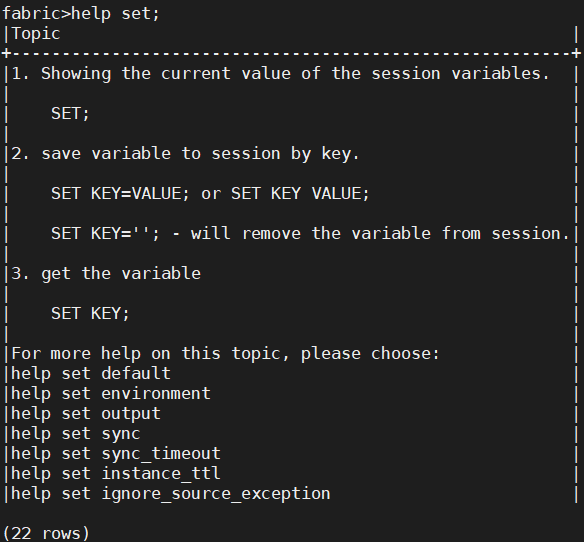
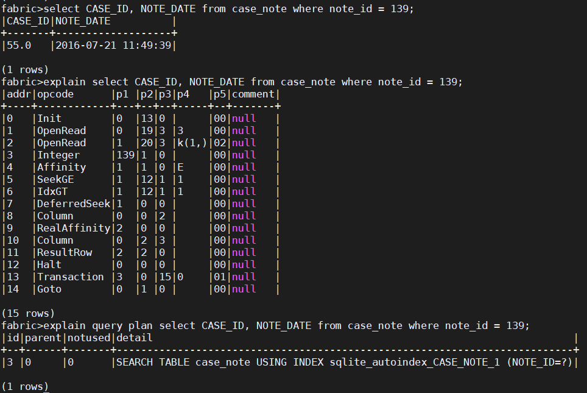

# Fabric Commands

Fabric includes a number of commands for viewing Fabric configurations, updating Fabric settings and running Fabric processes. Fabric commands can be executed from either the Fabric console or via the user code (project implementation) that invokes Fabric commands in the [execute() and fetch() methods](/articles/05_DB_interfaces/09_fabric_API_for_DB_interfaces.md#execute-fabric-command).

Fabric commands are **not** case sensitive. For example, a Get, get, or GET command are all equivalent.

In this document, we write commands in ALL CAPS when describing the commands in general, and in small type when quoting a command line example. This is done for clarity purposes only. You can type the commands in whatever type is convenient for your purposes, but it is a good practice to keep the manner of typing commands consistent. 

## Fabric Help

After [logging into Fabric](/articles/02_fabric_architecture/03_fabric_basics_getting_started.md#login-fabric), type HELP to view a list of available Fabric commands. To view the description and syntax of a specific command, type **help [command name]**.

For example: 



## Fabric Commands - Main Groups

 Fabric commands can be divided into the following groups: 

<table>
<tbody>
<tr>
<td width="350pxl" valign="top">
<p><strong>Command Group</strong></p>
</td>
<td width="550pxl" valign="top">
<p><strong>Group Description</strong></p>
</td>
</tr>
<tr>
<td width="350pxl" valign="top">
<p><a href="#get-commands">Get LUI</a></p>
</td>
<td width="550pxl" valign="top">
<p>Get an <a href="/articles/01_fabric_overview/02_fabric_glossary.md#lui">LUI</a> into Fabric.</p>
</td>
</tr>
<tr>
<td width="350pxl" valign="top">
<p><a href=/articles/02_fabric_architecture/04_fabric_commands.md#delete-lui-command>Delete LUI</a></p>
</td>
<td width="550pxl" valign="top">
<p>Delete an <a href="/articles/01_fabric_overview/02_fabric_glossary.md#lui">LUI</a> from Fabric.</p>
</td>
</tr>
<tr>
<td width="350pxl" valign="top">
<p><a href="/articles/02_fabric_architecture/04_fabric_commands.md#release-lu">Release LU</a></p>
</td>
<td width="550pxl" valign="top">
<p> Detach the <a href="/articles/01_fabric_overview/02_fabric_glossary.md#lui">LUI</a> from the session for a list of LUs or for all LUs.</p>
</td>
</tr>
<tr>
<td width="350pxl" valign="top">
<p><a href="/articles/02_fabric_architecture/04_fabric_commands.md#fabric-view">Fabric View</a></p>
</td>
<td width="550pxl" valign="top">
<p>View Fabric configurations and settings.</p>
</td>
</tr>
<tr>
<td width="350pxl" valign="top">
<p><a href="/articles/02_fabric_architecture/04_fabric_commands.md#fabric-settings">Fabric Settings</a></p>
</td>
<td width="550pxl" valign="top">
<p>Session and cluster levels settings.</p>
</td>
</tr>
<tr>
<td width="350pxl" valign="top">
<p><a href="/articles/02_fabric_architecture/04_fabric_commands.md#fabric-security-and-credentials">Fabric Security and Credentials</a></p>
</td>
<td width="550pxl" valign="top">
<p>Set the Master Key for an LUI or the encryption details of an interface.</p>
<p>Set users, roles and permissions.</p>
</td>
</tr>
<tr>
<td width="350pxl" valign="top">
<p><a href="/articles/02_fabric_architecture/04_fabric_commands.md#fabric-deployment--deploy-and-drop-commands">Fabric Deployment and Drop</a></p>
</td>
<td width="550pxl" valign="top">
<p>Deploy and drop Fabric implementation commands.</p>
</td>
</tr>
<tr>
<td width="350pxl">
<p><a href="/articles/02_fabric_architecture/04_fabric_commands.md#fabric-environments-and-interfaces">Fabric Environments and Interfaces</a></p>
</td>
<td width="550pxl" valign="top">
<p>Deploy environments and test connections on an active environment.</p>
</td>
</tr>
<tr>
<td width="350pxl" valign="top">
<p><a href="/articles/02_fabric_architecture/04_fabric_commands.md#run-queries-on-cassandra">Run Queries on Cassandra</a></p>
</td>
<td width="550pxl" valign="top">
<p>Run CQL queries on Cassandra.</p>
</td>
</tr>
<tr>
<td width="350pxl" valign="top">
<p><a href="/articles/02_fabric_architecture/04_fabric_commands.md#jobs-commands">Jobs</a></p>
</td>
<td width="550pxl" valign="top">
<p>Fabric jobs execution and monitoring commands.</p>
</td>
</tr>
<tr>
<td width="350pxl" valign="top">
<p><a href="/articles/02_fabric_architecture/04_fabric_commands.md#batch-process-commands">Batch Process</a></p>
</td>
<td width="550pxl" valign="top">
<p>Batch processing execution and monitoring commands.</p>
</td>
</tr>
<tr>
<td width="350pxl" valign="top">
<p><a href="/articles/02_fabric_architecture/04_fabric_commands.md#process-control">Process Control</a></p>
</td>
<td width="550pxl">
<p>Check for running tasks and kill a task if needed.</p>
</td>
</tr>
<tr>
<td width="350pxl" valign="top">
<p><a href="/articles/02_fabric_architecture/04_fabric_commands.md#execution-monitoring">Execution Monitoring</a></p>
</td>
<td width="550pxl" valign="top">
<p>Trace Fabric operations and write the results to trace files.</p>
</td>
</tr>
<tr>
<td width="350pxl" valign="top">
<p><a href="/articles/02_fabric_architecture/04_fabric_commands.md#common-reference-tables">Reference Tables</a></p>
</td>
<td width="550pxl" valign="top">
<p>Commands for handling Reference tables.</p>
</td>
</tr>
<tr>
<td width="350pxl" valign="top">
<p><a href="/articles/02_fabric_architecture/04_fabric_commands.md#fabric-transactions">Fabric Transactions</a></p>
</td>
<td width="550pxl" valign="top">
<p>Support transactions to update LUI or Reference table data (Fabric as the System of Record).</p>
</td>
</tr>
<tr>
<td width="350pxl" valign="top">
<p><a href="/articles/02_fabric_architecture/04_fabric_commands.md#cdc-and-search">CDC and Search</a></p>
</td>
<td width="550pxl" valign="top">
<p>Support Change Data Capture (CDC) across all LUI search functionalities.</p>
</td>
</tr>
<tr>
<td width="350pxl" valign="top">
<p><a href="/articles/02_fabric_architecture/04_fabric_commands.md#fabric-broadway">Fabric Broadway</a></p>
</td>
<td width="550pxl" valign="top">
<p>Run Broadway flow.</p>
</td>
</tr>
<tr>
<td width="350pxl" valign="top">
<p><a href="/articles/02_fabric_architecture/04_fabric_commands.md#queries-helpers">Queries Helpers</a></p>
</td>
<td width="550pxl" valign="top">
<p>Use EXPLAIN and EXPLAIN QUERY PLAN to analyze SQL queries on Fabric data.</p>
</td>
</tr>
</tbody>
</table>


### Get Commands

#### Get Instance

The **GET** command is used to get information for a given [LUI](/articles/01_fabric_overview/02_fabric_glossary.md#lui) and to synchronize information from data sources if needed.
Note that multiple LUs can be received using a GET command. However, multiple LUIs cannot be received from the same LU using a GET command. 

The following message is displayed when attempting to get multiple LUIs from the same LU using a GET command:

`Only single instance per LUT can be used on the same GET command.`

The consistency level of the GET LUI command can be set to ONE. If it fails to achieve a QUORUM consistency level, the [sync mode](/articles/14_sync_LU_instance/02_sync_modes.md#sync-modes-1) is set to OFF. To do so, run the following Fabric command on the session:
~~~
SET LUI_READ_ONE_WHEN_FAIL = true
~~~

Note that this command sets the consistency level on the session level. The default value of this parameter is **false**.

The following table lists the GET commands:

<table style="width: 787px;" width="900pxl">
<tbody>
<tr>
<td style="width: 300px;" valign="top">
<p><strong>Name and Description</strong></p>
</td>
<td style="width: 300px;" valign="top">
<p><strong>Syntax</strong></p>
</td>
<td style="width: 300px;" valign="top">
<p><strong>Example</strong></p>
</td>
</tr>
<tr>
<td style="width: 201.613px;" valign="top">
<p><strong>GET</strong> - Retrieves information for a specific <a href="/articles/01_fabric_overview/02_fabric_glossary.md#lui">LUI</a>, or multiple LUIs of different LUs. Fabric checks if the LUI needs to be synced from the source system, syncs the LUI if needed, or retrieves the latest version of the LUI from Fabric.</p>
<p>Setting the PARALLEL parameter to true enables running parallel GET commands on different LU types. Setting this parameter to false disables running parallel GET commands on different LU types. A new parameter STOP_ON_ERROR (added in V6.5.1) supports a GET of several LUIs even if the sync of one LUI fails (when set to false).</p>
</td>
<td style="width: 327.05px;" valign="top">
<p>Get an LUI:</p>
<p>get &nbsp;&lt;LUT_NAME&gt;.'&lt;INSTANCE_ID&gt;'[@&lt;DC&gt;] [WITH [PARALLEL=true/false]] [STOP_ON_ERROR=true/false];</p>
<p>Get multiple instances of different LUs:</p>
<p>get &lt;LUT_NAME&gt;.'&lt;INSTANCE_ID&gt;'[@&lt;DC&gt;], &lt;LUT_NAME_2&gt;.'&lt;INSTANCE_ID&gt;'[@&lt;DC&gt;] [WITH [PARALLEL=true/false]] [STOP_ON_ERROR=true/false];</p>
</td>
<td style="width: 237.938px;" valign="top">
<p>get Customer.1;</p>
<p>- Get the IID 1 of Customer LU.</p>
<p>get Customer.1, CRM.34 WITH parallel=true;</p>
<p>- Get the IIDs in parallel.</p>
<p>get Customer.1, CRM.34 STOP_ON_ERROR=false;</p>
<p>- Get the IIDs even if the GET command of one LUI fails.</p>
</td>
</tr>
<tr>
<td style="width: 201.613px;" valign="top">
<p><strong>GETF</strong> - Retrieves information for a specific <a href="/articles/01_fabric_overview/02_fabric_glossary.md#lui">LUI</a>, or multiple LUIs of different LUs. The instance is returned by an <a href="/articles/07_table_population/11_3_creating_an_LUDB_function.md">LUDB function</a>.</p>
<p>&nbsp;</p>
</td>
<td style="width: 327.05px;" valign="top">
<p>Get an LUI:</p>
<p>GETF &lt;LUT_NAME&gt;.&lt;function name&gt;(arg...)[@&lt;DC&gt;] [WITH [PARALLEL=true/false]] [STOP_ON_ERROR=true/false];</p>
<p>Get multiple instances of different LUs:</p>
<p>GET &lt;LUT_NAME&gt;.&lt;function name&gt;(arg...)@&lt;DC&gt;,&lt;LUT_NAME_2&gt;.&lt;function name&gt;(arg...) [WITH [PARALLEL=true/false]] [STOP_ON_ERROR=true/false];</p>
</td>
<td style="width: 237.938px;" valign="top">
<p>getf Customer.fnCreateInstId(235);</p>
<p>This function adds 1000 to the input value and returns the value 1235, Fabric gets Customer # 1235.</p>
</td>
</tr>
<tr>
<td style="width: 201.613px;" valign="top">
<p><strong>USE</strong> - an alias of GET command.</p>
</td>
<td style="width: 327.05px;" valign="top">
<p>Get an LUI:</p>
<p>use &nbsp;&lt;LUT_NAME&gt;.'&lt;INSTANCE_ID&gt;'[@&lt;DC&gt;] [WITH [PARALLEL=true/false] [STOP_ON_ERROR=true/false];</p>
<p>Get multiple instances of different LUs:</p>
<p>use &lt;LUT_NAME&gt;.'&lt;INSTANCE_ID&gt;'[@&lt;DC&gt;], &lt;LUT_NAME_2&gt;.'&lt;INSTANCE_ID&gt;'[@&lt;DC&gt;];</p>
</td>
<td style="width: 237.938px;" valign="top">
<p>use Customer.1;</p>
<p>- Get the IID 1 of Customer LU.</p>
<p>use Customer.1, CRM.34 WITH parallel=true;</p>
<p>- Get the IID 1 of Customer LU and the IID 34 of CRM LU in parallel.</p>
</td>
</tr>
</tbody>
</table>


#### Remote GET and GETF Commands

**GET** and **GETF** commands can be executed from a datacenter (DC) that is not connected to data  sources if other DCs are connected to the source interfaces. To carry out a GET or GETF command in such a manner, populate the DC parameter name of the GET and GETF commands. This will invoke the remote DC connected to the data source via the JDBC. The remote GET and GETF commands return the instances after executing the commands on the remote Fabric node. Cassandra then replicates the data between the nodes of the Cassandra cluster.

The remote GET and GETF commands run on a random Fabric node on the remote DC. Therefore, always verify the permissions for the GET and GETF commands’ execution on Fabric’s local and remote nodes.

Note that users are responsible for identifying if a [sync](/articles/14_sync_LU_instance/01_sync_LUI_overview.md) on an LUI is required, and to only then run the remote GET or GETF commands. This prevents unnecessary calls to the remote Fabric node and getting the local LUI version instead.

### Delete LUI Command

The **DELETE INSTANCE** command deletes an LUI or multiple LUIs from Fabric. Unlike the GET command, several LUI from the same LU can be deleted using one DELETE command.
The consistency level of the Delete Instance is set in the LU_INSTANCE_DELETE parameter of the [config.ini file](/articles/02_fabric_architecture/05_fabric_main_configuration_files.md#configini). The default value is LOCAL_QUOROM. 

The following table lists the  DELETE commands:

<table style="width: 650px;" width="900pxl">
<tbody>
<tr>
<td style="width: 300px;" valign="top">
<p><strong>Name and Description</strong></p>
</td>
<td style="width: 300px;" valign="top">
<p><strong>Syntax</strong></p>
</td>
<td style="width: 300px;" valign="top">
<p><strong>Example</strong></p>
</td>
</tr>
<tr>
<td style="width: 456.55px;" valign="top">
<p><strong>DELETE INSTANCE</strong> - Delete a specific <a href="/articles/01_fabric_overview/02_fabric_glossary.md#lui">LUI</a> or a list of LUIs from Fabric.</p>
<p>&nbsp;</p>
</td>
<td style="width: 289.35px;" valign="top">
<p>Delete one instance:</p>
<p>delete instance&nbsp;&lt;LUT_Name&gt;.'&lt;instance_id&gt;';&nbsp;</p>
<p>Delete multiple instances:</p>
<p>delete instance &lt;LUT_Name&gt;.'&lt;instance_id&gt;',&lt;LUT_Name&gt;.'&lt;instance_id&gt;',...;</p>
</td>
<td style="width: 95.15px;" valign="top">
<p>delete CRM.10;</p>
<p>delete CRM.10, CRM.3;</p>
<p>delete CRM.5, Customer.30;</p>
</td>
</tr>
<tr>
<td style="width: 456.55px;" valign="top">
<p><strong>DELETE INSTANCE IF NOT EXIST</strong> - Delete all LUIs that do not exist in the source system. To run this command, set the config.ini file as follows:</p>
<ul>
<li>Set DELETE_INSTANCES_IF_NOT_EXIST_COMMAND_ENABLED parameter to true</li>
<li>Uncomment DELETE_INSTANCES_IF_NOT_EXIST_COMMAND_ENABLED parameter</li>
</ul>
</td>
<td style="width: 289.35px;" valign="top">
<p>delete instances if not exist &lt;LUT_Name&gt;;</p>
</td>
<td style="width: 95.15px;" valign="top">
<p>delete instances if not exist CRM;</p>
</td>
</tr>
</tbody>
</table>

### Release LU

The Fabric **RELEASE** command is used to detach the [LUI](/articles/01_fabric_overview/02_fabric_glossary.md#lui) from the session on a list of LUs or all LUs.

### Fabric View

Fabric has commands that display a Fabric configuration and its settings. For example:

- Fabric cluster information:
  - **CLUSTERID**, returns the cluster identifier defined on the node.id.
  - **CLUSTERSTATUS**, returns the status of all Fabric nodes. Also includes: node_id, [logical IDs](/articles/02_fabric_architecture/05_fabric_main_configuration_files.md#nodeid), DC name, IP addresses.
  - **TIME**, gets the node system time.
  - **VERSION INFO**, the version of the installed Fabric. Note that to get the Fabric version when logged out of Fabric, use the [k2fabric -version](/articles/02_fabric_architecture/03_fabric_basics_getting_started.md#get-fabric-version) command.

- Information about the [deployed implementation](/articles/16_deploy_fabric/01_deploy_Fabric_project.md):
  - **DESCRIBE,** to query Fabric's metadata structure.
  - **LIST,** a list of [deployed objects](/articles/16_deploy_fabric/01_deploy_Fabric_project.md#how-are-deployed-objects-reflected-in-the-fabric-server) and [Fabric credentials](/articles/17_fabric_credentials/01_fabric_credentials_overview.md) (ROLES, USERS, TOKENS, ROLE_PERMISSIONS, ENVIRONMENTS and METHODS).

- General information:
  - **SET,** displays the current session’s settings: [Sync Mode](/articles/14_sync_LU_instance/02_sync_modes.md#sync-modes-1), the LUI in the scope (the latest LUI, get on each LU), the [deployed project name](/articles/16_deploy_fabric/01_deploy_Fabric_project.md#how-do-i-check-which-project-is-deployed-to-fabric), [Globals' values](/articles/08_globals/01_globals_overview.md#globals-overview) and the [active environment](/articles/25_environments/05_set_and_list_commands.md). 

### Fabric Settings

#### SET Command

The Fabric SET command displays the values Fabric session's settings such as project name, [sync mode](/articles/14_sync_LU_instance/02_sync_modes.md), scope, and displays the session variables values. Note that the settings with default value are not displayed. They become part of SET command's output only after being set to another value. 

#### Fabric Setting - Session Level

The Fabric SET command enables updating Fabric settings on a session level. 

- Set [global variables](/articles/08_globals/03_set_globals.md#how-do-i-use-the-set-command).

- [Sync](/articles/14_sync_LU_instance/01_sync_LUI_overview.md) settings:

  - Set [sync mode](/articles/14_sync_LU_instance/02_sync_modes.md).
  - Set [sync timeout](/articles/14_sync_LU_instance/08_sync_timeout.md).
  - Set [ignore source exception](/articles/14_sync_LU_instance/03_sync_ignore_source_exception.md).
  - Set [always_sync](/articles/14_sync_LU_instance/02_sync_modes.md#always-sync).
  - Set [sync_on_demand](/articles/14_sync_LU_instance/02_sync_modes.md#sync-on-demand).
  
- Set the [active environment](/articles/25_environments/05_set_and_list_commands.md#sync-on-demand).

- **SET ATTACH_POLICY** command, to set the MicroDB attachment policy to the Fabric session. The valid values are: LATEST, ANY, TRY_LATEST. LASTEST (default) - bring the latest MicroDB version from Cassandra. The default can be changed in config.ini.

- **SET OUTPUT** command, set the output format of the query's results. 

- **SET INSTANCE_TTL** command, set the Time To Live (TTL) in seconds for each [LUI](/articles/01_fabric_overview/02_fabric_glossary.md#lui); the LUI is deleted automatically from Fabric after the TTL ends.

- **SET LUI_READ_ONE_WHEN_FAIL** command, set the consistency level for the [GET LUI command](/articles/02_fabric_architecture/04_fabric_commands.md#get-lui-commands) to ONE. If it fails to achieve a QUORUM consistency level, the [sync mode](/articles/14_sync_LU_instance/02_sync_modes.md#sync-modes-1) is set to OFF.

- **SET FROM** command, update several settings in one compound command using JSON structure with the following syntax: "set from '{\["scope" : {\<list of key and value command elements \>}],\]["attached" : {"\<LUT 1\>": "\<LUI\>"\[ , "<LUT 2\>": "\<LUI\>"} , ...\]}' " . The command is built from two optional parts, each can be omitted:

  - Scope, holds one or more set commands like "sync" or "environment".
  
  - Attached, the LUs to load into the session. Several LUI can be specified if they are from different LUTs. 

  - Examples:
  
    ~~~
    fabric>set from '{ "attached" : {"Customer": "1", "ORDERS": "4"}}';
    (1 row affected)
    
    fabric>set from '{ "scope" : {"sync": "on", "environment" : "_dev"}, "attached" : {"Customer": "1", "ORDERS": "3"}}';
    (1 row affected)
    
    fabric>set from '{ "scope" : {"sync": "force", "environment" : "UAT1"}}';
    (1 row affected)
    ~~~
  
- **SET USER_ROLES** command, returns the list of roles of the connected user.

- **SET AUTO_MDB_SCOPE** command, provides an ability to query the Logical Unit without performing the **GET** command explicitly ("No Get") when an SQL statement includes a WHERE clause with the filter by IID. The filter must include the field name defined as Instance ID Column of the LU Root Table, otherwise the error message is displayed. 

  The following logic is performed on each SQL statement run:

  - Sync the LUI based on the defined [sync mode](/articles/14_sync_LU_instance/02_sync_modes.md#sync-modes-1).
  - Execute the query.
  - Release the instance.

  The queries without a filter by IID cannot be executed in this mode. To deactivate it, set **AUTO_MDB_SCOPE** to **false**.

  ~~~
  fabric>set auto_mdb_scope=true;
  (1 row affected)
  
  fabric>select * from CRM.customer where customer_id = 123;
  |CUSTOMER_ID|SSN       |FIRST_NAME|LAST_NAME|HAS_OPEN_CASES|VALIDATIONS_NOT_PASSED|
  +-----------+----------+----------+---------+--------------+----------------------+
  |123.0      |7416713403|Gaynelle  |Gill     |0             |null                  |
  
  (1 rows)
  
  fabric>select customer.customer_id, subscriber.contract_id, subscriber.contract_description 
  from CRM.customer, CRM.subscriber where customer.customer_id = 123;
  |CUSTOMER_ID|CONTRACT_ID|CONTRACT_DESCRIPTION|
  +-----------+-----------+--------------------+
  |123.0      |314.0      |5G tether           |
  |123.0      |315.0      |10G LTE             |
  |123.0      |316.0      |450 min             |
  |123.0      |317.0      |Unlimited call      |
  |123.0      |318.0      |Unlimited text      |
  
  (5 rows)
  
  fabric>select * from CRM.address where entity_id = 123;
  Cannot execute the query due to missing WHERE clause on the IID column.
  ~~~
  
  Note that this feature enables querying Fabric by various external systems (such as BI) that are not familiar with the Fabric syntax. They can use standard SQL language rather than the Fabric **GET** command. For external connection to Fabric, AUTO_MDB_SCOPE=true should be set via the [Fabric Connection URL](04_fabric_commands.md#fabric-setting-via-jdbc-connection-url).
  

* **SET DEFAULT** command, can be used to reset all the related parameters set on a session level to their default value.
* **SET DB_PROXY** command, can be used to activate an operations' scope toward the specified DB interface, so that until it is turned off, all operations are done against this interface.
  * Syntax: ``` SET DB_PROXY [= <interface name>]```
  * Description: Activates an operations' scope toward the specified DB interface, so that until it is turned off, all operations are done against this interface.

  * If interface name is not specified, the command will show the current interface name.

  * To turn it off use: set db_proxy=off.
  * A new parameter was added to config.ini called ENABLE_DB_INTERFACE_PROXY, it is set by default to FALSE. Set it to TRUE to enable using this new command.
* **SET BUFFER_RESULT_SET** command, enables uploading all the following SELECT statements from Fabric to memory. 
  * Syntax: ```SET BUFFER_RESULT_SET = true```
  * To inactivate it, set it back to false. 
  * The purpose is to avoid the problem of locked MicroDB SQLite file which can happen in a use case when a GET & SELECT from LU1 is followed by loop on GET & SELECT from LU2. 
* **SET CLUSTER_DISTRIBUTE_AFFINITY** command, to distribute the following command to the specified affinity. 
  * Syntax: ``` SET CLUSTER_DISTRIBUTE_AFFINITY = <AFFINITY>```
  * Use **ALL** to distribute the following command to all live nodes.


#### Fabric Setting via JDBC Connection URL

Fabric supports the ability to set the session variables via the Fabric Connection URL by concatenating them to the connection string using the following syntax:

```jdbc:fabric://[server:port]?user=[user_name]&password=[password]&[key1]=[value1]&[key2]=[value2]```

For example:

~~~
jdbc:fabric://[localhost:5124]?user=admin&password=admin&timeout=0&sync=off&auto_mdb_scope=true
~~~

This can be used when external systems (such as BI) that are not familiar with the Fabric syntax, are connecting to Fabric. The delimiter can be either **&** or **;**.

#### Fabric Setting - Cluster Level

Use the **SET_GLOBAL** command to set an active environment or a [global value](/articles/08_globals/03_set_globals.md#how-do-i-use-set_global-global-command) on a Fabric cluster. 

The values are kept in the Cassandra **global_settings** table under [k2system keyspace.](/articles/02_fabric_architecture/06_cassandra_keyspaces_for_fabric.md)

### Fabric Security and Credentials

#### Fabric Security Commands

- Master key generation commands used to encrypt LUI data and to encrypt an [interface’s](/articles/05_DB_interfaces/01_interfaces_overview.md) details. Click to open the Fabric [Devops Security](/articles/99_fabric_infras/devops/01_fabric_security_overview.md) articles and to read more about Fabric Security Hardening.
- Fabric [Credentials Commands](/articles/17_fabric_credentials/01_fabric_credentials_overview.md), a list of commands for setting Fabric credentials like, users, roles, tokens or permissions.

###  Deploy and Drop Commands

Fabric commands to deploy [Fabric implementation](/articles/16_deploy_fabric/03_offline_deploy.md) and [Fabric Environments](/articles/25_environments/03_deploy_env_from_Fabric_Studio.md) on the Fabric console.

#### Drop LU Command

The **DROP LUTYPE** command deletes [LU metadata (LU schema)](/articles/03_logical_units/01_LU_overview.md) and its [LUIs](/articles/01_fabric_overview/02_fabric_glossary.md#lui) from Fabric. The DROP command also deletes the keyspace for the LU from Cassandra and the related LU entry from the k2_lut_info in Cassandra. Once the LU is dropped it should be [redeployed to the Fabric server](/articles/16_deploy_fabric/01_deploy_Fabric_project.md).

[Click for more information about Cassandra Keyspaces.](/articles/02_fabric_architecture/06_cassandra_keyspaces_for_fabric.md)

Note that this command is used mainly in a Testing environment to restart deployment configurations. In Production, the DROP LUTYPE command and [reset.sh script](/articles/02_fabric_architecture/03_fabric_basics_getting_started.md#reset-fabric) are rarely used. A possible scenario is to clean the environment after a soft launch prior to starting an actual Production run. A Drop is followed by an initial load / migration of the data for the dropped LU.

##### Drop LU Syntax

~~~
DROP LUTYPE [LU Name];
~~~

**Example:** 

~~~
fabric>DROP LUTYPE Customer;
~~~

### Fabric Environments and Interfaces

Fabric enables the deployment of Fabric environments and setting active environments on a [session](/articles/02_fabric_architecture/04_fabric_commands.md#fabric-setting---session-level) or [cluster levels](/articles/02_fabric_architecture/04_fabric_commands.md#fabric-setting---cluster-level).

The interfaces of an active environment can be tested using the **TEST_CONNECTION** command. To do so, run the **TEST_CONNECTION** command without parameters to test the connection of all interfaces (DB and none DB) in the [active environment](/articles/25_environments/05_set_and_list_commands.md).

### Run Queries on Cassandra

CQL queries can be run on Cassandra in the Fabric server using the **CQL** command only for the selected statement.

**Example:**

~~~
fabric>cql select * from k2view_customer.entity;
~~~

[Click for more information about Cassandra Basic Commands.](/articles/02_fabric_architecture/07_cassandra_basic_commands.md)

### Jobs Commands

Get the Fabric jobs' list and status, start, stop, update and resume jobs.

[Click for more information about Fabric jobs](/articles/20_jobs_and_batch_services/01_fabric_jobs_overview.md).

### Batch Process Commands

The Batch Process mechanism enables executing different types of Fabric commands in a batch mode on remote Fabric nodes.

Fabric has commands that start an execution, retry and cancel the execution of a batch process and commands that monitor an execution on batch processes.

Note that MIGRATE commands are used as aliases to BATCH commands.

[Click for more information about the Fabric Batch Process mechanism](/articles/20_jobs_and_batch_services/11_batch_process_overview.md).

### Process Control

#### PS and Kill Commands

- The **PS** command displays the current tasks running on the Fabric cluster, i.e. you can run this command on node1 and view tasks running on node2. The **PS** command displays different types of tasks like Fabric commands, Fabric Jobs, [Web Service and Graphit](/articles/15_web_services_and_graphit/01_web_services_overview.md), [Sync processes](/articles/14_sync_LU_instance/01_sync_LUI_overview.md), [Broadway Actor](/articles/19_Broadway/03_broadway_actor.md), parser, or user logic.  When a task/thread is specified as a parameter it shows its stack trace.

- The **KILL** command is used to kill any running task displayed by the PS command. Note that you can kill a task that runs on a different node on the Fabric cluster.

### Execution Monitoring

The **TRACE** command enables tracing internal Fabric operations by request and writing them into Tracing files.

[Click for more information about the Tracing mechanism](/articles/29_tracing/01_tracing_overview.md).

### CommonDB & Reference Tables

Fabric enables creating [Reference tables](/articles/22_reference(commonDB)_tables/01_fabric_commonDB_overview.md) which can be used by all LUs or Web Services. A Reference table typically contains metadata. For example, a Postal Code table that identifies the postal code of customer addresses.

Reference table commands enable synchronizing, getting the sync status and waiting for a sync's processing of Reference tables to be completed before continuing the workflow.

Click for more information about [Reference Tables](/articles/22_reference(commonDB)_tables/01_fabric_commonDB_overview.md).


### Fabric Transactions

Fabric enables running a single transaction on a specific [LU table](/articles/06_LU_tables/01_LU_tables_overview.md) of the [Instance ID](/articles/01_fabric_overview/02_fabric_glossary.md#instance-id) or on a Reference table. When this functionality is used, Fabric becomes the master of the data rather than [syncing data](/articles/14_sync_LU_instance/01_sync_LUI_overview.md) from external systems. This way, Fabric can get transaction feeds and update a related Instance ID or Reference table accordingly. Always start a transaction with a **BEGIN** command before running INSERT, UPDATE or DELETE commands, and use **COMMIT** or **ROLLBACK** commands to commit or rollback the updates.

Fabric has a set of commands that support transactions:

- **BEGIN**, start a transaction.
- **SELECT**, **UPDATE**, **INSERT**, and **DELETE**, run Select, Insert, Update and Delete transactions on the [LUI](/articles/01_fabric_overview/02_fabric_glossary.md#lui) or Reference table data.
- **COMMIT** and **ROLLBACK**, commit or rollback the updates.

Fabric also enables writing the transaction into a delta table using the **SET ASYNC_TRX=true** command.

[Click for more information about Fabric Transactions](/articles/23_fabric_transactions/02_fabric_transactions.md).

### CDC and Search

The Fabric [Change Data Capture (CDC)](/articles/18_fabric_cdc/01_change_data_capture_overview.md) solution notifies external systems about data changes and has [built-in integration with Elasticsearch](/articles/18_fabric_cdc/cdc_consumers/search/01_search_overview_and_use_cases.md) to enable a cross [LUI](/articles/01_fabric_overview/02_fabric_glossary.md#lui) search.

For example: search all customers called “John Doe” that live in “New-York”.

Fabric has a **SEARCH** command that initiates a search on Elasticsearch. In addition, the Fabric **CDC_REPUBLISH_INSTANCE** command can be used to republish CDC data on LUI.

### Fabric Broadway

The Fabric **BROADWAY** command enables running a [Broadway flow](/articles/19_Broadway/02a_broadway_flow_overview.md) and providing the LU name and execution parameters using **param=value** syntax. The flow can be invoked by a command after it has been deployed:

~~~
broadway <LUT>.<FLOW_NAME> [param1=value1, param2=value2...] RESULT_STRUCTURE=<ROW/COLUMN/CURSOR>
~~~

Below are the types of execution parameters:

1. [External input arguments](/articles/19_Broadway/07_broadway_flow_linking_actors.md) of a flow, if they exist.

2. Result Structure enables defining the format of the flow output. The default mode is configurable via config.ini. Three modes exist:

  * **COLUMN** (default) – The outputs are returned as each output in a column.

    ~~~
    |result |date         |                                                 
    |+-----+--------------+                                                 
    |15     |2022-07-19   |
    ~~~

  * **ROW** – The Broadway flow outputs are returned as each output in a row.

    ~~~
    |column |value       |                                                     
    |+-------+-----------+                                                   
    |result   |15        |                                                   
    |date     |2022-07-19|
    ~~~

  * **CURSOR** – The first flow's output is treated as Iterable. Other outputs are dismissed.

    Case 1: the following output:

    ~~~
    |column   |value     |
    +---------+----------+
    |result   |1,2,3     |
    |date     |2022-07-19|
    ~~~

    will be transformed to:

    ~~~
    |result |
    +-------+
    |1      |
    |2      |
    |3      |
    ~~~

    Case 2: the following output:

    ~~~
    |column   |value                                                                 |
    +---------+----------------------------------------------------------------------+
    |result   | [{ val1: 1,val2: 2,val3: 3},{ val1: 4,val2: 5,val3: 6}               |
    |date     | 2022-07-19                                                           |
    ~~~

    will be transformed to:

    ~~~
    |val1 |  val2  | val3
    +-----+--------+-----
    |1    |  2     |  3
    |4    |  5     |  6
    ~~~

3. Recovery parameters:

  * **recoveryId**, unique ID for running the flow with a recovery point. Flow recovery is enabled only if the **recovery ID** is supplied.

  * **recoveryTtl** (optional), *time to live* in seconds for the recovery point to be kept in the Cassandra **broadway_recovery_point** table under the [k2system keyspace](/articles/02_fabric_architecture/06_cassandra_keyspaces_for_fabric.md). The default value is defined in the Broadway *config.ini* section with the RECOVERY_TTL_SEC key.

  * **recoveryMaxTries** (optional), maximum number of retries until the flow is deleted from the Cassandra **broadway_recovery_point** table. The default value is defined in the Broadway *config.ini* section with the RECOVERY_MAX_RETRIES key.

    [Click for more information about Broadway Recovery Points](/articles/19_Broadway/29_recovery_point.md).

  * Example of running in a recovery mode:

    ~~~
    fabric>broadway AT_MPI.files_test recoveryId=rl1, recoveryTtl=3000, recoveryMaxTries=5, param1=test1, param2=test2;
    ~~~

4. Profiler Telemetry:

  * To invoke the Broadway profiler, set **profilerTelemetry** to true. This will add the profiler results to the command results, under the **profilerTelemetry** key.

    [Click for more information about Broadway Profiler](/articles/19_Broadway/31_broadway_profiler.md).

  * Example of running with a profiler:

    ~~~
    fabric>broadway P2.getLUVariable luName='P2' variableName='TDM_TAR_ENV_NAME' profilerTelemetry=true;
    ~~~

### Queries Helpers

An SQL statement can be preceded by the **EXPLAIN** keyword or by the **EXPLAIN QUERY PLAN** phrase. The SQL statement then behaves like a query and returns information about the SQL statement’s operations if the EXPLAIN keyword or phrase is omitted. 

**EXPLAIN** and **EXPLAIN QUERY PLAN** are intended for interactive analysis and troubleshooting only.

Example:



[](/articles/02_fabric_architecture/03_fabric_basics_getting_started.md)[](/articles/02_fabric_architecture/05_fabric_main_configuration_files.md)
