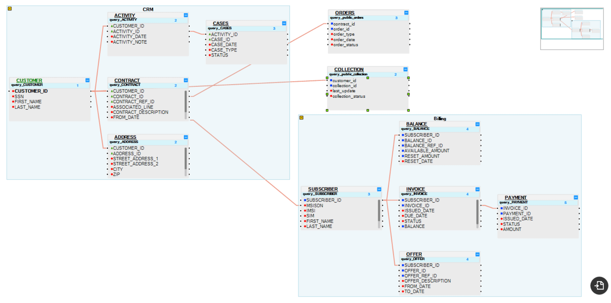
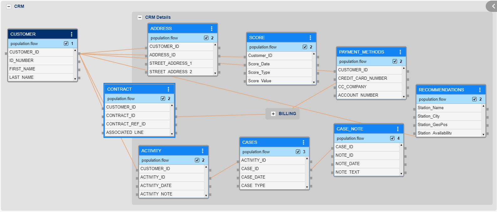

# Logical Unit Concepts

### Data Product 
A Data Product is K2View’s term for a reusable, domain-specific “package” of data that's prepared, governed, and delivered to users or applications. It aligns with the modern data mesh philosophy, where:

- Data domain teams treat data assets like software products—managing them end-to-end (define, engineer, test, deploy, monitor).
- A Data Product is centered on a specific business entity (like a customer, order, loan).
- It bundles everything needed:
  - **Schema** (tables, fields, relationships)
  - **Integration flow**s to pull from source systems
  - **Transformations** (cleansing, enrichment, masking)
  - **Access interfaces** (APIs, virtualization)

- The goal: One trusted, governed, accessible dataset per business entity—always current and compliant 

### Logical Unit (LU)
In K2View’s Fabric Studio, a Logical Unit (LU), also referred to as a Logical Unit Type (LUT), is the blueprint or definition of a Data Product. It consists of:

1. **LU Schema**: Defines root table, related tables, and their relationships.
2. **LU Tables**: Structures (columns, keys, indexes) holding the data.
3. **LU Table Populations**: Integration pipelines—specifying how data is sourced, transformed, and loaded.
4. **Supporting components**: functions, parsers, jobs, instance groups, etc..
5. **Properties**: Storage settings, sync policies, events, security, caching.

A Logical Unit is thus the template used to create actual data stores.

### Logical Unit Instance (LUI)
When a Logical Unit is executed or deployed, it creates one or more LU Instances (LUIs) — these are the physical representations of the Data Product for specific entity entries (e.g., each customer record).

- If your Customer LU is applied to 35 million customers, the system generates 35M LUIs—one isolated micro-database (e.g., SQLite/Cassandra/S3) per customer.
- Each LUI holds that entity’s integrated data, kept in sync and governed individually.

### How They're Connected
- Data Product = the concept/domain. It’s what you want to build—say, “Customer 360”.
- Logical Unit = the design artifact in K2View Fabric that defines that Data Product: schema, pipelines, policies.
- LU Instances = the runtime deliverables—physical micro-databases each holding that product’s data for individual entities.

So the flow is:
- Define a Logical Unit (Data Product blueprint) → Fabric auto-generates LU Instances, each holding one entity’s data → these are managed, accessed, and governed individually, but all under one Data Product.

### Logical Unit Details
The LU is the prototype from which LU Instances [(LUIs)](/articles/01_fabric_overview/02_fabric_glossary.md#lui) are created. 

An LU is defined and configured in the Fabric Studio as a core element of the [Fabric project](/articles/04_fabric_studio/08_fabric_project_tree.md). 
These definitions are comprised of 3 main types of objects:

1. [**LU Table**](/articles/06_LU_tables/01_LU_tables_overview.md): The definition of a table within the LU Schema, with its columns, primary keys, indexes, and triggers.

2. [**LU Table Population**](/articles/07_table_population/01_table_population_overview.md): 
    * Data feeding into LU tables from a variety of data sources and keeping it up to date.
    * Ability to manipulate the fed data, which includes enriching, cleansing, masking, transforming, etc. 
3. [**LU Schema**](/articles/03_logical_units/03_LU_schema_window.md): The relationship between the LU tables (similar to foreign keys). An LU schema has one LU table defined as its Root Table. The Root Table holds the LU’s unique key.

In addition to these main objects, others are part of the logical unit and are used to define its life cycle. They can be found in the Project Tree, under each logical unit:

- Java - [Globals](typora://app/articles/08_globals/01_globals_overview.md) and [Functions](typora://app/articles/07_table_population/08_project_functions.md)
- [Broadway](typora://app/articles/19_Broadway/01_broadway_overview.md)
- Instance Groups
- Resources - files that can be saved as part of a project
- IIDFinder 
<studio>    

- [Translations](typora://app/articles/09_translations/01_translations_overview_and_use_cases.md)
- Parsers
- Jobs

</studio>

**Let’s use an example of a Customer 360 implementation for Company ABC:**

* LU / Data Product: Customer.
* Data sources: CRM, <studio>Ordering, Billing and Collection, </studio><web>Billing and Assets.</web>
* LU tables: The tables that will hold the data you wish to keep about a customer from the 4 data sources.
* LU Table Populations: The set of definitions that will be used for extracting, transforming, cleaning, aggregating, validating (etc.) the data from the 4 data sources into the LU tables.
* LU schema: The definition of the Root Table and the relationship between all LU tables.

<studio>

   

</studio>

<web>

   

</web>

Using our example from above (Customer 360), assume that Company ABC has 35 million customers:

* LU/LUT = Customer
* LUI = one single customer database

Fabric will hold 35 million instances (LUIs) of the Customer LUT. That is, one physical database for each customer.

### Things to Consider Before Designing an LU 

Every Fabric project starts by defining its LUs. Analyze the business requirements and understand how the consuming application will use the data. Use this information to define the different Business Entities to implement and build an LU for each Business Entity.

### General Recommendations for Designing an LU 
A business entity is often split between different data sources. In some cases, it is preferable to create one LU that contains all data sources. In other cases, it is more advantageous to split the LUs and create a separate LU for each data source.

Generally, an LU should be based on the smallest number of data sources, as long as it provides a comprehensive view of a Data Product.

For example, if you have a Data Product called Customer, but different Customer Types (e.g., consumer and business) have different data sources, the recommended approach is to create an LU for each subtype (in our example, the different Customer Types).

Below is a **pros and cons** table of each alternative:

<table role="table" width="800">
<tbody>
<tr>
<td width="300">

<strong>Item</strong>

</td>
<td width="250">

<strong>LU per Business Entity</strong>

</td>
<td width="250">

<strong>LU per Business Entity and data source</strong>

</td>
<td width="250">

<strong>LU per Business Entity sub type</strong>

</td>
</tr>
<tr>
<td width="300">

Ease of writing APIs

</td>
<td align="center" width="60">&nbsp; 
<td align="center" width="10">&nbsp; 
<td align="center" width="10">&nbsp; 
</tr>
<tr>
<td width="300">

Replacing a data source

</td>
<td align="center" width="60">&nbsp; 
<td align="center" width="60">&nbsp; 
<td align="center" width="60">&nbsp;    
</tr>
<tr>
<td width="300">

Small amount of data in LU

</td>
<td align="center" width="60">&nbsp; 
<td align="center" width="60">&nbsp; 
<td align="center" width="60">&nbsp;    
</tr>
<tr>
<td width="250">

Maintenance, handling a less complex schema and internal relationships

</td>
<td align="center" width="60">&nbsp; 
<td align="center" width="60">&nbsp; 
<td align="center" width="60">&nbsp; 
</tr>
<tr>
<td width="250">

Implementing a real-time action based on an event like a Golden Gate update, when the action depends on multiple data systems

</td>
<td align="center" width="60">&nbsp; 
<td align="center" width="60">&nbsp; 
<td align="center" width="60">&nbsp; 
</tr>
<tr>
<td width="250">

Performance of real-time updates

</td>
<td align="center" width="60">&nbsp; 
<td align="center" width="60">&nbsp; 
<td align="center" width="60">&nbsp; 
</tr>
<tr>
<td width="250">

Tuning the migration process

</td>
<td align="center" width="60">&nbsp; 
<td align="center" width="60">&nbsp; 
<td align="center" width="60">&nbsp; 
</tr>
</tbody>
</table>

**Note:**

The file name's ambiguity is not supported within the same Logical Unit. This is not restricted by the Fabric Studio intentionally, allowing the implementor to continue the work and update the names later. For example, if 2 Java function files with identical names were exported from other projects or libraries, they can be saved in the project in the Fabric Studio. 

However, **at run-time, there should be no ambiguity within the LU**, otherwise, the server will run the first file it finds (with no commitment as to what is considered the first one).

 	
