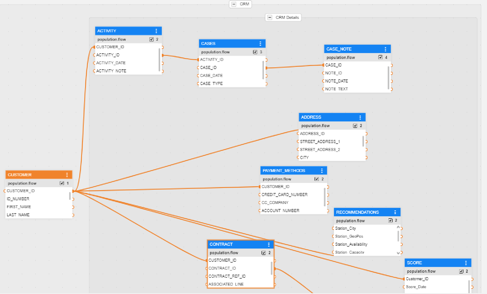
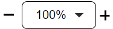

# Logical Unit / Data Product Schema Window

A Logical Unit schema's diagram represents the design for a specific data product dataset, its tables, their relations, population flows, synchronization rules and other business definitions.  

In order to open the **Logical Unit Schema** window, go to the **Project Tree**, click on the **LU Name** and then on the **Schema**.

<studio>

</studio>

<web>

</web>

The Logical Unit Schema window has 3 main sections:
* Logical Unit schema's diagram
* <studio>Logical Unit tabs panel</studio><web>Logical Unit side panel</web>
* Logical Unit toolbar

## Logical Unit Schema's Diagram

The Logical Unit schema's diagram is a working area where you can design the Logical Unit’s structure. 
* A Logical Unit schema's diagram displays a hierarchy of all business entities related to a Root Table. 
* Each table can have one or more population/s, where each population is linked to its parent table.

[Click for more information about Logical Unit Tables.](/articles/06_LU_tables/01_LU_tables_overview.md)

[Click for more information about LU Table Population.](/articles/07_table_population/01_table_population_overview.md)

### Customer LU Schema Example 

<studio>

</studio>

<web>

</web>

The Logical Unit schema's diagram displays the Root Table, the hierarchy of the tables included in the Logical Unit and the relationships between them:
* The Root Table of the LU schema is Customer. 

* Each table is displayed with all of its fields in a scrollable table.

<studio>

* Each field is displayed in a separate line, by name with a small colored icon. The icon’s color indicates the data type of the field:

    * Grey: Blob.
    * Red: Text.
    * Green: Real.
    * Blue: Integer.

</studio>

In order to get a clearer view of the schema's structure, you can group a list of tables. For example, group all Billing tables in the Customer LU.

[Click for more information about Grouping and Ungrouping LU Tables](/articles/03_logical_units/16_LU_schema_group_and_ungroup_tables.md).

## Logical Unit Side Panel

<studio>

The side panel is divided into several tabs:

<table style="width: 900px;">
<tbody>
<tr>
<td width="170pxl">

<a href="04_LU_properties.md"><strong>Properties Tab</strong></a>

</td>
<td width="630pxl">

Contains the properties on an LU level.

</td>
</tr>
<tr>
<td style="width: 119px;">

<strong><a href="15_LU_schema_edit_reference_tab.md">References Tab</a></strong>

</td>
<td style="width: 414px;">

Used for configuring the Reference Tables that are accessible from this LU.

</td>
</tr>
<tr>
<td style="width: 119px;">

<a href="14_edit%20enrichment%20order.md"><strong>Enrichment Order Tab</strong></a>

</td>
<td style="width: 414px;">

Defines the execution order of Enrichment functions using the upward and downward arrows. Only Enrichment functions - directly related to specific LU tables - are included in the display.

</td>
</tr>
<tr>
<td style="width: 119px;">

<a href="/articles/05_DB_interfaces/03_DB_interfaces_overview.md"><strong>DB Objects Tab</strong></a>

</td>
<td style="width: 414px;">

Displays a list of objects in the source database according to the selected DB Interface in the DB Connection field.

DB objects can be refreshed by clicking on the Refresh icon adjacent to the <a href="/articles/05_DB_interfaces/04_creating_a_new_database_interface.md">DB Connection</a> drop-down list.

Dragging an object to the diagram creates a new table in the schema. &nbsp;

</td>
</tr>
<tr>
<td style="width: 119px;">

<strong>Objects Tab</strong>

</td>
<td style="width: 414px;">

Displays a list of all <a href="/articles/06_LU_tables/01_LU_tables_overview.md">LU tables </a> defined for the LU. Drag a table into the Logical Unit diagram area in order to add it to the LU schema.

</td>
</tr>
<tr>
<td style="width: 119px;">

<strong><a href="/articles/12_LU_navigation/01_Navigating_an_LU_schema.md#how-do-i-use-the-diagram-outline">Diagram Outline Tab</a></strong>

</td>
<td style="width: 414px;">

Displays an overview of the LU structure, and enables searching a subset of tables that is included in the schema.

</td>
</tr>
</tbody>
</table>

</studio>

<web>

The side panel is divided into 2 tabs:

* **[Schema Properties](04_LU_properties.md)** - where you can set the logical unit definitions.
* **[Population Order View](19_LU_population_order_view.md)** - where you can see and manage both the tables' list and the order of table population flows.

The side panel can be collapsed or expanded by clicking the  icon in the upper-right corner of the schema window.

</web>

## Logical Unit Schema Window Toolbar
<studio>

The LU schema's diagram window displays the following toolbar:

<table>
<tbody>
<tr>
<td width="60">&nbsp; </td>
<td width="557">

Group SubGraph

</td>
</tr>
<tr>
<td width="60">&nbsp; </td>
<td width="557">

Ungroup SubGraph

</td>
</tr>
<tr>
<td width="60">&nbsp;</td>
<td width="557">

Update Tables From Database

When clicked, the LU tables' schema is refreshed from the source database. This action is required when the LU tables' schema has been updated in the source database.

Note: Only current tables are updated. Tables are manually added or deleted from an LU.

</td>
</tr>
<tr>
<td width="60">&nbsp; 
<td width="557">

Refresh Items - refreshes items from an implementation into the LU schema.

</td>
</tr>
</tbody>
</table>

You can customize the schema's toolbar by right-clicking on it and selecting 'Customize...'; a pop-up window shall then open, where you can add/remove toolbars to/from the display:

[Click for more information about Group and Ungroup SubGraph Objects.](/articles/03_logical_units/16_LU_schema_group_and_ungroup_tables.md)

[Click for more information about Fabric Studio Diagrams Toolbars.](/articles/04_fabric_studio/03_diagram_and_toolbars.md)

[Click for more information about LU Refresh Options.](/articles/03_logical_units/18_LU_schema_refresh_LU_options.md)

</studio>

<web>

The LU Schema toolbar includes the following elements:

<table style="width: 900px;">
<tbody>
<tr>
<td style="text-align: center;" width="170pxl"></td>
<td width="630pxl">

Refresh schema's elements that are based on changes made outside this window. For example, when a table was edited via the project tables folder or when population inputs were updated in the population editor.

</td>
</tr>
<tr>
<td style="text-align: center;" width="170pxl"></td>
<td width="630pxl">

Ungroup - remove either selected tables from a group (in case you select tables) or an entire group (if a group is selected).

</td>
</tr>
<tr>
<td style="text-align: center;" width="170pxl"></td>
<td width="630pxl">

Group the selected tables.

</td>
</tr>
<tr>
<td style="text-align: center;" width="170pxl"></td>
<td width="630pxl">

Add a new table to the schema by either creating one or selecting one from the list.

</td>
</tr>
<tr>
<td style="text-align: center;" width="170pxl"></td>
<td width="630pxl">

Schema's Auto Layout - automatically arranges and optimizes visualization.

</td>
</tr>
<tr>
<td style="text-align: center;" width="170pxl"></td>
<td width="630pxl">

Open the Data Viewer pop-up window in order to run queries on the current LU's IIDs.

</td>
</tr>
<tr>
<td style="text-align: center;" width="170pxl"></td>
<td width="630pxl">

Open the Table Data Viewer's bottom panel (height adjustable). The data will be displayed according to the selected table.

</td>
</tr>
<tr>
<td style="text-align: center;" width="170pxl"></td>
<td width="630pxl">

Highlight tables - activated when clicked, as explained <a href="/articles/03_logical_units/20_LU_highlight_tables.md">here.</a>

</td>
</tr>
<tr>
<td style="text-align: center;" width="170pxl"></td>
<td width="630pxl">

Magnifier - activated when clicked; can be moved across the schema's diagram to enlarge existing elements, as explained <a href="/articles/03_logical_units/21_big_schema_productivity_tips.md#magnifier">here</a>.

</td>
</tr>
<tr>
<td style="text-align: center;" width="170pxl"></td>
<td width="630pxl">

Navigation Minimap - when clicked, it provides an overview of the whole schema, as explained <a href="/articles/03_logical_units/21_big_schema_productivity_tips.md#navigation-mini-map">here</a>.

</td>
</tr>
<tr>
<td style="text-align: center;" width="170pxl"></td>
<td width="630pxl">

Zoom in/zoom out.

</td>
</tr>
<tr>
<td style="text-align: center;" width="170pxl"></td>
<td width="630pxl">

Search elements (tables, table-groups, tables' columns, populations) in the schema, as explained <a href="/articles/03_logical_units/21_big_schema_productivity_tips.md#schema-search">here</a>.

</td>
</tr>
</tbody>
</table>

</web>

