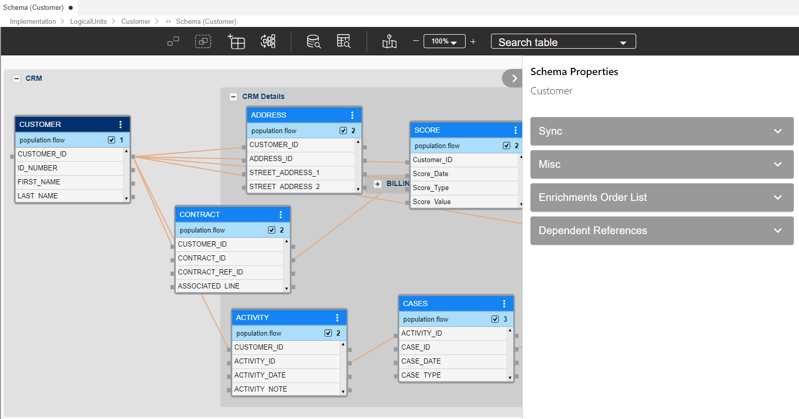
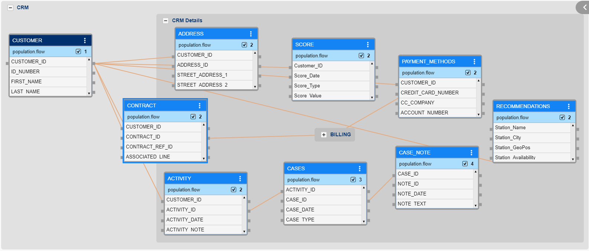
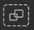
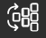
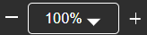

# LU Schema Window

### Logical Unit (LU) - Related Objects
A [Fabric project](/articles/04_fabric_studio/08_fabric_project_tree.md) has a tree-like structure known as the Project Tree which displays entities in a hierarchical order. The Project Tree is displayed on the left side of the K2View Fabric Studio window and its Logical Units (LU) are located under the Logical Units branch.

The following objects are located under each [Logical Unit (LU)](/articles/03_logical_units/01_LU_overview.md) in the Project Tree:
* [Schema](/articles/03_logical_units/03_LU_schema_window.md#logical-unit-lu-schema).
* Java - [Globals](/articles/08_globals/01_globals_overview.md) and [Functions](/articles/07_table_population/08_project_functions.md).
* Resources, files that can be saved as part of a project. For example, an Excel file.
* [Tables](/articles/06_LU_tables/01_LU_tables_overview.md).
* [Broadway](/articles/19_Broadway/01_broadway_overview.md).

<studio>
    
* [Translations](/articles/09_translations/01_translations_overview_and_use_cases.md).
* Parsers.
* Instance Groups: lists of instances to be migrated into Fabric for the LU. 
* Jobs.
* IIDFinder. 
    
</studio>

### Opening the Logical Unit (LU) Window
Go to the **Project Tree**, click the **LU Name** and then click the **Schema** to open the **Logical Unit** window.

### Logical Unit (LU) Window

<studio>

</studio>

<web>

</web>

The Logical Unit window has three main sections:
* [Logical Unit schema.](/articles/03_logical_units/03_LU_schema_window.md#logical-unit-lu-schema)
* [Logical Unit tabs.](/articles/03_logical_units/03_LU_schema_window.md#logical-unit-lu-tabs)
* [Logical Unit toolbar.](/articles/03_logical_units/03_LU_schema_window.md#logical-unit-lu-schema-window-toolbar) 

### Logical Unit (LU) Schema
The Logical Unit schema is a work area where you can define the Logical Unit’s structure. 
* A Logical Unit schema displays a hierarchical representation of all business entities related to a Root Table. 
* Each table can have one or several populations where each population is linked to its parent table.

[Click for more information about Logical Unit Tables.](/articles/06_LU_tables/01_LU_tables_overview.md)

[Click for more information about LU Table Population.](/articles/07_table_population/01_table_population_overview.md)

### Customer LU Schema Example 

<studio>

</studio>

<web>

</web>

The Logical Unit Schema window shows the Root Table and hierarchy of the tables included in the Logical Unit and the relationships between them:
* The Root Table of the LU schema is Customer. 

* Each table is displayed with all of its fields in a scrollable table.

    <studio>

* Each field is displayed in a separate line, by name with a small colored icon. The icon’s color indicates the data type of the field:

    * Grey: Blob.
    * Red: Text.
    * Green: Real.
    * Blue: Integer.
    
    </studio>

To make the structure of the table schema clearer, group or ungroup a list of tables. For example, group all Billing Tables in the Customer LU.

[Click for more information about Grouping and Ungrouping LU Tables](/articles/03_logical_units/16_LU_schema_group_and_ungroup_tables.md).

### Logical Unit (LU) Tabs

<studio>

<table style="width: 900px;">
<tbody>
<tr>
<td width="170pxl">

<a href="04_LU_properties.md"><strong>Properties Tab</strong></a>

</td>
<td width="630pxl">

Contains the properties on an LU level.

</td>
</tr>
<tr>
<td style="width: 119px;">

<strong><a href="15_LU_schema_edit_reference_tab.md">References Tab</a></strong>

</td>
<td style="width: 414px;">

Used to configure the Reference Tables that are accessible from this LU.

</td>
</tr>
<tr>
<td style="width: 119px;">

<a href="14_edit%20enrichment%20order.md"><strong>Enrichment Order Tab</strong></a>

</td>
<td style="width: 414px;">

Defines the execution order of Enrichment functions using the up and down arrows. Only Eenrichment functions that are directly related to specific LU tables are included in the display.

</td>
</tr>
<tr>
<td style="width: 119px;">

<a href="/articles/05_DB_interfaces/03_DB_interfaces_overview.md"><strong>DB Objects Tab</strong></a>

</td>
<td style="width: 414px;">

Displays the list of objects in the source database according to the DB Interface selected in the DB Connection field.

DB objects can be refreshed by clicking the Refresh icon adjacent to the <a href="/articles/05_DB_interfaces/04_creating_a_new_database_interface.md">DB Connection</a> dropdown list.

Dragging an object to a diagram creates a new table in the schema. &nbsp;

</td>
</tr>
<tr>
<td style="width: 119px;">

<strong>Objects Tab</strong>

</td>
<td style="width: 414px;">

Displays the list of all <a href="/articles/06_LU_tables/01_LU_tables_overview.md">LU tables </a> defined for the LU. Drag the table into the Logical Unit diagram area to add it to the LU schema.

</td>
</tr>
<tr>
<td style="width: 119px;">

<strong><a href="/articles/12_LU_navigation/01_Navigating_an_LU_schema.md#how-do-i-use-the-diagram-outline">Diagram Outline Tab</a></strong>

</td>
<td style="width: 414px;">

Displays an overview of the LU structure and enables searching for a subset of tables included in the schema.

</td>
</tr>
</tbody>
</table>

</studio>

<web>

The LU Tabs display the schema properties and they can be collapsed or expanded by clicking the  icon in the right upper corner of the schema window.

<table style="width: 900px;">
<tbody>
<tr>
<td width="170pxl">

<strong>Sync</strong>

</td>
<td width="630pxl">

Sets the sync properties and <a href="/articles/14_sync_LU_instance/04_sync_methods.md">sync method</a> on an LU level.

Sets the <a href="/articles/07_table_population/08_project_functions.md#event-function">Event functions</a> that are triggered upon a Sync's success or failure or after a successful Delete instance.

</td>
</tr>
<tr>
<td>

<strong>Misc</strong>

</td>
<td>

Contains various settins such as Storage, Cache location type and Enable data encryption.

</td>
</tr>
<tr>
<td style="width: 119px;">

<strong><a href="15_LU_schema_edit_reference_tab.md">Dependent References</a></strong>

</td>
<td style="width: 414px;">

Used to configure the Reference Tables that are accessible from this LU.

</td>
</tr>
<tr>
<td style="width: 119px;">

<a href="14_edit%20enrichment%20order.md"><strong>Enrichment Order List</strong></a>

</td>
<td style="width: 414px;">

Defines the execution order of Enrichment functions using the up and down arrows. Only Eenrichment functions that are directly related to specific LU tables are included in the display.

</td>
</tr>
</tbody>
</table>

</web>

### Logical Unit (LU) Schema Window Toolbar
<studio>

By default, the LU Diagram window displays the following toolbar:

You can customize your window by adding or deleting toolbars to/from diagram windows:

<table>
<tbody>
<tr>
<td width="60">&nbsp; </td>
<td width="557">

Group SubGraph.

</td>
</tr>
<tr>
<td width="60">&nbsp; </td>
<td width="557">

Ungroup SubGraph.

</td>
</tr>
<tr>
<td width="60">&nbsp;</td>
<td width="557">

Update Tables from Database.

When clicked, the LU tables schema is refreshed from the source database. This action is needed if the LU tables schema has been updated in the source database.

Note: only current tables are updated. Tables are added or deleted from an LU manually.

</td>
</tr>
<tr>
<td width="60">&nbsp; 
<td width="557">

Refresh Items, refreshes items from an implementation into the LU schema.

</td>
</tr>
</tbody>
</table>

[Click for more information about Group and Ungroup SubGraph Objects.](/articles/03_logical_units/16_LU_schema_group_and_ungroup_tables.md)

[Click for more information about Fabric Studio Diagrams Toolbars.](/articles/04_fabric_studio/03_diagram_and_toolbars.md)

[Click for more information about LU Refresh Options.](/articles/03_logical_units/18_LU_schema_refresh_LU_options.md)

</studio>

<web>

The LU Schema toolbar includes the following elements:

<table style="width: 900px;">
<tbody>
<tr>
<td style="text-align: center;" width="170pxl"></td>
<td width="630pxl">

Group the selected tables.

</td>
</tr>
<tr>
<td style="text-align: center;" width="170pxl"></td>
<td width="630pxl">

Remove the selected tables from the group.

</td>
</tr>
<tr>
<td style="text-align: center;" width="170pxl"></td>
<td width="630pxl">

Add new table to the schema by either creating it or selecting from the list.

</td>
</tr>
<tr>
<td style="text-align: center;" width="170pxl"></td>
<td width="630pxl">

Schema auto-layout.

</td>
</tr>
<tr>
<td style="text-align: center;" width="170pxl"></td>
<td width="630pxl">

Open the Data Viewer to run queries on IID of the current LU.

</td>
</tr>
<tr>
<td style="text-align: center;" width="170pxl"></td>
<td width="630pxl">

Open the Data Viewer in a context of a selected table of the current LU. You can switch between the schema tables. The data will be displayed according to the selected table.

</td>
</tr>
<tr>
<td style="text-align: center;" width="170pxl"></td>
<td width="630pxl">

Open the navigation pane of the LU schema.

</td>
</tr>
<tr>
<td style="text-align: center;" width="170pxl"></td>
<td width="630pxl">

Zoom in / zoom out.

</td>
</tr>
<tr>
<td style="text-align: center;" width="170pxl"></td>
<td width="630pxl">

Search a table in the LU schema.

</td>
</tr>
</tbody>
</table>

</web>
