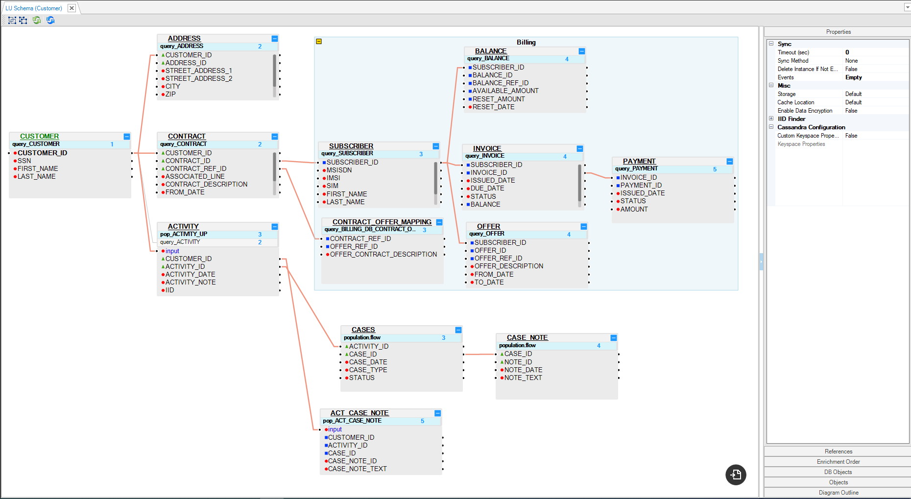
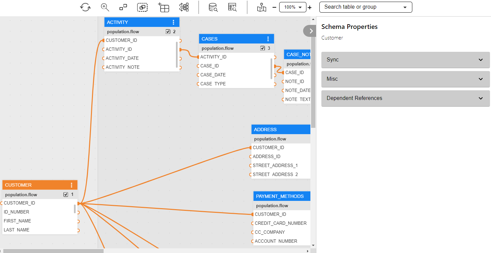
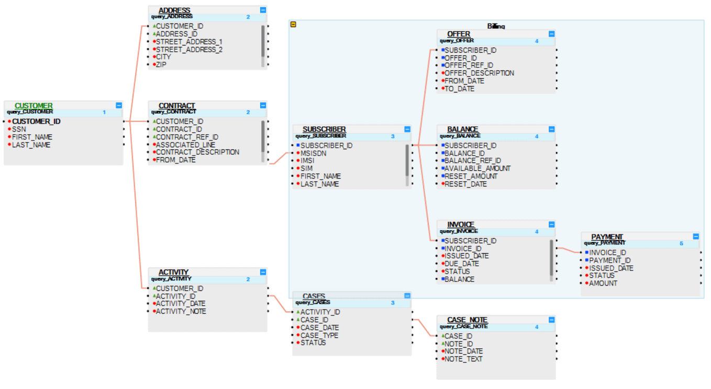

# LU Schema Window

### Logical Unit (LU) - Related Objects
A [Fabric project](/articles/04_fabric_studio/08_fabric_project_tree.md) has a tree-like structure known as the Project Tree; it displays entities in a hierarchical order. The Project Tree is displayed on the left side of the K2View Fabric Studio window and its Logical Units (LUs) are located under the Logical Units branch.

The following objects are located under each [Logical Unit (LU)](/articles/03_logical_units/01_LU_overview.md) in the Project Tree:
* [Schema](/articles/03_logical_units/03_LU_schema_window.md#logical-unit-lu-schema).
* Java - [Globals](/articles/08_globals/01_globals_overview.md) and [Functions](/articles/07_table_population/08_project_functions.md).
* Resources, files that can be saved as part of a project. E.g., an Excel file.
* [Tables](/articles/06_LU_tables/01_LU_tables_overview.md). 
* [Broadway](/articles/19_Broadway/01_broadway_overview.md).

<studio>    

* [Translations](/articles/09_translations/01_translations_overview_and_use_cases.md).
* Parsers.
* Instance Groups: lists of instances to be migrated into Fabric for the LU. 
* Jobs.
* IIDFinder. 

</studio>

### 
In order to open the **Logical Unit Schema** window, go to the **Project Tree**, click on the **LU Name** and then on the **Schema**.

### Logical Unit Schema Window

<studio>

</studio>

<web>

</web>

The Logical Unit Schema window has three main sections:
* [Logical Unit schema diagram.](/articles/03_logical_units/03_LU_schema_window.md#logical-unit-lu-schema)
* <studio>[Logical Unit tabs panel.](/articles/03_logical_units/03_LU_schema_window.md#logical-unit-tabs-panel)</studio><web>[Logical Unit properties panel](/articles/03_logical_units/03_LU_schema_window.md#logical-unit-properties-panel)</web>
* [Logical Unit toolbar.](/articles/03_logical_units/03_LU_schema_window.md#logical-unit-lu-schema-window-toolbar) 

### Logical Unit Schema Diagram
The Logical Unit schema diagram is a working area where you can define the Logical Unit’s structure. 
* A Logical Unit schema diagram displays a hierarchy of all business entities related to a Root Table. 
* Each table can have one or more population/s, where each population is linked to its parent table.

[Click for more information about Logical Unit Tables.](/articles/06_LU_tables/01_LU_tables_overview.md)

[Click for more information about LU Table Population.](/articles/07_table_population/01_table_population_overview.md)

### Customer LU Schema Example 

<studio>

</studio>

<web>

</web>

The Logical Unit schema diagram displays the Root Table, the hierarchy of the tables included in the Logical Unit and the relationships between them:
* The Root Table of the LU schema is Customer. 

* Each table is displayed with all of its fields in a scrollable table.

<studio>

* Each field is displayed in a separate line, by name with a small colored icon. The icon’s color indicates the data type of the field:

    * Grey: Blob.
    * Red: Text.
    * Green: Real.
    * Blue: Integer.

</studio>

In order to make the structure of the table schema clearer, group or ungroup a list of tables. For example, group all Billing Tables in the Customer LU.

[Click for more information about Grouping and Ungrouping LU Tables](/articles/03_logical_units/16_LU_schema_group_and_ungroup_tables.md).

<studio>

### Logical Unit Tabs Panel

<table style="width: 900px;">
<tbody>
<tr>
<td width="170pxl">

<a href="04_LU_properties.md"><strong>Properties Tab</strong></a>

</td>
<td width="630pxl">

Contains the properties on an LU level.

</td>
</tr>
<tr>
<td style="width: 119px;">

<strong><a href="15_LU_schema_edit_reference_tab.md">References Tab</a></strong>

</td>
<td style="width: 414px;">

Used to configure the Reference Tables that are accessible from this LU.

</td>
</tr>
<tr>
<td style="width: 119px;">

<a href="14_edit%20enrichment%20order.md"><strong>Enrichment Order Tab</strong></a>

</td>
<td style="width: 414px;">

Defines the execution order of Enrichment functions using the up and down arrows. Only Enrichment functions - directly related to specific LU tables - are included in the display.

</td>
</tr>
<tr>
<td style="width: 119px;">

<a href="/articles/05_DB_interfaces/03_DB_interfaces_overview.md"><strong>DB Objects Tab</strong></a>

</td>
<td style="width: 414px;">

Displays the list of objects in the source database according to the DB Interface selected in the DB Connection field.

DB objects can be refreshed by clicking on the Refresh icon adjacent to the <a href="/articles/05_DB_interfaces/04_creating_a_new_database_interface.md">DB Connection</a> dropdown list.

Dragging an object to a diagram creates a new table in the schema. &nbsp;

</td>
</tr>
<tr>
<td style="width: 119px;">

<strong>Objects Tab</strong>

</td>
<td style="width: 414px;">

Displays the list of all <a href="/articles/06_LU_tables/01_LU_tables_overview.md">LU tables </a> defined for the LU. Drag the table into the Logical Unit diagram area in order to add it to the LU schema.

</td>
</tr>
<tr>
<td style="width: 119px;">

<strong><a href="/articles/12_LU_navigation/01_Navigating_an_LU_schema.md#how-do-i-use-the-diagram-outline">Diagram Outline Tab</a></strong>

</td>
<td style="width: 414px;">

Displays an overview of the LU structure and enables a search of a subset of tables included in the schema.

</td>
</tr>
</tbody>
</table>

</studio>

<web>

### Logical Unit Properties Panel

The properties panel displays the schema properties. It can be collapsed or expanded by clicking the  icon in the upper right corner of the schema window.

<table style="width: 900px;">
<tbody>
<tr>
<td width="170pxl">

<strong>Sync</strong>

</td>
<td width="630pxl">

Sets the <a href="/articles/14_sync_LU_instance/08_sync_timeout.md">sync timeout</a> and <a href="/articles/14_sync_LU_instance/04_sync_methods.md">sync method</a> on an LU level.

Sets the <a href="/articles/07_table_population/08_project_functions.md#event-function">Event functions</a> that are triggered following a Sync's success or failure or following a successful Delete instance.

</td>
</tr>
<tr>
<td>

<strong>Misc</strong>

</td>
<td>

Contains various settings such as <a href="/articles/32_LU_storage/01_LU_storage_overview.md#storage-types">storage</a>, <a href="/articles/32_LU_storage/02_storage_management.md#changing-the-location-of-the-cache">cache location</a> and Enable data encryption.

</td>
</tr>
<tr>
<td style="width: 119px;">

<strong><a href="15_LU_schema_edit_reference_tab.md">Dependent References</a></strong>

</td>
<td style="width: 414px;">

Used to configure the Reference Tables that are accessible from this LU.

</td>
</tr>
</tbody>
</table>

</web>

### Logical Unit (LU) Schema Window Toolbar
<studio>

The LU Diagram window displays the following toolbar - by default:

You can customize your window by adding or deleting toolbars to/from diagram windows:

<table>
<tbody>

<tr>
<td width="60">&nbsp; </td>
<td width="557">

Group SubGraph.

</td>
</tr>
<tr>
<td width="60">&nbsp; </td>
<td width="557">

Ungroup SubGraph.

</td>
</tr>
<tr>
<td width="60">&nbsp;</td>
<td width="557">

Update Tables from Database.

When clicked, the LU tables schema is refreshed from the source database. This action is required when the LU tables schema has been updated in the source database.

Note: only current tables are updated. Tables are manually added or deleted from an LU.

</td>
</tr>
<tr>
<td width="60">&nbsp; 
<td width="557">

Refresh Items, refreshes items from an implementation into the LU schema.

</td>
</tr>
</tbody>
</table>

[Click for more information about Group and Ungroup SubGraph Objects.](/articles/03_logical_units/16_LU_schema_group_and_ungroup_tables.md)

[Click for more information about Fabric Studio Diagrams Toolbars.](/articles/04_fabric_studio/03_diagram_and_toolbars.md)

[Click for more information about LU Refresh Options.](/articles/03_logical_units/18_LU_schema_refresh_LU_options.md)

</studio>

<web>

The LU Schema toolbar includes the following elements:

<table style="width: 900px;">
<tbody>

<tr>

<td style="text-align: center;" width="170pxl"></td>
<td width="630pxl">

Refresh Schema's elements that are based on changes done externally to this window. For example, when a table was edited via the project tables folder or when population inputs were updated at the population editor.

</td>
</tr>

<tr>
<td style="text-align: center;" width="170pxl"></td>
<td width="630pxl">

Magnifier - activated when clicked; can be moved anywhere over the schema diagram in order to magnify existing features.

</td>
</tr>

<tr>
<td style="text-align: center;" width="170pxl"></td>
<td width="630pxl">

Ungroup, Remove the selected tables from the group, in case you select tables; Remove the group if a group is selected.

</td>
</tr>

<tr>
<td style="text-align: center;" width="170pxl"></td>
<td width="630pxl">

Group the selected tables.

</td>
</tr>

<tr>
<td style="text-align: center;" width="170pxl"></td>
<td width="630pxl">

Add a new table to the schema by either creating one or selecting one from the list.

</td>
</tr>
<tr>
<td style="text-align: center;" width="170pxl"></td>
<td width="630pxl">

Schema auto-layout.

</td>
</tr>
<tr>
<td style="text-align: center;" width="170pxl"></td>
<td width="630pxl">

Open the Data Viewer popup in order to run queries on IID of the current LU.

</td>
</tr>
<tr>
<td style="text-align: center;" width="170pxl"></td>
<td width="630pxl">

Open the Table Data Viewer bottom panel. The data will be displayed according to the selected table.

</td>
</tr>
<tr>
<td style="text-align: center;" width="170pxl"></td>
<td width="630pxl">

Open the navigation small panel of the LU schema.

</td>
</tr>
<tr>
<td style="text-align: center;" width="170pxl"></td>
<td width="630pxl">

Zoom in/zoom out.

</td>
</tr>
<tr>
<td style="text-align: center;" width="170pxl"></td>
<td width="630pxl">

Search a table or a table's group in the LU schema.

</td>
</tr>
</tbody>
</table>

</web>
