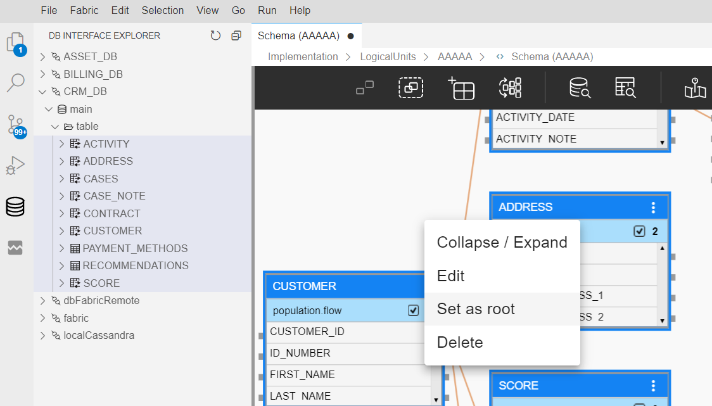

# Create a New Logical Unit (LU) Object

<studio>

A new [Logical Unit (LU)](/articles/03_logical_units/01_LU_overview.md) can be added by either:

* Creating a new Logical Unit.
* Duplicating a Logical Unit and saving it. 

### How Do I Create a New Logical Unit (LU)?
1. Go to **Project Tree** > right click **Logical Units** > **New Logical Unit** > **Logical Unit** dialog box. 
2. Enter the **Name** of the new **Logical Unit**. 
3. Do either: 
    * Check **Open LU Auto Discovery** to create the LU using the [**Auto Discovery Wizard.**](/articles/03_logical_units/06_auto_discovery_wizard.md) 
    * Do not check **Open LU Auto Discovery** and manually build the **Logical Unit**. 
4. Click **OK**.

[Click here for more information about the LU Creation Steps.](/articles/03_logical_units/02_create_a_logical_unit_flow.md)

### How Do I Duplicate a Logical Unit (LU)?

1. Go to **Project Tree** > right click **Logical Unit** > **Logical Unit** dialog box. 
2. Enter the **Name** of the new (duplicated) **Logical Unit**. 
3. Click **OK**.  

</studio>

<web>

A new [Logical Unit (LU)](/articles/03_logical_units/01_LU_overview.md), also known as a Data Product, can be added in the Fabric Web Studio as follows:

1. Go to **Project Tree** > right click **Logical Units / Data Products** > **New Data Product**. 

2. Populate the **Name** of the new **Logical Unit** and click **Enter** to save it.

3. Proceed to manual creation of the LU schema:

   * Open the **Schema** of the newly created Logical Unit and switch from the Project tree to the **DB Interface Explorer** by clicking the  icon on the left panel.

   * Click on the relevant interface, select the required tables and add them to the schema using a right click.

     

   * Click on the table that should be an LU Root Table and set it as root using the table context menu. Only a table with no input connections can be set as root.

     

   * After the table is set as root, the table properties tab is opened to set the required Instance ID column. In addition, the color of the root table's header is changed to dark blue.

   * Save your changes once all the required tables are added to the LU Schema.

</web>

