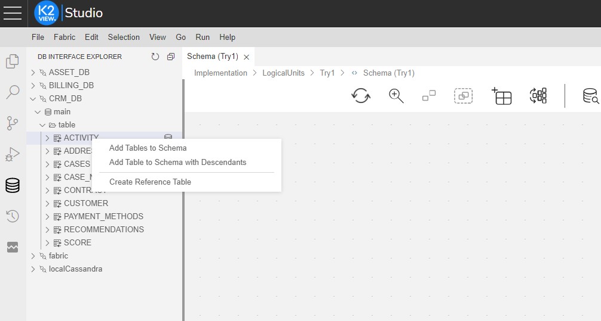
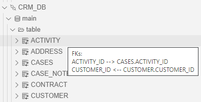

# Create a New Logical Unit (LU) Object

A new [Logical Unit (LU)](/articles/03_logical_units/01_LU_overview.md) can be added by either:

* Creating a new Logical Unit.
* Duplicating a Logical Unit. 

### How Do I Create a New Logical Unit (LU)?

<studio>

1. Go to **Project Tree** > right click **Logical Units** > **New Logical Unit** > **Logical Unit** dialog box. 
2. Enter the **Name** of the new **Logical Unit**. 
3. Do either: 
    * Check **Open LU Auto Discovery** to create the LU using the [**Auto Discovery Wizard.**](/articles/03_logical_units/06_auto_discovery_wizard.md) 
    * Do not check **Open LU Auto Discovery** and manually build the **Logical Unit**. 
4. Click **OK**.

</studio>

<web>

1. Go to **Project Tree** > right-click **Logical Units / Data Products** > **New Data Product**. 

2. Populate the **Name** of the new **Logical Unit** and click **Enter**.

3. Proceed with creation of the LU schema:

   * Open the **Schema** of the newly created Logical Unit and switch from the Project tree to the **DB Interface Explorer** by clicking the  icon on the left panel.

   * Click on the relevant interface data source, select the required tables, one or more, and add them to the schema using a right-click. The options to choose from are either:

     * "Add Tables To Schema" - where each selected table is added to the schema independently.

     * "Add Tables To Schema with Relations" - where selected tables upon their links (if any & if defined as FKs in the original data source) are added to the schema to be displayed; see below image:

       

       ​

       

       ​

       

     * "Add Table to Schema with Descendants" - The original source contains a table, which, knowingly, has linked children, grandchildren, etc. (i.e. descendants). The user may choose to add such table the schema, asking for all its descendants to be both brought along and  displayed in the schema as well (2nd option in the window in the below image).

       If a selected table has a PK, which has only field 1, adding it to an empty schema turns it into the root table. Additionally, the field - defined in the data source as primary key - is turned into the IID. 

       This option is valid if: (a) Schema is completely empty (b) Root table is defined in the system (c) IID is defined in the system.

       

          

     >**Tip:** You can recognize tables that are connected to others according to the icon located on their left-hand-side in the DB Interface Explorer tree. In the below example, you can see that the icon next to ACTIVITY table appears with arrows (), which hints at a connection/s to other table/s, whereas the icon next to RECOMMENDATIONS table is lacking the arrows (). 
     >
     >Moreover, when hovering on such "connected" tables, a tooltip will appear, showing you the connections, with their directions. 

​     

   * You can add more tables to the schema either from this data source interface or from other data sources.

     > **Note**: By adding a table to the schema this way, the table population flow is automatically created and is being associated with the table.

   * Connect the tables with each other, by drawing a linking connection between the output and input table's connectors.

   * Set the root table as explained [here](/articles/03_logical_units/08_define_root_table_and_instance_ID_LU_schema.md).

   * Save the schema. 

</web>

[Click here for more information about the LU Creation Steps.](/articles/03_logical_units/02_create_a_logical_unit_flow.md)

### How Do I Duplicate a Logical Unit (LU)?

1. Go to **Project Tree** > right click the origin logical unit > **Duplicate**. 
2. Enter the **Name** of the new (duplicated) **Logical Unit**. 
3. Click **OK**.  

<studio>

</studio>

<web>

</web>

