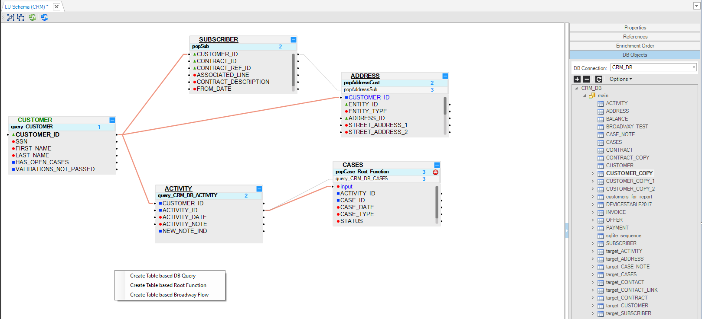
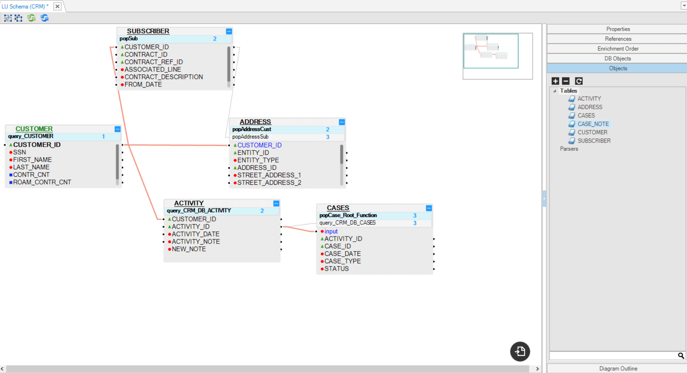
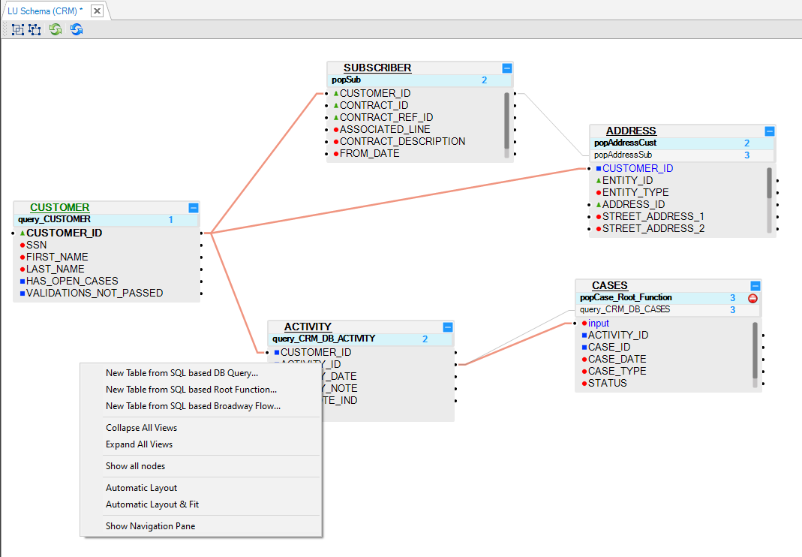
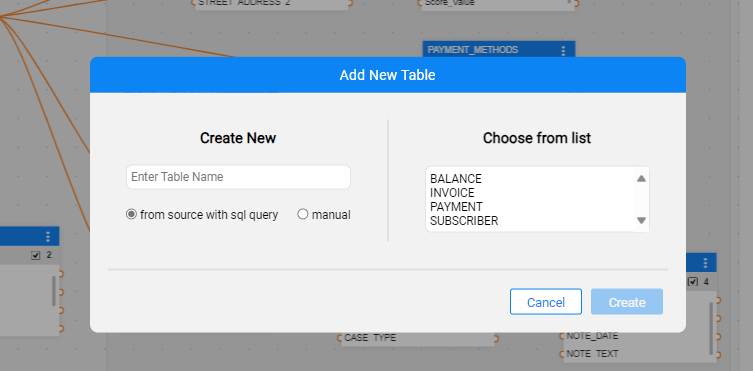
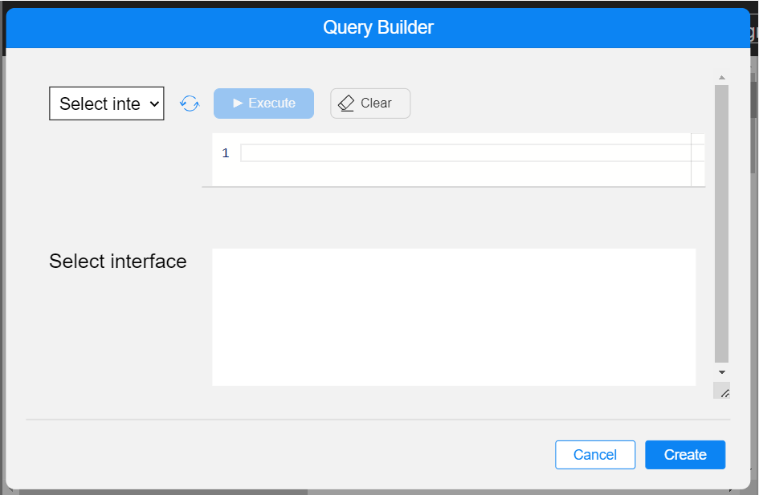
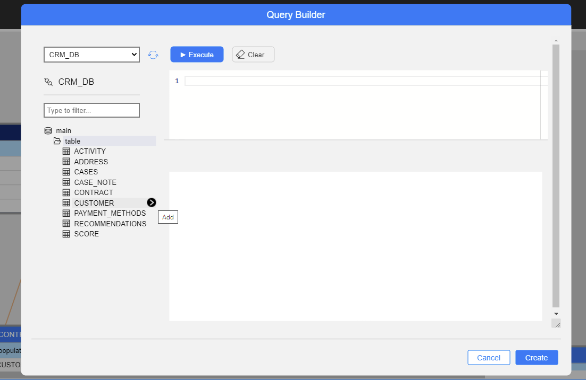
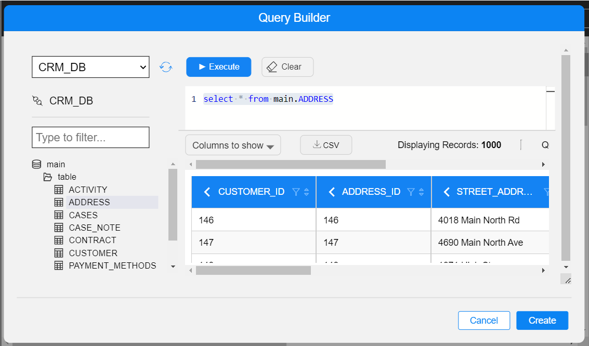
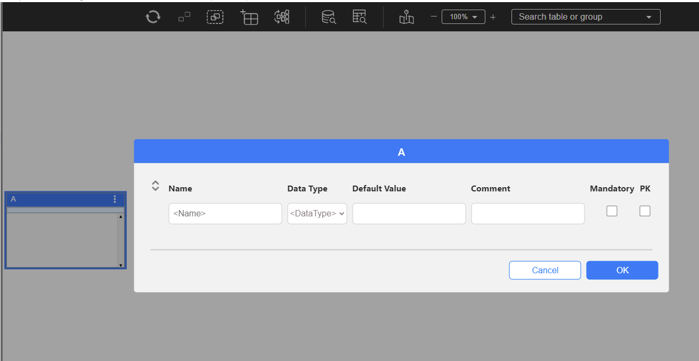

# Adding a Table to an LU Schema

An [LU table](/articles/06_LU_tables/01_LU_tables_overview.md)  is a basic building block in a Logical Unit (LU).

The following are some of the methods you can use for adding a table to an [LU schema](/articles/03_logical_units/03_LU_schema_window.md): 

<studio>

1. Use the [Auto Discovery Wizard](/articles/03_logical_units/06_auto_discovery_wizard.md) for creating or editing an LU by which the tables and their populations are automatically created and added to the LU schema.

   -- or --

2. From the [LU schema](/articles/03_logical_units/03_LU_schema_window.md) window:

   * Go to the [DB Objects tab](/articles/03_logical_units/03_LU_schema_window.md#logical-unit-lu-tabs). 
   * Click **DB Connection** and select a [DB interface](/articles/05_DB_interfaces/03_DB_interfaces_overview.md) from the drop-down menu.
   * From the window underneath the **DB Connection** drop-down menu, open the table tree, select a **Table**, open its drop-down menu and drag the table from its title into the **LU schema**. You can drag several tables at the same time.
   * A right-click menu appears; select one of the following from it: **Create Table Based DB Query** or **Create Table Based Root Function** or **Create Table Based Broadway Flow**.

   The selected table or tables are automatically created with the selected type of [population](/articles/07_table_population/01_table_population_overview.md) and added to the LU schema.

      

   -- or --

3. Drag a **Table** into the **LU Schema window**:

    * Go to the [Objects tab](/articles/03_logical_units/03_LU_schema_window.md#logical-unit-lu-tabs) of the [LU schema](/articles/03_logical_units/03_LU_schema_window.md).
    * Select a **Table** and drag it into the **LU Schema window**.

    

    -- or --

4. Right click the **Schema window** and select one of the following options:

    * **New Table from SQL Based DB Query**.
    * **New Table from SQL Based Root Function**.
    * **New Table from SQL Based Broadway Flow**.

    All the above 3 options open the Query Builder. The LU table and its populations are automatically generated, based on an SQL query defined in the Query Builder.

      

[Click for more information about LU Table Creation.](/articles/06_LU_tables/02_create_an_LU_table.md)  

[Click for more information about LU Tables and Table Population.](/articles/07_table_population/01_table_population_overview.md)

[Click for more information about Broadway Population.](/articles/07_table_population/14_table_population_based_Broadway.md)

</studio>

<web>

1. From the **DB Interface Explorer**: click on the  icon -  activity panel on the left - as described [here](/articles/03_logical_units/05_create_a_new_LU_object.md). This option is useful when you wish to add tables from data sources.

2. From the [LU schema](/articles/03_logical_units/03_LU_schema_window.md) window top bar, click the  icon to open the Add New Table popup window, where you can choose one of three options:

   * Choose from list, Select the table from the list of tables. The drop-down menu displays the existing tables in the LU that are not a part of the schema.
     

   * **Create New** is based on a data source query: Name the table and click on Create. Query Builder popup window will appear.

      

   Choose the required Interface. Then either write the SQL query in upper part of the Query Editor or expand the Interface schema and tables list to find the relevant table and select it.

      

      

   Once a query exists in the Query Editor, you can examine it by clicking on Execute.

      

   When done, click on the Create button.

      

   * **Create New** manually: Name the table and click on Create. A new empty table popup window will appear.

      

      Define and populate the table's columns: 

      * When populating a column with a name and moving on to populate the next column, a new row is automatically added at the bottom of the table.
      * Once the table contains several columns, you can reorganize them by using the drag and drop method, by clicking on 

        ​	More information can be found [here](/articles/06_LU_tables/02_create_an_LU_table.md )

The table is automatically created (unless already exists and just added to the schema) with the [population](/articles/07_table_population/14_table_population_based_Broadway.md) and is added to the LU schema.

   

</web>

