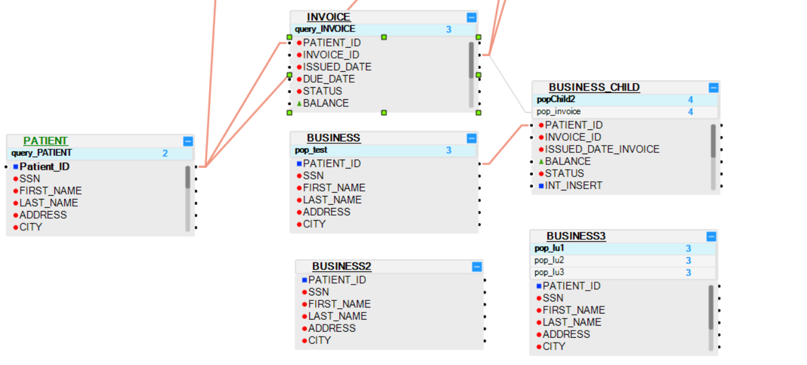

# Editing and Adding a Table to an LU Schema

## LU Tables

An [LU table](/articles/06_LU_tables/01_LU_tables_overview.md)  is a basic building block in a Logical Unit (LU).

The following are some of the methods you can use to add a table to an [LU schema](/articles/03_logical_units/03_LU_schema_window.md): 

1. Use the [Auto Discovery Wizard](/articles/03_logical_units/06_auto_discovery_wizard.md) to create or edit an LU whereby the tables and their populations are automatically created and added to the LU schema.

   -- or --

2. From the **[LU schema](/articles/03_logical_units/03_LU_schema_window.md) window**:

   a. Go to the [DB Objects tab](/articles/03_logical_units/03_LU_schema_window.md#logical-unit-lu-tabs). 
   
   b. Click **DB Connection** and select a [**DB interface**](/articles/05_DB_interfaces/03_DB_interfaces_overview.md) from the drop-down menu.
   
   c. From the window underneath the **DB Connection** drop-down menu, open the table tree, select a **Table** and open its drop-down menu, then drag the table from its title  into the **LU schema**. You can drag several tables at the same time.
   
   d. A right-click menu appears, from it select one of the following: **Create Table Based DB Query** or **Create Table Based Root Function** or **Create Table Based Broadway Flow**.

      The selected table or tables are automatically created with the selected type of [population](/articles/07_table_population/01_table_population_overview.md) and added to the LU schema.

      

   -- or --

3. Drag a **Table** into the **LU Schema window**:

    a. Go to the [Objects tab](/articles/03_logical_units/03_LU_schema_window.md#logical-unit-lu-tabs) of the [LU schema](/articles/03_logical_units/03_LU_schema_window.md).
    
    b. Select a **Table** and drag it into the **LU Schema window**.

      
     
    -- or --

4. Right click the **Schema window** and select one of the following options:

    a. **New Table from SQL Based DB Query**.
    
    b. **New Table from SQL Based Root Function**.
    
    c. **New Table from SQL Based Broadway Flow**.
    
    All the above options open the Query Builder. The LU table and its population are automatically generated based on the SQL query defined in the Query Builder.

      

[Click for more information about LU Table Creation.](/articles/06_LU_tables/02_create_an_LU_table.md) - additional methods of creating and adding an LU table are shown there. 

[Click for more information about LU Tables and Table Population.](/articles/07_table_population/01_table_population_overview.md)

[Click for more information about Broadway Population.](/articles/07_table_population/14_table_population_based_Broadway.md)

## Business Tables

The ability to create business tables and to store them in the LU schema has been added to Fabric release 6.5.4. 
Business tables are tables that give the user the ability to decide whether a table should have one or more populations and whether these populations should be connected, or not, to other tables in the LU schema.

Such tables allow the user to compute, transform and store new data inside the LU microDBs. 
Such data could be statistics, LUI-based calculations, or a mix of different functions and populations. 

In the example below, we can see different examples for such tables:

- **Business** table: 1 population, not connected to an LU parent table,

- **Business Child** table: 2 populations with 1 connected to its parent *Business* table, and the other population connected to the LU invoice table.
 
- **Business2** and **Business3** tables: Unconnected to any other table in the schema and with (respectively) no population or 3 items.

It is important to note that considering the flexibility of the populations types introduced with these tables, the appropriate population *execution order* will need to be carefully selected by the user, otherwise the table/field in question will not be filled. 
 

