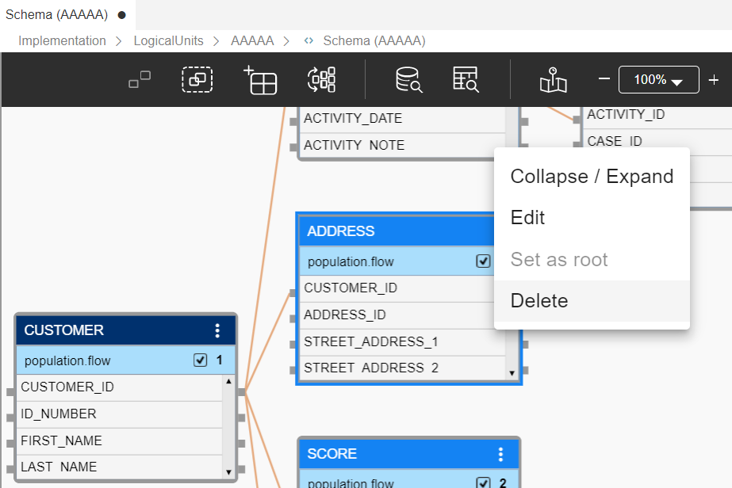

# Remove a Table from an LU Schema

To remove a table from the LU schema, open the [LU Schema window](/articles/03_logical_units/03_LU_schema_window.md), click the required table and press the **Delete** key. Then save the changes in the LU Schema.

<web>

Alternatively, you can delete a table using the table context menu.

</web>

**Notes:**

* Removing a table from an LU schema does not delete it from the LU. You can still see it at the LU's **Tables** folder.
* Deleting a table from the **Tables** branch under an LU in the Project Tree does not automatically remove it from the LU schema. To do so, open the LU Schema window and delete the LU table from the LU schema.    

