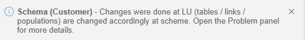
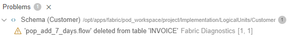

# Add or Delete Population from LU Schema

A Table Population object holds the transformation and mapping rules of the data and populates the data into the LU table. Each table can have one or more populations. 

### How Do I Add a Table Population To the LU Schema?

<web>

**From the Schema Window**

1. Go to the **Project Tree** > **Logical Units / Data Products** > relevant logical unit >  **Schema** in order to open the Schema window.
2. Click on the table > select **Add Population** from the context menu. 
3. Populate the population name. The new population flow is open. 
4. Add input argument(s) to the **PopulationArgs** Actor, make it **External** and save the population. 
5. Re-open the schema. The new population is automatically added to the LU schema. 
6. Link the new **population** to its **parent** table.

</web>

**From the Project Tree**

1. Go to the **Project Tree** > **Logical Unit** > right click on the **LU table** > select **New Population** for creating a new population object.  
2. Open the **LU schema** window. The new population is automatically added to the LU schema. 
3. Link the new **population** to its **parent** table.

Note: If required, you can edit the execution order of the new population.

<web>[Click for more information about Population Flow.](/articles/07_table_population/14_table_population_based_Broadway.md)</web>

<studio>[Click for more information about Table Population.](/articles/07_table_population/01_table_population_overview.md)</studio>

[Click for more information about Editing the Execution Order of a Table Population.](/articles/07_table_population/13_LU_table_population_execution_order.md)

### How Do I Delete a Table Population From an LU Schema? 
1. Go to the **Project Tree** > **Population Object** > press the **Delete** key. 
2. Re-open the **LU schema** screen.
3. **Save** the changes for removal of the deleted population object from the LU schema.

Note: if the LU schema is already open, you can click on the **Refresh** icon on the toolbar.

<web>

Either way - reopening the file or refreshing it - a popup notification will appear at the bottom right corner of the screen, advising of the change. It would look like this:

In order to verify your changes and/or deletions, open the "Problems" panel view (can be opened from the top menu > View  or by pressing CTRL+SHIFT+M). I.e.:

 </web>

