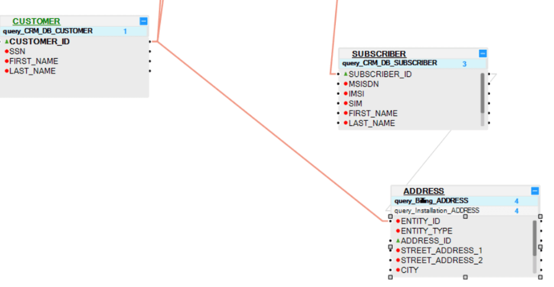
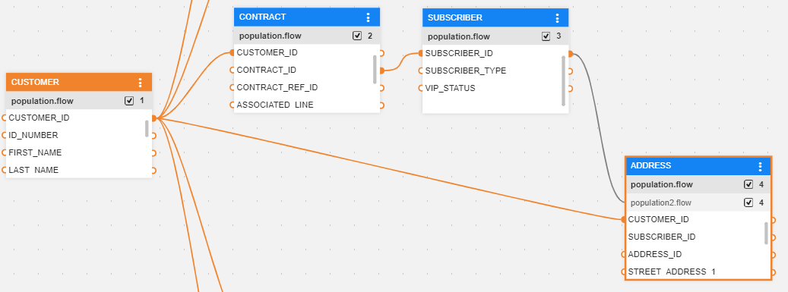
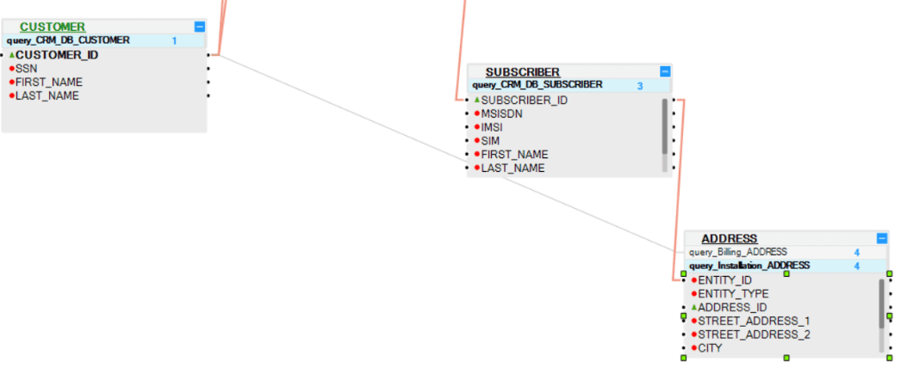
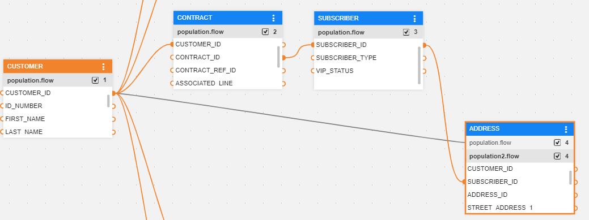
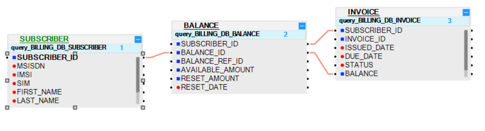
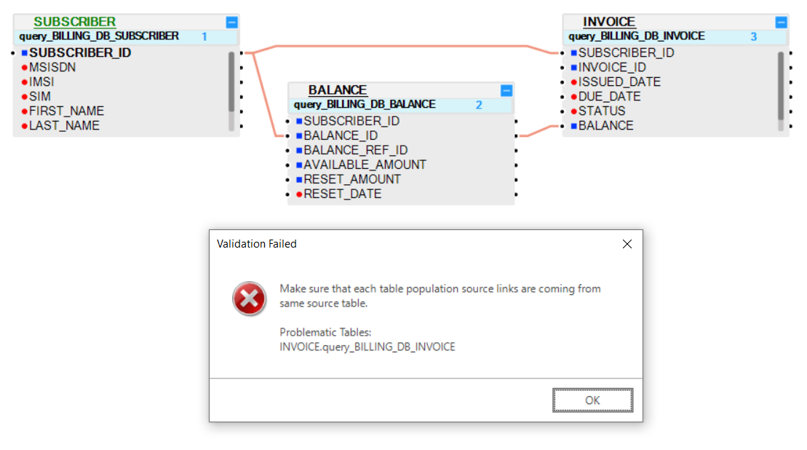
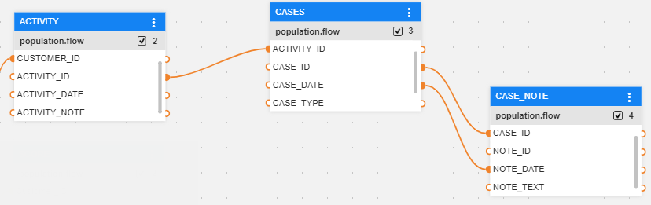
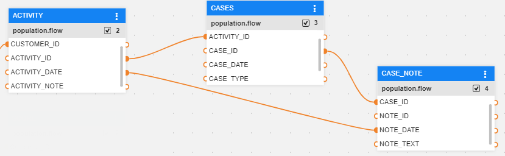
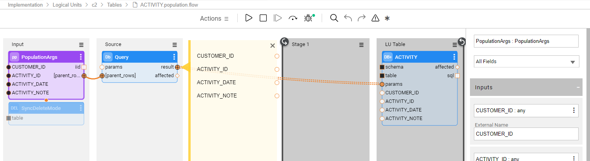
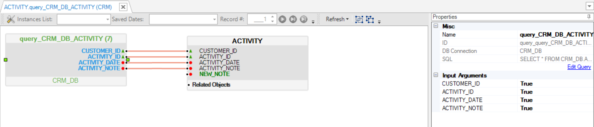

# LU Hierarchy and Linking Populations

## Table Population Links Overview
An LU schema structure displays a hierarchical representation of the data related to the Root Table. Parent-child links in LU tables are created via their Table Population objects :
* Each LU table can have one or several Table Population objects and each Table Population object, except the Table Population object of the Root LU table, must be linked to a parent table via its [input arguments](/articles/03_logical_units/12_LU_hierarchy_and_linking_table_population.md#what-are-the-table-populations-input-arguments). 

* Each Table Population object can be linked to a different parent LU table.

  **For example:** an ADDRESS LU table is populated by two populations: 

  * Population 1, populates the customer’s billing address. It is linked to the CUSTOMER table and selects source address records that belong to the CUSTOMER_ID.

    <studio>

    

    </studio>

    <web>

    

    </web>

  * Population 2, populates the the installation address of each subscription. It is linked to the SUBSCRIBER table and selects the source address records that belong to the SUSBCRIBER_ID.

    <studio>
    
    
    
    </studio>
    
    <web>
    
    
    
    </web>

* A link from a Table Population object to a parent LU table can be based on several columns where all columns must be linked to the **same parent LU table**.

  <studio>

  * **Example 1:** The INVOICE Table Population object can be linked to the BALANCE LU table by two columns: SUBSCRIBER_ID and BALANCE. This is a valid link.

    

  * **Example 2:** Linking the INVOICE Table Population object to two different LU tables - BALANCE and SUBSCRIBER is invalid.
  
    

​	</studio>

​	<web>

* **Example 1:** The CASE_NOTE Table Population object can be linked to the CASES LU table by two columns: CASE_ID and NOTE_DATE. This is a valid link.

  

* **Example 2:** Linking the CASE_NOTE Table Population object to two different LU tables - CASES and ACTIVITY is invalid. The validation error will be displayed in the Problems pane upon save.

  

</web>

**Note:** An LU table can be added to an LU schema without a Table Population object. This table is not populated by the sync of the instance, but can be populated by a separate transaction.

## What Are the Table Population's Input Arguments?
<web>

Input arguments of a population flow are defined by the **PopulationArgs** Actor's input argument that must be set to **External** population type.

Each population flow must have at least one Input parameter. A Root table's population can have only one input argument which is populated by the Instance ID.

[Click for more information about population flows.](/articles/07_table_population/14_table_population_based_Broadway.md)

[Click for more information about actor's input parameters.](/articles/19_Broadway/03_broadway_actor_window.md#actors-inputs-and-outputs)

</web>

<studio>

Input arguments are a property of the [Source Object](/articles/01_fabric_overview/02_fabric_glossary.md#source-object)  of a Table Population object.

There are [two types of Source Objects](/articles/07_table_population/02_source_object_types.md) for a Table Population object:
* DB query
* Root function

**DB Query**
* A DB query Table Population object can be linked to a parent table via its input argument fields. Only input arguments that are defined as True can be linked to parent tables.
* In the DB query of a Root Table, only one field can be defined as True and is populated by the [Instance ID](/articles/01_fabric_overview/02_fabric_glossary.md#instance-id).
* Other LU Tables can have several fields defined as input arguments. 

**Root Function**
* Each root function must have at least one Input parameter.
* A population can be linked to a parent table via its Input parameters based on a Root function. 
* The Root function of a Root Table can have only one Input parameter and is populated by the Instance ID.

[Click for more information about Table Population Types.](/articles/07_table_population/02_source_object_types.md#table-population---source-object-types)

## How Do I Edit the Input Arguments In a DB Query?
When creating a DB query, by default all Input fields are set to True.  

To edit an Input argument, do the following: 

Click the **source object** of the Population window (the DB query) and verify that the fields that should be linked to the **parent table** are set to **True**. Other fields which do not need to be linked to a parent table, can be set to **False**. 

</studio>

## How Do I Link Tables? 
A link can be added in both directions:
* **Child to parent**, linking the child population to a parent table.
* **Parent to child**, linking a parent table to a child population.

<web>

1. Click the child population header.
1. Connect each of its input fields connectors to a parent table output connectors.

</web>

<studio>

## How Can I Link the Child Population to a Parent Table? 
1. Click the **Child Population** header.
1. Connect each **input field** to a **parent table** using one of the following methods:
  * Drag the **connection line** to the **parent table** and **column**.
  * Right click, select **Add link from** > **parent table** > **column**.

## How Can I Link a Parent Table to a Child Population?
1. Click the **parent table**.
1. Connect each **parent column** to the **child population** using one of the following methods:
  * Click the **child population** header and drag the **connection line** to the **parent table** and **column**.
  * Right click, select **Add link to** > **child population** > **column**.

</studio>

**Note:** Link all the Input fields of the selected Table Population object to one parent table. A Table Population object cannot be linked to several parent tables. 

## How Can I Delete Table Population Links?

Click the link and press the **Delete** key<studio>, or right click and select **Delete**</studio>.

