# LU Tables' Hierarchy and Linking Populations

## Table Population Links Overview
An LU schema structure displays a hierarchical presentation of data relating to the LU's Root table. Parent-child links in the LU tables are created via their **Table Population** objects:
* Each LU table can have one or more **Table Population** objects. These objects appear as distinct entries beneath the table’s name (i.e., a separate line(s)). A **Table Population** object can be linked to a parent table by connecting the parent table's **output parameter** to the child table's **input parameter**, which is also referred to as an [**input argument**](/articles/03_logical_units/12_LU_hierarchy_and_linking_table_population.md#table-populations-input-arguments). This linking mechanism applies to all tables, except for the LU's Root table, which does not require a parent-child relationship due to its role as the starting point of the hierarchy. 

* Each **Table Population** object can be linked to a different parent LU table.

  **For example:** The **ADDRESS LU table** is populated with 2 **Table Population** objects: 

  * Population 1 (ADDRESS table) populates the customer’s **Billing ADDRESS**. The CUSTOMER and ADDRESS tables are linked, and they select the source address records that belong to the CUSTOMER_ID (that originates from the CUSTOMER table, which is the root table in this example).

    <studio>

    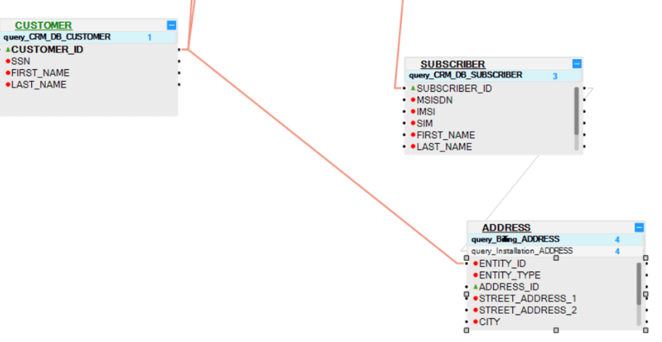

    </studio>

    <web>

    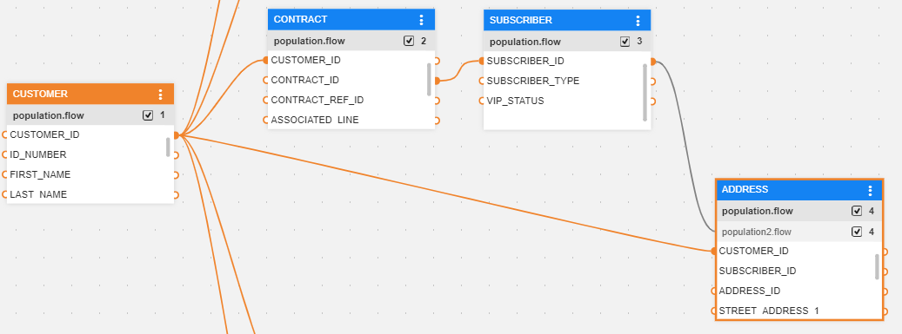

    </web>

  * Population 2 populates the **Installation ADDRESS** of each subscription. The SUBSCRIBER and ADDRESS tables are linked, and they select the source address records that belong to the SUBSCRIBER_ID (which originates from the SUBSCRIBER table).

    <studio>

    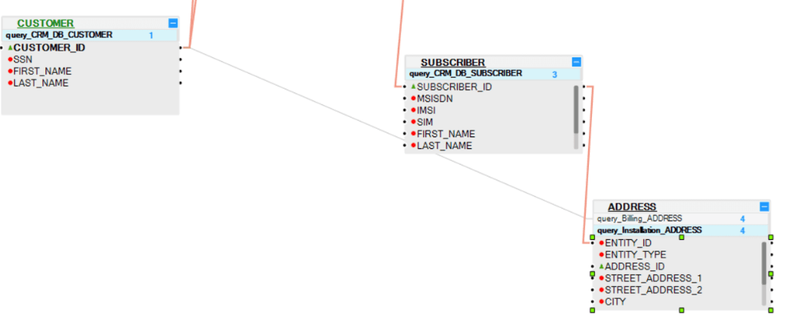

    </studio>

    <web>

    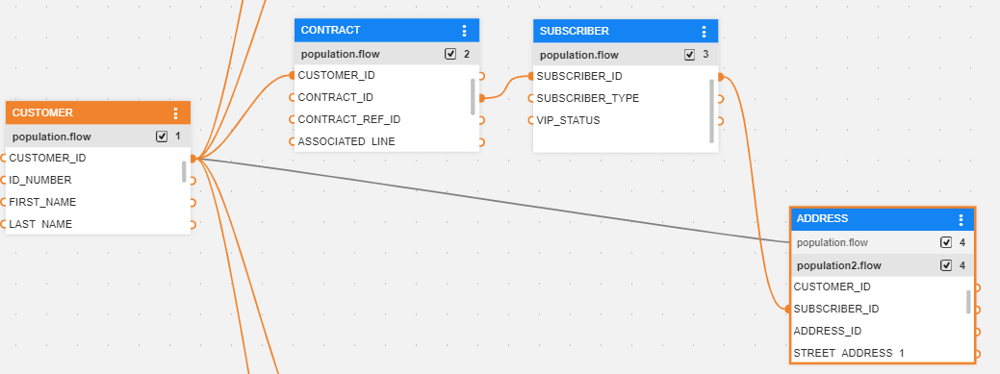

    </web>

* A link from a Table Population object to a parent LU table can be based on several columns, all of which should be linked to the **same parent LU table**.

  <studio>

  * **Example 1:** The INVOICE Table Population object can be linked to the BALANCE table by 2 columns: SUBSCRIBER_ID and BALANCE. This is a valid link.

    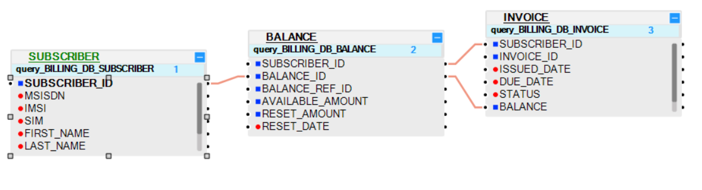

  * **Example 2:** Linking the INVOICE Table Population object to 2 different LU tables - BALANCE and SUBSCRIBER - is invalid.

    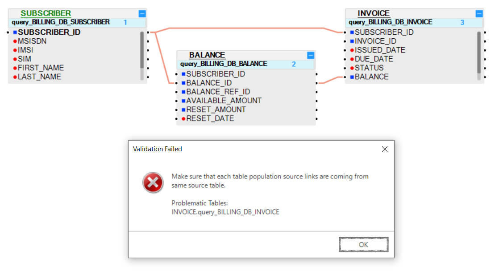

    </studio>

    <web>

  * **Example 1:** The CASE_NOTE Table Population object can be linked to the CASES table by 2 columns: CASE_ID and NOTE_DATE. This is a valid link.

    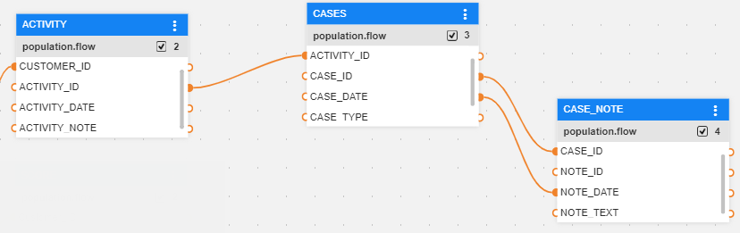

  * **Example 2:** Linking the CASE_NOTE Table Population object to 2 different LU tables - CASES and ACTIVITY - is invalid; a validation error will be displayed in the Problems panel when trying to save. 

    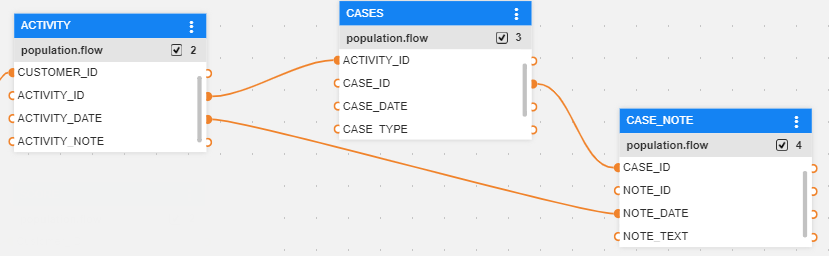

    </web>

**Note:** An LU table can be added to an LU schema without a Table Population object. Such table is not populated by the sync of the instance, but rather by a separate transaction.

## Table Population's Input Arguments
<web>

A population flow template includes a predefined set of **Input arguments**, defined within the **PopulationArgs Actor**, which are input parameters set as **External**.

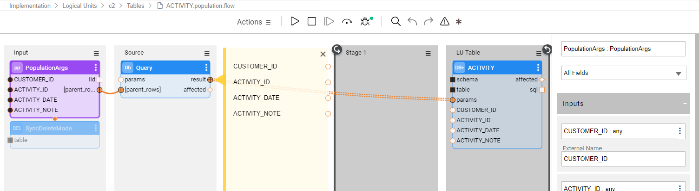

In a table population flow, at least one Input argument must be defined to retrieve data from external systems. The Root table must only have one Input argument, which receives the Instance ID to fetch data specific to that entity. Other tables use Input arguments to receive relevant identifiers from parent tables, which are then used to fetch related data from external systems.

[Click for more information about population flows.](/articles/07_table_population/14_table_population_based_Broadway.md)

[Click for more information about an Actor's input parameters.](/articles/19_Broadway/03_broadway_actor_window.md#actors-inputs-and-outputs)

</web>

<studio>

Input arguments are parameters used to retrieve data in a Table Population object. They define how data is linked to parent tables and fetched from external systems.

These arguments are utilized by [2 types of Source Objects](/articles/07_table_population/02_source_object_types.md) in a Table Population object: **DB Query** and **Root Function**.

**DB Query**
* A DB query Table Population object can be linked to a parent table via its Input argument fields. Only Input arguments that are defined as *True* can be linked to parent tables.
* In the DB query of a Root table, only one field can be defined as *True* and it is populated by the [Instance ID](/articles/01_fabric_overview/02_fabric_glossary.md#instance-id).
* The other LU tables can have several fields defined as Input arguments. 

**Root Function**
* Each Root function must have at least one Input parameter.
* A population can be linked to a parent table via its Input parameters based on a Root function. 
* The Root function of a Root table can have only one Input parameter and it is populated by the Instance ID.

[Click for more information about Table Population Types.](/articles/07_table_population/02_source_object_types.md#table-population---source-object-types)

## Edit the Input Arguments in a DB Query
When creating a DB query, by default, all Input fields are set to *True*.  

To edit an Input argument, do the following: 

Clicking on the **source object** of the Population window (the DB query) opens the Properties pane on the right side of the screen. Verify that the fields that should be linked to the **parent table** are set to ***True***. Other fields that do not need to be linked to a parent table, can be set to ***False***. 

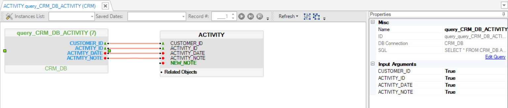

</studio>

## Linking Tables
A link can be added in both directions:
* **Child to parent** - linking the child table population to a parent table.
* **Parent to child** - linking a parent table to a child table population.

You can link them by either dragging a connection line or by using the Tables Connection Assistance pop-up window, as follows:

### Link a Child Table Population to a Parent Table
1. Click the Population name of the child table.

2. Connect each **Input field** to a **parent table** using one of the following methods:

   - Drag the **connection line** from this field into the **parent table** and **column**.

   - <studio>Right-click on this field, select **Add link from** > **parent table** > **column**.</studio>

   - <web>Right-click on this field connector, select the source table and then select source table field.</web>

     <web>

     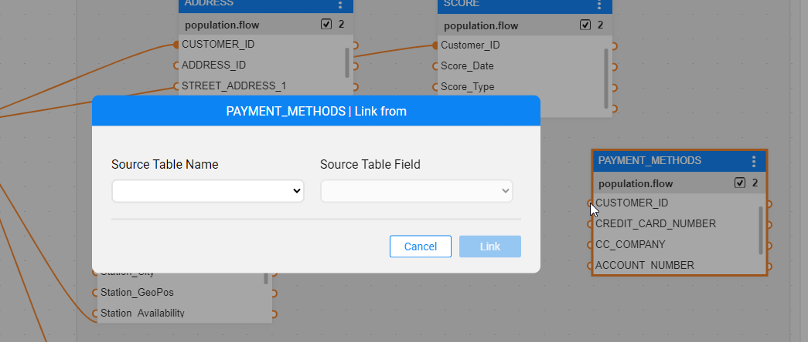

​	</web>

### Link a Parent Table to a Child Table Population

1. Click the **parent table**.
2. Connect each **parent column** to the **child table population** using one of the following methods:

   - Click the **child table population** header and drag a **connection line** between the **parent table**'s column and the **child table**'s Input field.

   - <studio>Right-click, select **Add link to** > **child table population** > **column**.</studio>

   - <web>Right-click on a field's output connector, select the target table, the target table population and then the target Input field.</web>

     <web>

     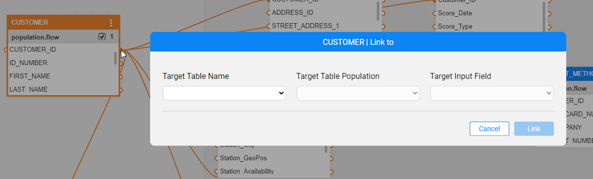

   ​	</web>

> **Note:** Link all the Input fields of the selected Table Population object to one parent table. A Table Population object cannot be linked to several parent tables. 

<web>

## Population Links Clarity and Context

### Highlight Table Population Links

In complex and large schemas, it is sometimes difficult to track the population link - which table it comes from and/or which tables it goes to. 

You can therefore click on the link and see it as an animated dashed line.

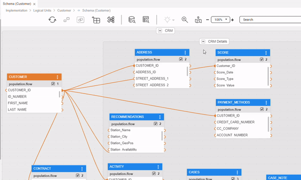

### Population Link Context

In certain scenarios, the connecting columns for a population might not be immediately visible - for instance, when tables include numerous columns that require scrolling for viewing. This could make exploring the schema and understanding table connections less convenient.

You can therefore hover over the population link with your mouse cursor to view a tooltip that provides detailed information about the link, including the source table and columns, the destination table and columns, and the population name.

In the below example, the connecting column in the destination table - RECOMMENDATIONS - is hidden. However, with this tooltip you do not need to scroll down to reveal it.

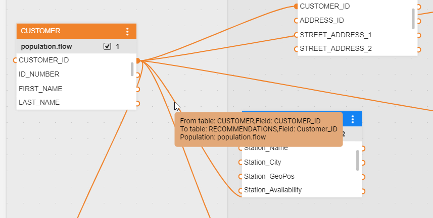

</web>

## Delete Table Population Links

<studio>Either click on the link and press the **Delete** key on your keyboard, or right-click and select **Delete**</studio>.
<web>Click on the link and press the **Delete** key on your keyboard.</web>

