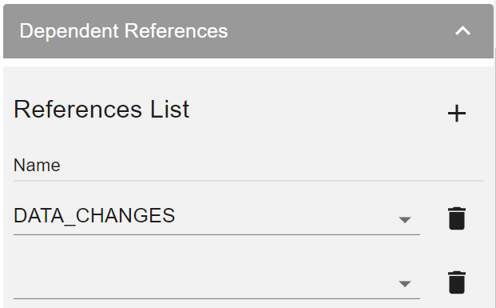

# Editing Logical Unit's References List

### What Are Reference Tables?
Fabric enables creating [Reference tables](/articles/22_reference(commonDB)_tables/01_fabric_commonDB_overview.md) which can be used by all Logical Units.
A Reference table typically contains metadata that is referenced by different LU instances of a specific LU, by instances from a different LU or by Web Services. For example, a postal-code table that identifies the postal code of customer addresses. 

### LU References List
The References tab displays a list of the common Reference tables defined in the project. 
To ensure that a [References table](/articles/22_reference(commonDB)_tables/02_reference_table_fabric_studio.md#sync-method) in an LU schema is always populated when synching an instance for the first time, add it to the the LU's Reference Table List.

Click [here](/articles/22_reference(commonDB)_tables/02_reference_table_fabric_studio.md) for more information how to create a new reference table in Fabric.

### How Do I Edit LU References List? 

<studio>

1. Open the **LU Schema Window** and click the **References tab** to display the **Reference Tables** list. 
1. Check the **Reference Table** to create a **Lookup Object** in the **Reference Table** in the **LU Population**.

**Notes:** 
* A Reference table must be checked to enable creating a Lookup  for the table.   
* A Reference table can be accessed using code (for example, function) also when the table is not checked in the References tab. 
* It is recommended to limit the number of checked reference tables in the Reference Tab to avoid a massive sync of the Reference tables when synchronizing a LU instance for the first time.

</studio>

<web>

1. Open the **LU Schema Window**, click the **Proproteins tab** and expand the **Dependent References** section. The Reference List then appears. 

2. Click the  icon to add a reference table to the LU and select it from the list.

   

3. Click the  icon to delete a reference table from the LU.

4. Save the LU to apply the changes.

 </web>

