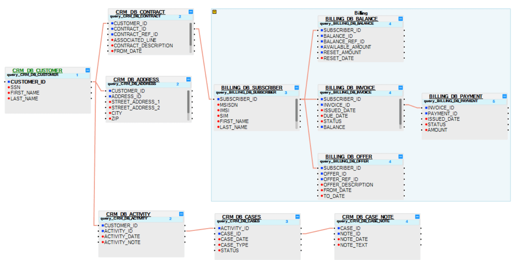

# Group and Ungroup LU Tables

An LU schema may include a large number of [tables](/articles/06_LU_tables/01_LU_tables_overview.md). To make the structure of the table schema clearer, group or ungroup list of tables. 

For example, see below a group of tables marked with a title and a different color:

<studio>

### How Can I Group LU Tables?
1. Select the tables to be grouped.
1. Click the **Group SubGraph** icon in the **Logical Unit** toolbar.
1. Click the **Grouped SubGraph** and edit the name of the **Group**.

### How Can I Ungroup LU Tables? 
Click the **Grouped SubGraph** and click the **Ungroup SubGraph** icon.

</studio>

<web>

### How Can I Group LU Tables?

1. Select the tables to be grouped. 
2. Click the  icon in the **Logical Unit** toolbar.
3. Click the group's title and edit the name.

 
### How Can I Ungroup LU Tables? 

1. Select one or more tables to be removed from the group.
2. Click the  icon in the **Logical Unit** toolbar.
3. When all the tables are removed from the group, the group is deleted.

 </web>

