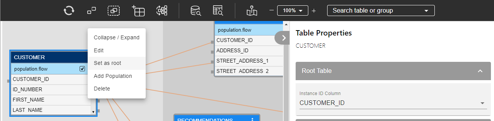

# Change LU Root Table

Each LU schema must have a [Root Table](/articles/01_fabric_overview/02_fabric_glossary.md#root-table) and an [Instance ID](/articles/01_fabric_overview/02_fabric_glossary.md#instance-id) columns.  

### How Can I Change the Root Table? 

<studio>

1.  Go to the [Schema window](/articles/03_logical_units/03_LU_schema_window.md) and right click the table is to be the new Root Table
2.  Click **Set as: Root**.
3.  Define the **Instance ID Column** of the new Root Table.

You must link the previous Root Table to a parent table. This can be the new Root Table.

</studio>

<web>

1.  Go to the [Schema window](/articles/03_logical_units/03_LU_schema_window.md) and click on the table that is designated to be the new Root table.

2. Set it as root using the table context menu. Only a table with no input connections can be set as root.

   

3. After the table is set as root, the table properties tab is open to set the required Instance ID column. Additionally, the color of the root table's header changes to dark blue.

4. Link the previous Root Table to a parent table.

5. Save your changes once all the required tables are added to the LU Schema.

</web>

[Click for more information about Defining a Root Table and Instance ID Column.](/articles/03_logical_units/08_define_root_table_and_instance_ID_LU_schema.md)

