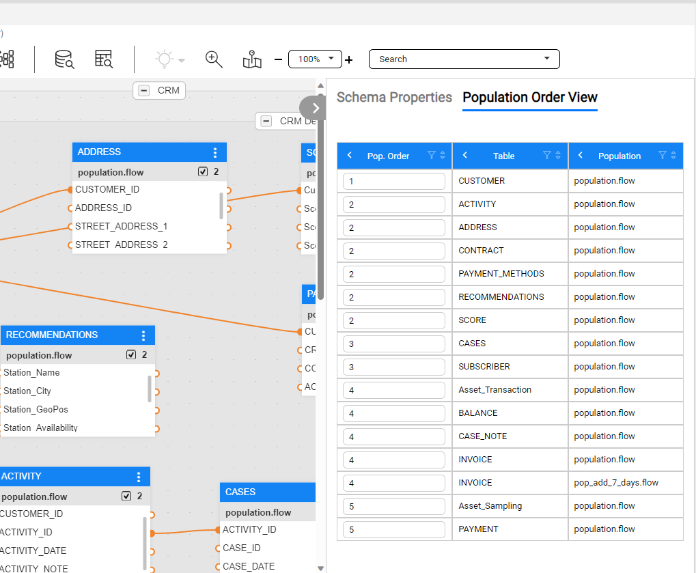
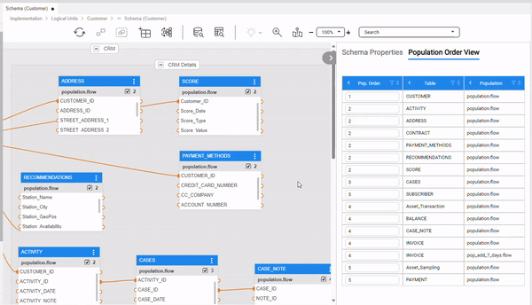

<web>

# Population Order View

The Logical Unit Schema Population Order View provides a simple way to view and manage the population order of tables. This is especially useful for large schemas with many tables, where the schema diagram is complex to maintain. The Population Order View makes it easy to understand and manage when each table is populated during an LUI sync process.

To open the Population Order View:

1. Click on the  icon in the upper right corner of the schema window.
2. Choose the Population Order View tab.

The view shows a table with several columns: Order, Table and population flow name.

* The default table sort order is by the population order. This lets you understand what tables are populated first. 
* You can change the sort order as well as filter the table or group rows (for example by population order), using the table's top control actions
* The population order is editable, letting you control and manage them, without the need to look for it at the schema
  * When you change the order, it is automatically reflected and affected the schema diagram.
  * When editing the order, the table is not reordered, so that you will not loose the location of your changes.

- Clicking on a table name within the table, will lead you to the table location in the schema diagram, as well as highlighting it by blinking (Note that table is not being selected, in order to remain in schema perspective view).

</web>
