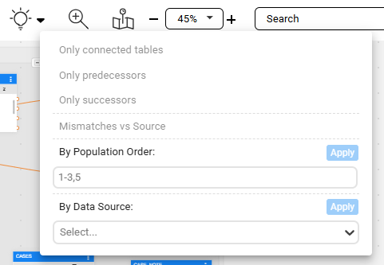
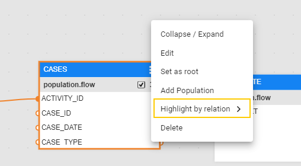
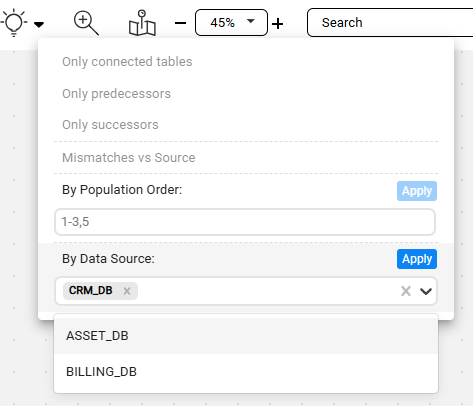
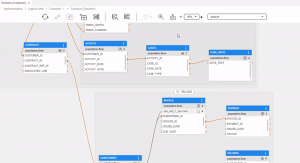
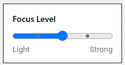

<web>

# Schema Tables' Highlighting

When maintaining large logical units with many tables, it becomes difficult to understand and manage their complex schemas. The Tables' Highlighting feature enables to highlight some of the tables, according to some criteria, and bring them into focus.

The criteria are:

* Highlighting connected tables
* Highlighting tables that are not matched to their data source; read [here](/articles/06_LU_tables/07_reconciliation.md#highlighting-mismatched-tables) for more information about this option. 
* Highlighting tables by their associated population order
* Highlighting tables by their data source

The criteria can be found and set by clicking on the schema's top bar **highlighting bulb** action icon ( ).  

## Highlighting Connected Tables 

Highlighting connected tables helps you to better understand the connection and relations between tables, especially in large schemas, by highlighting related tables.

To activate the *highlighting connected tables* feature: 

1. First, select a table with connections to other tables that you wish to see. 

2. Choose to highlight by either:

   - Clicking on the schema's top bar **highlighting bulb** action icon ( ). 

   - Opening the table menu (vertical ellipsis, 3-dot menu) and choosing **Highlight by relation**

     

3. Selecting one of the following highlighting option types:

   - Only connected tables, All connected tables - predecessors and successors
   - Only predecessors
   - Only successors

## Highlighting Tables by Population Order

Highlighting tables by their associated populations' order lets you understand better the population flows. 

To activate it:

1. Choose one or more population orders, by typing a range and/or by specifying each of them, using commas as separators. For example, to highlight population orders 1,2,3 and 5, you can type either  "1, 2 ,3 ,5" or "1-3, 5".

   Once any population order is typed, the Apply button becomes active.

2. Click on Apply.

Read [here](/articles/03_logical_units/19_LU_population_order_view.md) more about viewing and editing tables' populations order.

## Highlighting Tables by Data Source

To highlight tables by their origin data source (data sources are defined by [Interfaces](/articles/05_DB_interfaces/01_interfaces_overview.md)):

1. Select one or more data sources using the select list. 

   

   * Once any data source is selected the Apply button becomes active.

   * You can deselect a selected data source by clicking on the X sign aside its name.

2. Click on Apply

  

> **Note**: tables' data source are kept in case they were add to the schema by using the Data Explorer View  

## Highlighting tables Operation

### Activate Highlighting

Once highlighting is activated, the focus in the schema is applied to the required tables, while all other tables become blurred. 

Additionally, the highlighting bulb icon in the schema' top bar turns orange, indicating that the highlight feature is currently turned-on.

> **Tip**: The activated highlighting type can be quickly revealed as a tooltip when hovering the mouse over the highlighting bulb icon. (You can also click on the down arrow symbol, located next to it, in the schema's top bar, and look for the 'v' sign). 

> **Note**: When the Tables' Highlighting feature is turned-on, other tables are still available and active.

### Focus Level

As a result of applying the highlighting, the **Focus Level** widget pops up at the schema's bottom-left corner. 

The color contrast between the focused and blurred views ( i.e., less prominent tables) can be adjusted by moving the slider of the Focus Level feature (increments of 25%; default is the midpoint). The stronger the Focus Level is set, the more non-focused tables will be hidden.

> **Note**: The **Auto Layout** feature dynamically applies to visible tables, ensuring that when full focus is enabled, it is implemented for these tables only. 

### Deactivate Highlighting

To deactivate the highlighting feature and turn it off, either click on the highlighting bulb icon, or click on the down arrow symbol and then on the selected highlighting option.

### Change Highlighting Type

In case the highlighting feature is turned-on and you wish change the highlighting option type (for example, from focusing on all connected tables to focusing on only predecessors), click on the down arrow symbol and select the desired option.

</web>
