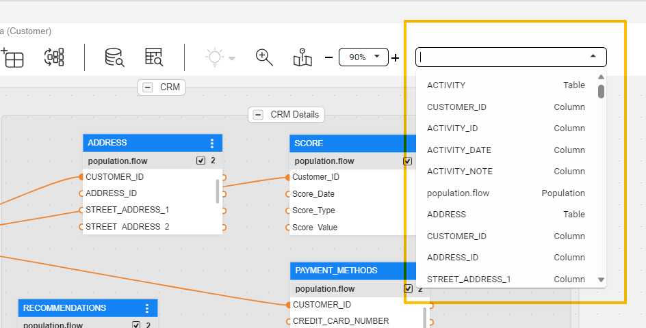
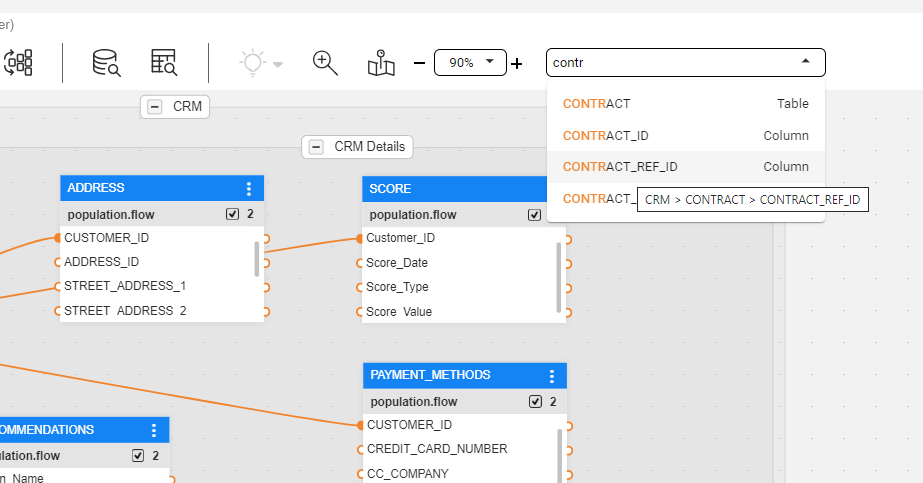
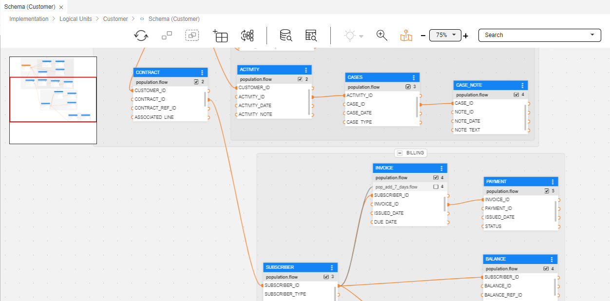
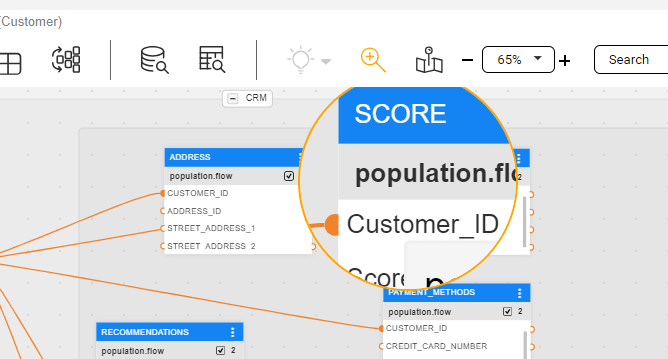

<web>

# Large Schema - Productivity Tips

When maintaining large logical units with many tables, it sometimes becomes difficult to understand and manage their complex schemas. This article suggests several features and productivity tips that may assist in such a case.

## Schema Search 

Use the schema Search input field for looking for tables, table-groups, tables' columns, populations and their input fields.

To do so, first tap the search box located at the schema's top toolbar. Once done, the search box expands into a result widget, displaying all schema tables in an alphabetical order, along with their related elements (columns and populations). The element type appears besides each element name.

You can type a keyword into the search box, where the result widget would then display all the occurrences of the searched text.

* The results show the entire element name containing the searched text, which is highlighted in orange. 

* Hovering over an entry in the search result widget triggers a tooltip that indicates the location of the searched text in the schema hierarchy. The below screenshot shows the example: "CRM > CONTRACT > CONTRACT_REF_ID". In this example, 'CRM' is the name of the group (which is optional), followed by a table name and a column, as the hovering is done on a table's column.

  

* Clicking on an entry directs you to the element's location, to either the group or the table, and selects it.

## Navigation Mini Map

You can have an overview of the whole schema's diagram using the Navigation Map feature. To activate it, click on the schema's top bar Magnifier control icon ().

Once Opened - at the top-left side of the schema diagram window, you can click and move the red rectangle, which represents the current schema view. This way you can navigate within the schema.

When clicked, in addition to the appearing navigation map, the Navigation Map icon turns orange, indicating that it is turned-on. To turn it off, click on this control icon again.

## Zoom In and Out

Using the Zoom in and out top bar control, you can either focus on a specific area or get a wider view of the schema's diagram and its tables. Use either the '+' and '-' controls to gradually zoom (5% each click) or select one of the predefined zoom values using the select list options.  

## Magnifier

When the schema diagram is zoomed out - which usually happens in large LUs with complex diagram, where tables looks small - you can use the Magnifier control to magnify areas in the schema. Click on the schema's top bar Magnifier control icon () to activate it. 

When clicked, in addition to the appearing Magnifier that appears on the schema diagram, the Magnifier icon turns orange, indicating that it is turned-on.

To turn it off and deactivate the Magnifier, click on this control icon again.

> Note: While the Magnifier is activated, all other actions are still available, including the magnified elements.

## Highlighting Tables and Links

The Highlighting Connected Tables feature helps you to better understand the connection and relations between tables, especially in large schemas, by highlighting related tables. Use the schema's top bar highlighting bulb control icon ( ) to activate it. Read [here](/articles/03_logical_units/20_LU_highlight_tables.md) to learn about this feature.

## Connecting Tables

In a large schema, it is sometimes difficult to connect tables that are located far from each other, by drawing a link. Instead, you can right-click on either the input field connector (in the 'child' table) or the outer field connector (in the 'parent' table) and use the open popup window to set the connection. Read [here](/articles/03_logical_units/12_LU_hierarchy_and_linking_table_population.md#linking-tables.md) to learn more about this feature.

## Population Order Overview

Studio provides a Population Order View that make it easy to understand and manage when each table is populated during an LUI's sync process. This view is accessible using the right schema tab, aside the Schema's properties. Read [here](/articles/03_logical_units/19_LU_population_order_view.md) to learn about this feature.

</web>
