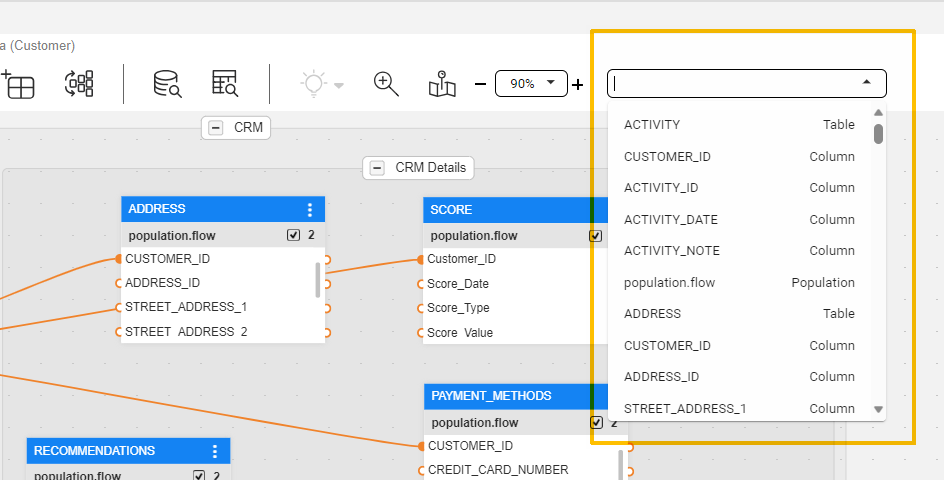
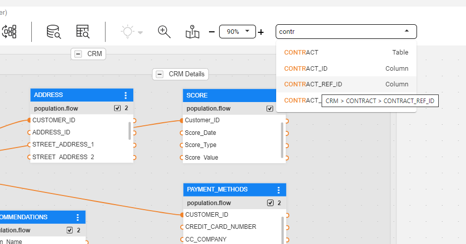
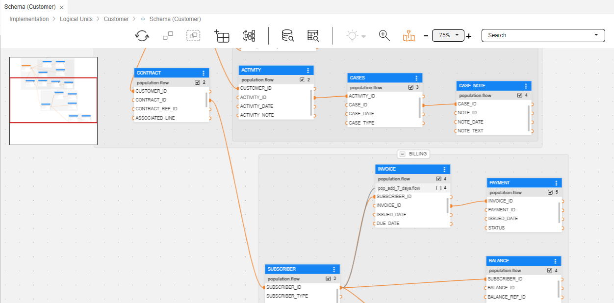
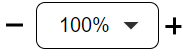
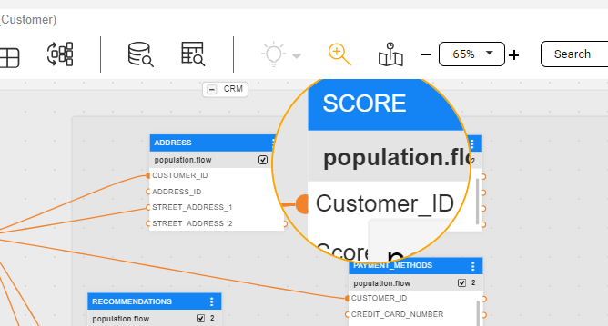

<web>

# Large Schema - Productivity Tips

When maintaining large Logical Units with many tables, it sometimes becomes difficult to understand and manage their complex schemas. This article highlights several features and productivity tips that may assist in such cases.

## Schema Search 

Use the schema Search input field to look for tables, table-groups, tables' columns, populations and their input fields.

To do so, first tap the Search box located on the right of the schema's top toolbar. The Search box then expands into a **search result widget**, displaying all schema tables in alphabetical order, along with their related elements (columns and populations). The element type appears alongside each element name.

You can type a keyword in the Search box, where the search result widget will accordingly display all occurrences of the searched text.

* The search results display the entire element name, which contains the searched text highlighted in orange. 

* Hovering over an entry in the search result widget triggers a tooltip that indicates the location of the searched text in the schema hierarchy. The below screenshot depicts an example, "CRM > CONTRACT > CONTRACT_REF_ID", where 'CRM' is the name of the group (which is optional), followed by a table name and a column, as the hovering is done on a table's column.

  

* Clicking on an entry in the search result widget directs you to the element's location, to either the group or the table, and selects it. The table is also blinking for a short time. In case the search is for a table's column, then when clicking on it in the search bar will lead you to the column within its table, include scrolling the column list to the column and highlighting it.

## Navigation Minimap

An overview of the whole schema's diagram is available using the Navigation Map feature. To activate it, click on the schema's top bar Magnifier control icon ().

Once opened - on the top-left side of the schema diagram window - you can click and move the red rectangle, which represents the current schema view. Using this feature enables your navigation within the schema.

When clicked, in addition to the appearing navigation map, the Navigation Map icon turns orange, indicating that it is turned-on. To turn it off, click on this control icon again.

## Zoom In/Out

Using the Zoom In/Out top bar control, you can either focus on a specific area or get a wider view of the schema's diagram and its tables. Use either the '+' and '-' controls to gradually zoom in/out (5% each click) or select one of the predefined zoom values using the drop-down arrow inside the box. 

## Magnifier

When the schema diagram is zoomed out - which usually happens in large LUs with a complex diagram in which case tables look small - you can use the Magnifier control to magnify areas in the schema. Click on the schema's top bar Magnifier icon () to activate it. 

When clicked, in addition to the appearing Magnifier that appears on the schema diagram, the Magnifier icon turns orange, indicating that it is turned-on.

To turn it off and deactivate the Magnifier, click on this control icon again.

> Note: While the Magnifier is activated, all other actions are still available, including the magnified elements.

## Highlighting Tables and Links

The Highlighting Connected Tables feature helps you to better understand the connection and relations between tables, especially in large schemas, by highlighting related tables. Use the schema's top bar highlighting bulb control icon ( ) to activate it. Read [here](/articles/03_logical_units/20_LU_highlight_tables.md) to learn about this feature.

## Connecting Tables

In a large schema, it is sometimes difficult to connect tables that are located far from each other, by drawing a link. Instead, you can right-click on either the input field connector (in the 'child' table) or the outer field connector (in the 'parent' table) and use the open popup window to set the connection. Read [here](/articles/03_logical_units/12_LU_hierarchy_and_linking_table_population.md#linking-tables.md) to learn more about this feature.

## Population Order View

Studio provides a Population Order View that makes it easier to understand and manage when each table is populated during an LUI's sync process. This view is accessible using the right tab in the schema's side panel. Read [here](/articles/03_logical_units/19_LU_population_order_view.md) to learn more about this feature.

</web>
