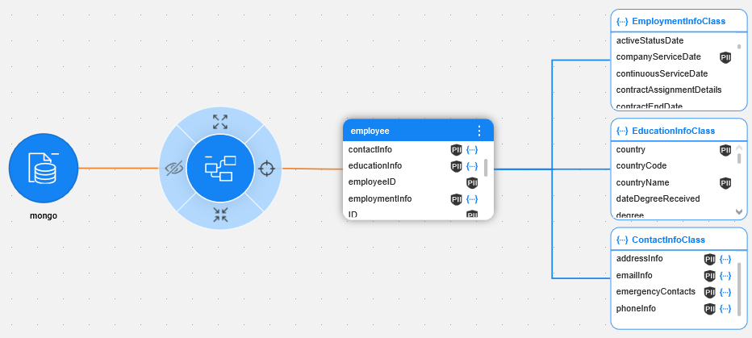
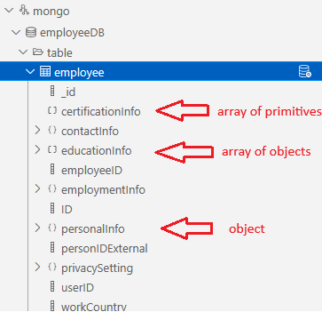
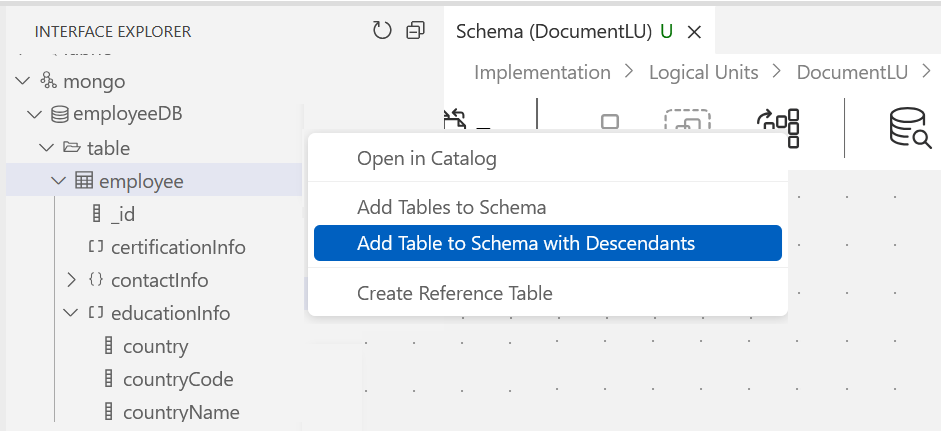
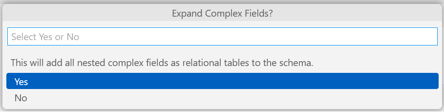
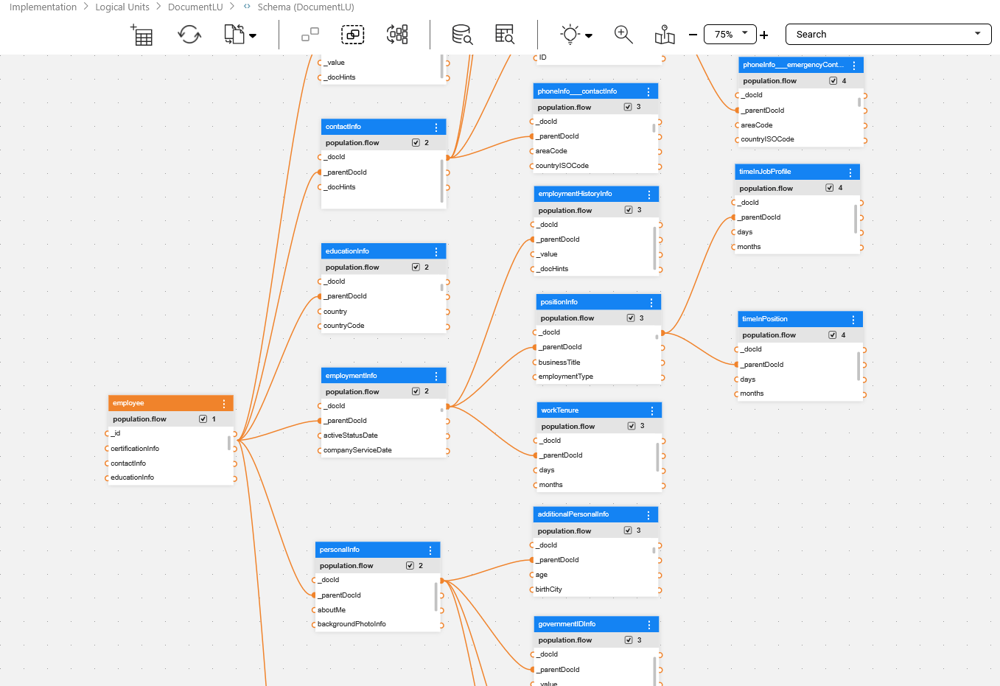

# Native Support for NoSQL Document Storage

### Overview

Starting from V8.3, Fabric can provide native E2E support for NoSQL Document Storage (such as MongoDB or CouchBase), including the following:

* Discovery job can run on interfaces such as MongoDB or CouchBase, once the respective K2exchange connector has been installed in the project. The Catalog is then created based on the discovered document hierarchy. (This feature was already supported prior to V8.3)
* The Web Studio’s Interface explorer can now display complex document structures, such as nested hierarchy levels and arrays of primitives.
* Logical Unit can now be created based on the Document’s metadata retrieved from the Catalog, after Discovery process has run on it.

  * Nested hierarchy levels are then created as LU tables, each with a referential link to its respective parent level.
  * When a complex structure on any level has a non-unique name, the names of the parent levels are concatenated to it, after 3 underscores; e.g., ```emailInfo___emergencyContacts```.
* LU tables are created with the following system-generated fields:

  * ```_docId``` is a unique ID added to each LU table. Its purpose is to uniquely identify the row of an instance, when splitting the document and composing it back.
  * ```_parentDocId``` is added to all LU tables except the root table, and it is used for creating the referential link from the nested structure to its parent structure.
  * ```_value``` is only added to LU tables that represent an array of primitives, to keep the element’s value.
  * ```_docHints``` is a field used internally by Fabric to manage the composition of the original Document.
* Root table population is the only action that reads data from the source (the Document).
* The populations created for such LU tables include a dedicated **DocumentQuery** Actor that is responsible for generating unique IDs to maintain the relations between hierarchy levels of the Document. In addition, the Actor takes the respective part of the original Document and breaks it into fields that are then populated in the LU table.

### Step 1: Running Discovery on Document DB

Start by defining the interface for the Document DB, installing the required connector, and running Discovery on this interface. 

The below image illustrates the **employee** document in MongoDB, which is represented by a **dataset** entity in the Catalog. The additional nesting levels of the document are represented by the **classes** and **fields** entities of the Catalog. 




### Step 2: Document DB Presentation in Interface Explorer

Once the Discovery of the Document DB has been completed, the interface is displayed in the Studio's Interface Explorer. The dataset representing an object graphically displays the nested hierarchy levels, such as embedded objects, arrays of objects and arrays of primitives. 

The below image illustrates the nested levels along with their graphical indication.



### Step 3: LU Creation Based on Document DB

The Logical Unit can be created based on the Document DB, using the metadata retrieved from the Catalog. The nested hierarchy levels are then created as LU tables.

Start the LU creation by the right click on the dataset which represents the document and clicking 'Add Table to Schema with Descendants'.



The following message is then displayed. Click Yes to expand all the nested complex fields and create a relational LU schema.



The LU Schema is created:


