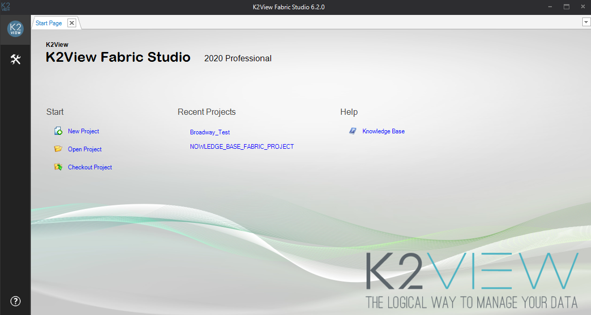
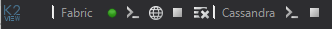
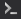
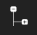
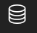
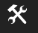
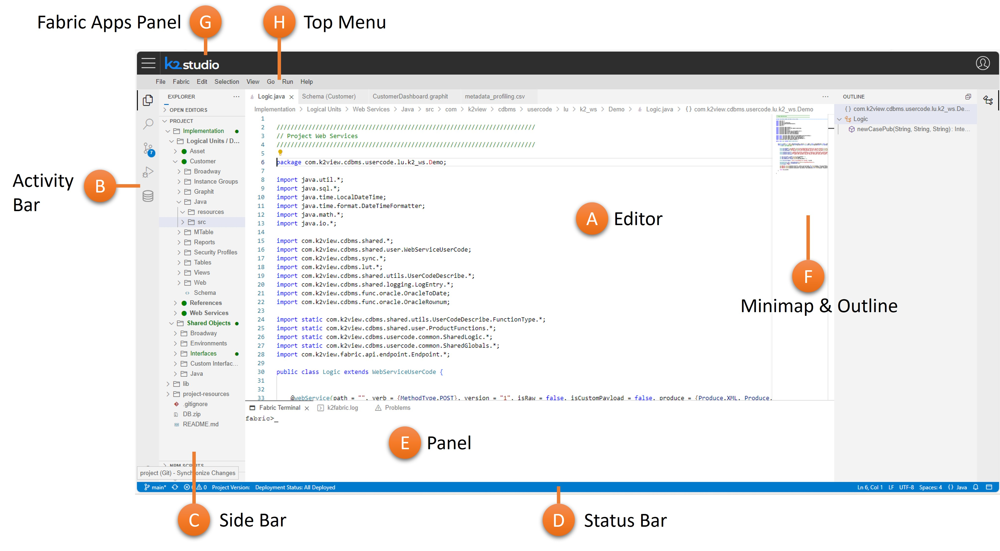

# Fabric Studio User Interface

## What Is the Fabric Studio?
Fabric Studio is a designer tool that manages the construction of [Digital Entities](/articles/01_fabric_overview/02_fabric_glossary.md#digital-entity). As an integrated tool, Fabric allows you to implement mapping rules into a *project* and to deploy your implementation to the *Fabric Server*.

Fabric Studio offers a user friendly look-and-feel development environment known as the *Implementation Layer*. Each project is initiated and maintained through this platform and working space. 

As an integrated tool, the Fabric Studio allows you to:
* Design [Digital Entities](/articles/01_fabric_overview/02_fabric_glossary.md#digital-entity) and their associated [Logical Units (LUs)](/articles/03_logical_units/01_LU_overview.md).
* Use robust ETL (Extract, Transform, Load) options to define the mapping logic for the various tables in the LUs. Transformation objects used can be [Functions](/articles/07_table_population/08_project_functions.md) or [Globals](/articles/08_globals/01_globals_overview.md) <studio>as well as [Translations](/articles/09_translations/01_translations_overview_and_use_cases.md)</studio>.
* Deploy a [Fabric project](/articles/04_fabric_studio/05_creating_a_new_project.md) or selected components of a project to the Fabric runtime environment. 
* [Debug and view](/articles/13_LUDB_viewer_and_studio_debug_capabilities/01_data_viewer.md) mapped data, data flow and data exposure. 

The Fabric Studio also enables you to integrate your projects into source version control systems based on Git <studio>or the Apache Sub-version (SVN) Standard</studio>.

[Click for more information about Best Practices for Working with GIT <studio>and SVN</studio>.](/articles/04_fabric_studio/07_best_practices_for_working_with_GIT_and_SVN.md)

## Get Started

<studio>

### Start Page

Upon opening the desktop Studio, the Start Page will appear. 

The Start Page has links, including: 
* Start a new project, with or without configuration control. 
* Open an existing project.
* Checkout a project from a source versioning control.
* Quick links to recently opened projects. 
* Help and support. 

[Click for more information about Creating a New Project.](/articles/04_fabric_studio/05_creating_a_new_project.md)

Click the K2View icon on the top left corner of the Studio to restore, move, size, minimize, maximize or close the Fabric Studio.

The Start Page can be reopened, even after it is closed, by using the *Tools* actions.

Once a project is opened, the debug panel appears on the upper left of the window, and the activity toolbar appears along the left side of the window.

### Debug Panel

The debug panel enables access to the Fabric debug server, Cassandra debug server, and the Fabric Web Admin. The debug panel is divided into two main areas: Fabric and Cassandra:

<table>
<tbody>
<tr>
<td colspan="2" width="660pxl">

<h4>Fabric

</td>
</tr>    
<tr>
<td width="60pxl" valign="top">

    
</td>
<td width="600pxl" valign="top">

Deploy all updated LUs to Fabric debug server

(appears white before the deploy, green after a successful deploy)

</td>
</tr>
<tr>
<td width="60pxl" valign="top">

    
</td>
<td width="600pxl" valign="top">

Open Fabric console. Opens the console of the debug Fabric server with the appropriate port for each Fabric project.

</td>
</tr>
<tr>
<td width="60pxl" valign="top">

    
</td>
<td width="600pxl" valign="top">

Open the Fabric Web Admin on the localhost.

</td>
</tr>
<tr>
<td width="60pxl" valign="top">

</td>
<td width="600pxl" valign="top">

Start and stop Fabric debug console.

</td>
</tr>
<tr>
<td width="60pxl" valign="top">

    
</td>
<td width="600pxl" valign="top">

Run <a href="/articles/02_fabric_architecture/03_fabric_basics_getting_started.md#reset-fabric">Reset Drop</a> on the Fabric debug server.

</td>
</tr>
<tr>
<td colspan="2" width="660pxl">

<h4>Cassandra

</td>
</tr>    
<tr>    
<tr>
<td width="60pxl" valign="top">

    
</td>
<td width="600pxl" valign="top">

Open Cassandra console for <a href="/articles/02_fabric_architecture/07_cassandra_basic_commands.md#cassandra-useful-commands">cqlsh commands.</a>

</td>
<tr>
<td width="60pxl" valign="top">

</td>
<td width="600pxl" valign="top">

Start and stop Cassandra console.

</td>
</tr>    
</tr>
</tbody>
</table>

### Activity Toolbar ###

<table>
<tbody>
<tr>
 <td width="60pxl" valign="top">

</td>
<td width="600pxl" valign="top">

file

</td>
</tr>
<tr>
<td width="60pxl" valign="top">

</td>
<td width="600pxl" valign="top">

New Item (CTRL+N)

&nbsp;

</td>
</tr>
<tr>
<td width="60pxl" valign="top">

</td>
<td width="600pxl" valign-"top">

Project Tree (CTRL+T)

</td>
</tr>
<tr>
<td width="60pxl" valign="top">

</td>
<td width="600pxl" valign="top">

Query Builder

</td>
</tr>
<tr>
<td width="60pxl" valign="top">

</td>
<td width="600pxl" valign="top">

Tools

</td>
</tr>
<tr>
<td width="60pxl" valign="top">

</td>
<td width="600pxl" valign="top">

Server Activity

</td>
</tr>
<tr>
<td width="60pxl" valign="top">

</td>
<td width="600pxl" valign="top">

Help (link to the support)

</td>
</tr>
</tbody>
</table>

**File Tab**

The File tab has the following options:

* New Project. 
* Open Project. 
* Checkout Project (from <studio>SVN or</studio> Git repository). 
* Close Project. 
* Recent Projects.

#### New Item Tab
Click **New Item** to open a **New Item** under a selected **LU** or **Shared Objects**:
* Select an **LU** from the current **Logical Unit** dropdown list to create the new item under the selected **LU**. For example, a new [Function](/articles/07_table_population/11_3_creating_an_LUDB_function.md), [LU Table,](/articles/06_LU_tables/01_LU_tables_overview.md) [Interface](/articles/05_DB_interfaces/01_interfaces_overview.md) or [Global](/articles/08_globals/01_globals_overview.md).
* To create a new item under [Shared Objects](/articles/04_fabric_studio/12_shared_objects.md), the current Logical Unit dropdown list should be blank.

Note that this area allows you to open a new item only for LU or Shared Objects. 

</studio>

<web>

The Fabric Web Studio has a simple and intuitive layout. Like many other code editors (also called IDE - Integrated Development Environment), it adopts a common user interface and layout,  maximizes the space provided for the editor while leaving ample room to browse and access the full context of your project.

## Basic Layout

 The Fabric Web Studio adopts Visual Studio Code concepts. The UI is divided into several main areas:

* **Editor** (A) - The main area to edit all your project files and entities. You can open as many editors as you like side by side vertically and horizontally.
* **Activity Bar** (B) -  Located on the far left-hand side and lets you switch between views and gives you additional context-specific indicators, like the number of outgoing changes when Git is enabled.
* **Side Bar** (C) - Contains different views like the Explorer to assist you while working on your Fabric project.
* **Status Bar** (D) - Information about the opened project and the files you are editing.
* **Panels** (E) - Enables you to see different panels below the editor region for debug information, compilations errors and warnings, or the integrated Fabric console. Panels can also be moved to the right to allow more vertical space.
* **Minimap** & **Outline** (F) = Code outline, Gives you a high-level overview of your source code, which is useful for quick navigation and code comprehension. A file's minimap is shown on the right side of the editor. You can click or drag the shaded area to quickly jump to different sections of your file. The minimap is shown only for some of the editors (mainly code editors) and when using those editors you can also click on the **Outline** icon at top right, which, when expanded, shows the symbol tree of the currently active editor.

In addition, the layout contains a **top menu** (H) where you either carry out IDE operations or activate certain Fabric commands. The Web Studio works as part of the Fabric Web Platform, where you can navigate to its other apps via the **Fabric Apps Panel** (G).  

>**Tip:** You can reorganize or reorder elements of editors. Drag and drop the editor title area to reposition it. You can do this either from the Editor (A) area or from the  Panel (E) area.

## Activity Bar and Views

The **Activity Bar** lets you quickly switch between views. Once you click on a view, the **Side Bar** is changed accordingly and allows you to make the relevant operations for this view. 

The Web Studio comes with several default views in the Activity Bar, as described below. You can open those as well as other views using the **View: Open View** command. If a selected view does not yet appear in the Activity Bar, it will be added at this point in time. 

The views which appear by default at the Web Studio are as follows:

<table>
<tbody style="vertical-align: text-top; ">
<tr>
    <td width="60px" style="text-align: center; padding-top: 10px;"></td>
    <td style="padding-left: 30px;"><strong>File Explorer</strong></td>
    <td style="width:60%">Used to browse, open, and edit the files in your project.  When selected, the Side Bar shows the project tree, enabling you to open and edit files or make other actions using the context menu. To learn more how to explore files in your project see  <a href="21_web_file_explorer_and_navigation.md">here</a>.</td>
</tr>
<tr >
<td style="text-align: center; padding-top: 10px;"></td>
<td style="padding-left: 30px;"><strong>Search</strong></td>
<td style="width:60%">Provides ש global search and replace across your project files. This tool, which is opened from the Side Bar, lets you make smart searches using various filters. To learn more about using the Search tool within the Web Studio see <a href="22_web_search.md">here</a></td>
</tr>
<tr>
    <td style="text-align: center; padding-top: 10px;"></td>
    <td style="padding-left: 30px;"><strong>Source Control</strong></td>
    <td style="width:60%">Git source View, shows the details of current repository changes and also enables comparing those changes to the origin, as well as making various source control actions.  A badge appears on the Source Control icon at the Activity Bar showing how many changes you currently have in your repository. To learn more about using the Git tool within the Web Studio see <a href="23_web_versioncontrol.md">here</a></td>
</tr>
<tr>
    <td style="text-align: center; padding-top: 10px;"></td>
    <td style="padding-left: 30px;"><strong>Debug</strong></td>
    <td style="width:60%">Run and Debug View displays variables, call stacks, and breakpoints. To learn more how to debug your project see <a href="24_web_debug.md">here</a>.</td>
</tr>
<tr>
    <td style="text-align: center; padding-top: 10px;"></td>
    <td style="padding-left: 30px;"><strong>DB Interface Explorer</strong></td>
    <td style="width:60%">Enables exploring the project's DB interfaces, showing schemas, tables, views, and columns. According to the opened editor's context it lets you to apply actions, like: executing SQL queries at Query Builder, adding DB statements to Fabric functions, adding DB actors to Broadway and adding an SQL section to Graphit. To learn more about using the Git tool within the Web Studio see <a href="25_web_data_explorer.md">here</a></td>
</tr>
<tr>
    <td style="text-align: center; padding-top: 10px;"></td>
    <td style="padding-left: 30px;"><strong>Log Viewer</strong></td>
    <td style="width:60%">Enables you to select and view Fabric logs, in a rich and useful mode. When clicked it allows you to select which log to open (from the Side Bar). To learn more about Log Viewer and how to use it effectively see [here](TBD).</td>
</tr>
</tbody>
</table>

>**Tip:** You can reorder views on the Activity Bar by dragging and dropping them.

  

## Command Palette

The Command Palette is an interactive window that provides access to the Fabric Web Studio functionality, including keyboard shortcuts for many common operations. You can open files, execute editor commands, and launch Fabric dedicated editors such as Create New LU, Create new Broadway flow and many more.

You can reach the command palette from the top menu by selecting **View > Find command** or use ⇧⌘P in Mac or F1 in Windows to bring it up.

To learn more about useful Command Palette commands and shortcuts see [here](20_web_command_keyboard_shortcuts.md).

## Color Themes

As part of Web studio Settings Capabilities, you can modify the colors in the Visual Studio Code's user interface to suit your preferences and work environment.

To select a color theme

1. Open the Color Theme picker with **File** > **Preferences** > **Color Theme**. You can open it also by using  the Preference gear icon  resides at left bottom of the Web Studio. 
2. Use the cursor keys to preview the colors of the theme.
3. Select the theme you want and press Enter.

 

>**Notes:** 
>
>1. Fabric Web Studio is basically a Visual Studio Code-like editor, with slight differences. While you can look and learn from VS Code's vast user guides, keep in mind that they are not the same.
>2. Fabric Web Studio follows the current Fabric Desktop Studio concept in terms of being code editor oriented, file and folder based.
>3. Fabric Web Studio is fully compatible and compliant with the Desktop Studio. You can smoothly switch between them while implementing your project.

</web>

### The Project Tree

The Project Tree displays the components of the current project as a hierarchy of entities. The main elements of the hierarchy include:

* Project, the top-level of the hierarchy. Each project has the following branches (sub-objects): 
  * [Shared Objects](/articles/04_fabric_studio/12_shared_objects.md) used by all Logical Units and project references and may include a sub-hierarchy, as follows:
    * Environments. 
    * Templates
    * Database types. 
    * [Interfaces](/articles/05_DB_interfaces/01_interfaces_overview.md). 
    * Java, [Java files](/articles/04_fabric_studio/09_logic_files_and_categories.md), [Functions](/articles/07_table_population/08_project_functions.md) and [Globals](/articles/08_globals/01_globals_overview.md). 
    * Resource files. 
    * [Translations](/articles/09_translations/01_translations_overview_and_use_cases.md). 
    * [Broadway flows](/articles/19_Broadway/01_broadway_overview.md). 
* References, reference information that may be used throughout the instance. References includes also [common project's tables](/articles/22_reference(commonDB)_tables/01_fabric_commonDB_overview.md).
* [Web Services](/articles/15_web_services_and_graphit/01_web_services_overview.md), a collection of all functions that are defined as Web Services for this project.
* [Logical Units](/articles/03_logical_units/01_LU_overview.md), a collection of all Logical Units defined in the project.

**Note:** All operations performed in the project tree’s options are accessible from the context menus of the different components in the project tree. For example, creating a new function is accessed from the context menu when you right click the Functions object in the project tree.

Click for more information about the [Query Builder.](/articles/11_query_builder/01_query_builder_overview.md#query-builder-overview)

Click for more information [Fabric Studio log file](/articles/13_LUDB_viewer_and_studio_debug_capabilities/02_fabric_studio_log_files.md).

