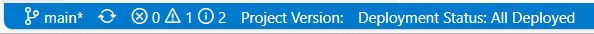

# Get Started with Fabric Studio

## What Is the Fabric Studio?
Fabric Studio is a designer tool that manages the construction of [Data Products](/articles/01_fabric_overview/02_fabric_glossary.md#logical-unit--data-product). As an integrated tool, Fabric allows you to implement mapping rules into a *project* and to deploy your implementation to the *Fabric Server*.

Fabric Studio offers a user-friendly look-and-feel development environment, known as the *Implementation Layer*, providing both code and low-code tools for easing the impetration process. Each project is initiated and maintained via this platform and working space. 

As an integrated tool, Fabric Studio allows you to:
* Design [Data Products / Logical Units (LUs)](/articles/03_logical_units/01_LU_overview.md) 
* Use robust ETL (Extract, Transform, Load) options in order to define the population logic for various tables in the LUs. 
* Define the connectivity to data sources as well as project's APIs to be exposed to your organization apps.
* Deploy a [Fabric project](/articles/04_fabric_studio/05_creating_a_new_project.md) or selected components of a project into the Fabric runtime environment. 
* [Debug and view](/articles/13_LUDB_viewer_and_studio_debug_capabilities/01_data_viewer.md) mapped data, data flow and data exposure. 

<studio>

Additionally, the Fabric Studio enables you to integrate your projects into source version control systems based on either Git or the Apache Subversion (SVN) standard.

[Click for more information about Best Practices for Working with GIT and SVN](07_best_practices_for_working_with_GIT_and_SVN.md). </studio>

<web>

Fabric Studio has a built-in integration with GIT-source version control.

[Click for more information about Best Practices for Working with GIT](23_web_versioncontrol.md).

</web>

<studio>

## Start Page

Upon opening the desktop Studio, the Start Page appears. 

The Start Page has links, including: 
* Start a new project, with or without configuration control. 
* Open an existing project.
* Checkout a project from a source versioning control.
* Quick links to recently opened projects. 
* Help and support. 

[Click for more information about Creating a New Project.](/articles/04_fabric_studio/05_creating_a_new_project.md)

Click the K2view icon in the upper-left corner of the Studio in order to restore, move, change size, minimize, maximize or close the Fabric Studio.

The Start Page can be reopened, even after it was closed, by using the *Tools* actions.

## User Interface Layout

Once a project has opened, the Studio's main user interface layout is shown. It is divided into several main areas:

* **Debug Panel** (A & B) - an action panel for managing actions toward the Fabric debug server.
* **Activity Toolbar** (C) - enables making various actions, as explained below. 
* **Project Tree** (D) - displays different components of the current project by an hierarchical order. Click for more information about the [Project Tree](08_fabric_project_tree.md).
* **Logs Panel** (E) - enables viewing logs, output and debug steps. Click for more information about the [Fabric Studio log file](/articles/13_LUDB_viewer_and_studio_debug_capabilities/02_fabric_studio_log_files.md).
* **Editor** (F) - the main area in which you edit all your project files and entities.

### Debug Panel

The debug panel enables access to the Fabric debug server, Cassandra debug server and to the Fabric Web Admin. The debug panel is divided into 2 main areas - Fabric and Cassandra:

<table>
<tbody>
<tr>
<td colspan="2" width="660pxl">

<h4>Fabric

</td>
</tr>    
<tr>
<td width="60pxl" valign="top">

    
</td>
<td width="600pxl" valign="top">

Deploy all updated LUs into Fabric debug server

(appears white before the deploy, green after a successful deploy)

</td>
</tr>
<tr>
<td width="60pxl" valign="top">

    
</td>
<td width="600pxl" valign="top">

Open Fabric console. Opens the console of the debug Fabric server with the appropriate port for each Fabric project.

</td>
</tr>
<tr>
<td width="60pxl" valign="top">

    
</td>
<td width="600pxl" valign="top">

Open the Fabric Web Admin on the localhost.

</td>
</tr>
<tr>
<td width="60pxl" valign="top">

</td>
<td width="600pxl" valign="top">

Start and stop Fabric debug console.

</td>
</tr>
<tr>
<td width="60pxl" valign="top">

    
</td>
<td width="600pxl" valign="top">

Run <a href="/articles/02_fabric_architecture/03_fabric_basics_getting_started.md#reset-fabric">Reset Drop</a> on the Fabric debug server.

</td>
</tr>
<tr>
<td colspan="2" width="660pxl">

<h4>Cassandra

</td>
</tr>    
<tr>    
<tr>
<td width="60pxl" valign="top">

    
</td>
<td width="600pxl" valign="top">

Open Cassandra console for <a href="/articles/02_fabric_architecture/07_cassandra_basic_commands.md#cassandra-useful-commands">cqlsh commands.</a>

</td>
<tr>
<td width="60pxl" valign="top">

</td>
<td width="600pxl" valign="top">

Start and stop Cassandra console.

</td>
</tr>    
</tr>
</tbody>
</table>

### Activity Toolbar ###

<table>
<tbody>
<tr>
 <td width="60pxl" valign="top">

</td>
<td width="600pxl" valign="top">

File

</td>
</tr>
<tr>
<td width="60pxl" valign="top">

</td>
<td width="600pxl" valign="top">

New Item (CTRL+N)

&nbsp;

</td>
</tr>
<tr>
<td width="60pxl" valign="top">

</td>
<td width="600pxl" valign-"top">

Project Tree (CTRL+T)

</td>
</tr>
<tr>
<td width="60pxl" valign="top">

</td>
<td width="600pxl" valign="top">

<a href="/articles/11_query_builder/01_query_builder_overview.md#query-builder-overview">Query Builder</a>

</td>
</tr>
<tr>
<td width="60pxl" valign="top">

</td>
<td width="600pxl" valign="top">

Tools

</td>
</tr>
<tr>
<td width="60pxl" valign="top">

</td>
<td width="600pxl" valign="top">

Server Activity

</td>
</tr>
<tr>
<td width="60pxl" valign="top">

</td>
<td width="600pxl" valign="top">

Help (link to the support)

</td>
</tr>
</tbody>
</table>

#### **File Menu**

The File menu has the following options:

* New Project 
* Open Project 
* Checkout Project (from <studio>SVN or</studio> Git repository) 
* Close Project 
* Recent Projects

#### **New Item Menu**

Click **New Item** to open a **New Item** under either a selected **LU** or **Shared Objects**:
* Select an **LU** from the current **Logical Unit** drop-down list in order to create the new item under the selected **LU**. Examples for such new items are [Function](/articles/07_table_population/11_3_creating_an_LUDB_function.md), [LU Table,](/articles/06_LU_tables/01_LU_tables_overview.md) [Interface](/articles/05_DB_interfaces/01_interfaces_overview.md) or [Global](/articles/08_globals/01_globals_overview.md).
* In order to create a new item under [Shared Objects](/articles/04_fabric_studio/12_shared_objects.md), the current Logical Unit drop-down list should be empty.

</studio>

<web>

## User Interface Layout

The Fabric Web Studio has a simple and intuitive layout. Like many other code editors (also called IDE - Integrated Development Environment), it has a common user interface and a layout of an explorer on the left, where all files and folders are shown for designing your Fabric project, and an editor on the right, displaying your open files' content.

More specifically, the Fabric Web Studio follows Visual Studio Code layout concepts, where the user interface is divided into several main areas:

* **Editor** (A) - the main area in which you edit all your project files and entities. You may open many editors, alongside each other, vertically and horizontally.
* **Activity Bar** (B) - it is the left-most menu, allowing you to switch between views.
* **Side Bar** (C) - the second sidebar from the left, containing a variety of views - where each provides a different aspect in tailoring your project - such as File Explorer that assists you during the work on your Fabric project. Click for more information about the [Project Tree](08_fabric_project_tree.md).
* **Status Bar** (D) - located at the very bottom of the screen and presents information about the open project and the files you are editing.
* **Panel** (E) - displays different panel modules below the Editor area. Examples for such panel modules are the Fabric Terminal, Fabric Logs Viewer, Problems (comprised of compilation errors and warnings) and Debug Information. These can be dragged to the right side of the screen, allowing for more vertical space. 
* **Minimap** & **Outline** (F) - a code outline, provides a high-level overview of your source code, which is useful for both a quick navigation and the code comprehension. A file's minimap is shown on the right side of the Editor. You can either click on or drag the shaded area in order to quickly jump to different sections of your file. The minimap is shown only for some of the editors (mainly code editors) and when using those editors you can also click on the **Outline** icon at top-right, which, when expanded, shows the symbol tree of the currently active editor.
* **Fabric Apps Panel** (G) - as the Web Studio works as part of the Fabric Web Platform, you can navigate to its other apps by clicking the hamburger icon on this panel.
* **Top Menu** (H) - from the top menu you can either carry out IDE operations or activate certain Fabric commands.

>**Tip:** You can reorganize editors and panels, placing them in locations convenient to you. Drag and drop the various tabs and panel modules in order to reposition them in the desired location on the screen.

 

### Activity Bar and Views

The **Activity Bar** lets you switch quickly between views. Once you click on a view, the **Side Bar** changes accordingly, allowing you to make the relevant operations for this view.

The Web Studio comes with several default views in the Activity Bar, as described below. You can open them, as well as other views, using the **View: Open View** command from the Top Menu. Selecting a view adds it to the Activity Bar.

The views that appear by default on the Web Studio are as follows:

<table>
<tbody style="vertical-align: text-top; ">
<tr>
    <td width="60px" style="text-align: center; padding-top: 10px;"></td>
    <td style="padding-left: 30px;"><strong>File Explorer</strong></td>
    <td style="width:60%">Used for browsing, opening and editing files in your project.  When selected, the Side Bar shows the project tree, enabling you to open and edit files or take other actions using the context menu. To learn more about how to explore files in your project, see  <a href="21_web_file_explorer_and_navigation.md">here</a>.</td>
</tr>
<tr >
<td style="text-align: center; padding-top: 10px;"></td>
<td style="padding-left: 30px;"><strong>Search</strong></td>
<td style="width:60%">Provides a global search and replace across your project files. This tool, which opens from the Side Bar, allows you make smart searches using various filters. To learn more about using the Search tool within the Web Studio see <a href="22_web_search.md">here</a>.</td>
</tr>
<tr>
    <td style="text-align: center; padding-top: 10px;"></td>
    <td style="padding-left: 30px;"><strong>Source Control</strong></td>
    <td style="width:60%">Git source View, shows the details of current repository changes and also enables comparing these changes to the origin, as well as taking various source control actions.  A badge appears on the Source Control icon in the Activity Bar, showing how many changes you currently have in your repository. To learn more about using the Git tool within the Web Studio see <a href="23_web_versioncontrol.md">here</a>.</td>
</tr>
<tr>
    <td style="text-align: center; padding-top: 10px;"></td>
    <td style="padding-left: 30px;"><strong>Debug</strong></td>
    <td style="width:60%">Run and Debug View displays variables, call stacks and breakpoints. To learn more about how to debug your project see <a href="24_web_debug.md">here</a>.</td>
</tr>
<tr>
    <td style="text-align: center; padding-top: 10px;"></td>
    <td style="padding-left: 30px;"><strong>DB Interface Explorer</strong></td>
    <td style="width:60%">Enables exploring the project's DB interfaces, showing schemas, tables, views and columns. According to the open editor's context, it lets you apply actions such as executing SQL queries in Query Builder, adding DB statements to Fabric functions, adding DB Actors to Broadway and adding an SQL section to Graphit. To learn more about using the Git tool within the Web Studio see <a href="25_web_data_explorer.md">here</a>.</td>
</tr></tbody></table>

>**Tip:** You can change the order of views in the Activity Bar by dragging and dropping them.

###   

 

### Fabric Menu 

The Fabric menu, which is part of the Top Menu bar, provides several Fabric and Studio actions:

* **Open Fabric Terminal** - opens the Fabric Terminal in the bottom panel area, where you can run [Fabric Commands](/articles/02_fabric_architecture/04_fabric_commands.md).
* **Watch Fabric Log** - opens the Fabric Log terminal, where you can see the active Fabric log, in a tail mode.
* **Show Fabric Apps**
* **Deploy all Updated Logical Units** - lets you deploy, at once, all data products/logical units that have been changed but not yet redeployed.
* **Version Tag** - activates the [Project Versioning Tagging](/articles/16_deploy_fabric/04_project_versioning.md) process.
* **Create new** Fabric project's entities (some of these actions are also available in the project tree's context menu):
  * New [Data Product (Logical Unit)](/articles/03_logical_units/01_LU_overview.md)
  * New Web Service - lets you create either Graphit or Java based [custom web service](/articles/15_web_services_and_graphit/05_custom_ws.md), to be located in the Web Service logical unit, according to a chosen category.
  * New Java Function - lets you to easily create either a [Fabric function type](/articles/07_table_population/08_project_functions.md), like Event, Decision, Trigger, or LUDB, as well as regular function. When Fabric function is selected then it will be crated with relevant decelerations and format.
  * New [Broadway Flow](/articles/19_Broadway/02a_broadway_flow_overview.md)
  * New [Interface](/articles/05_DB_interfaces/01_interfaces_overview.md)
  * New [Custom DB Interface type](/articles/05_DB_interfaces/10_database_types.md)
* **Export project to Zip File** - Prepare a zip file that contains the whole project entities and files at the Project's tree root folder. 

 

### Status Bar

The status bar provides an Information and status about the opened project and the files you are editing, as well as enables making actions. 

it is divided into few parts (yet - there is no visual separation between them):

* **GIT** - shows the current GIT branch name ("main" in the example), that your space is pointing on. Next to it there is a *Synchronize Changes* action icon that when clicked it pulls remote changes down to your local repository and then pushes local commits to the upstream branch.
* **Problems status** - quick indication of few problems levels in the project's files - error, warnings and info )in the example - 0 errors, 1 warning and 2 info issues). When clicked, the *Problems* panel is opened, showing the problems details. 
* **Project Version** - version is shown if exists. Click [here](/articles/16_deploy_fabric/04_project_versioning.md) for more information about project versions.
* **Deployment status**. If not all LUs are deployed, then when hovering it shows the undeployed LUS. You can then click on it to deploy them

 

### Color Themes

As part of Web Studio Settings Capabilities, you can modify the colors in the Visual Studio Code's user interface to suit your preferences and work environment.

To select a color theme

1. Open the Color Theme picker with **File** > **Preferences** > **Color Theme**. You can open it also by using  the Preference gear icon  located at the bottom left area of Web Studio.  
2. Use the cursor keys to preview the colors of the theme.
3. Select a desired theme and click Enter.

 

>**Studio Desktop .Net Compatibility:** 
>
>1. Fabric Web Studio follows the current Fabric Desktop Studio concept in terms of having a code editor orientation and being a file and folder based.
>2. Fabric Web Studio is fully compatible and compliant with the Desktop Studio. You can smoothly switch between them while implementing your project. Yet, some of the editors are not equals or not exist in each. For example, Translations editor does not exist at Web Studio, while MTables editor does not exists in Desktop studio. Nevertheless, because the same Fabric server is running at backend, all features are supported in runtime, even though an editor is not available.
>3. In general, Web studio is considered the next generation of k2view Studio and thus most of new features and capabilities are available only there.  

</web>

