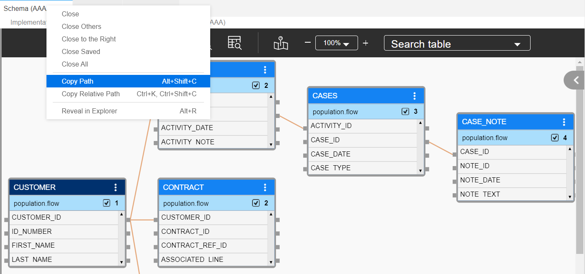

# Window Tab Context Menu

When working in the Fabric Studio, use a Window tab to navigate between multiple project components in the same main window’s working area.

### How Do I Use the Window Tab Menu?
Right click the **Window Tab Header** to display a context menu with the following options:

<studio>

<table width="700pxl">
<tbody>
<tr>
<td width="200pxl">

<strong>Command</strong>

</td>
<td width="500pxl">

<strong>Description</strong>

</td>
</tr>
<tr>
<td width="200pxl">

<strong>Save</strong>

</td>
<td width="300pxl">

Save object.

</td>
</tr>
<tr>
<td width="200pxl">

<strong>Save &amp; Close</strong>

</td>
<td width="300pxl">

Save object and close it.

</td>
</tr>
<tr>
<td width="200pxl">

<strong>Save As</strong>

</td>
<td width="300pxl">

Create a new instance of the object with a different name.

</td>
</tr>
<tr>
<td width="200pxl">

<strong>Object Name to Clipboard</strong>

</td>
<td width="300pxl">

Copy the object name onto your clipboard. For example: Schema Name.

</td>
</tr>
<tr>
<td width="200pxl">

<strong>Full File Path to Clipboard</strong>

</td>
<td width="300pxl">

Copy the object name including its file path onto your clipboard. For example:

C\k2view\k2Projects\Fabric\KNOWLEDGE_BASE\Implementation\
 LogicalUnits\Customer\vdb.k2vdb.xml.

</td>
</tr>
<tr>
<td width="200pxl">

<strong>Close</strong>

</td>
<td width="300pxl">

Close object.

</td>
</tr>
<tr>
<td width="200pxl">

<strong>Close All</strong>

</td>
<td width="300pxl">

Close all open objects.

</td>
</tr>
<tr>
<td width="200pxl">

<strong>Close All But This</strong>

</td>
<td width="300pxl">

Close all open objects except for the one that you are working on.

</td>
</tr>
<tr>
<td width="300pxl">

<strong>New Horizontal Tab Group</strong>

</td>
<td width="300pxl">

Set a horizontal view for your open objects.

</td>
</tr>
<tr>
<td width="200pxl">

<strong>New Vertical Tab Group</strong>

</td>
<td width="300pxl">

Set a vertical view for your open objects.

</td>
</tr>
<tr>
<td width="200pxl">

<strong>Move to Next Tab Group</strong>

</td>
<td width="300pxl">

Move and connect this tab to the next group of tabs on the screen. This option is available once using the <strong>New Vertical Tab Group</strong> command.

</td>
</tr>
<tr>
<td width="200pxl">

<strong>Move to Previous Tab Group</strong>

</td>
<td width="300pxl">

Move and connect this tab to the previous group of tabs on the screen. This option is available once using <strong>New Horizontal Tab Group</strong> command.

</td>
</tr>
<tr>
<td width="200pxl">

<strong>Locate in Project Tree</strong>

</td>
<td width="300pxl">

Select the open object in the Project Tree.

</td>
</tr>
<tr>
<td width="200pxl">

<strong>Open Folder</strong>

</td>
<td width="300pxl">

Open the object&rsquo;s folder.

</td>
</tr>
</tbody>
</table>
</studio>

<web>

<table width="700pxl">
<tbody>
<tr>
<td width="200pxl">

<strong>Command</strong>

</td>
<td width="500pxl">

<strong>Description</strong>

</td>
</tr>
<tr>
<td width="200pxl">

<strong>Close</strong>

</td>
<td width="500pxl">

Close object.

</td>
</tr>
<tr>
<td width="200pxl">

<strong>Close Others</strong>

</td>
<td width="500pxl">

Close all open objects except the current.

</td>
</tr>
<tr>
<td width="200pxl">

<strong>Close to the Right</strong>

</td>
<td width="500pxl">

Close all open objects to the right of the current.

</td>
</tr>
<tr>
<td width="200pxl">

<strong>Close Saved</strong>

</td>
<td width="500pxl">

Close all saved objects.

</td>
</tr>
<tr>
<td width="200pxl">

<strong>Close All</strong>

</td>
<td width="500pxl">

Close all objects.

</td>
</tr>
<tr>
<td width="200pxl">

<strong>Copy Path</strong>

</td>
<td width="500pxl">

Copy full path to the object. For example: /opt/apps/fabric/pod_workspace/project/Implementation/LogicalUnits/Customer/vdb.k2vdb.xml

</td>
</tr>
<tr>
<td width="200pxl">

<strong>Copy Relative Path</strong>

</td>
<td width="500pxl">

Copy relative path to the object. For example: Implementation/LogicalUnits/Customer/vdb.k2vdb.xml 

</td>
</tr>
<tr>
<td width="200pxl">

<strong>Reveal in Explorer</strong>

</td>
<td width="500pxl">

Show the open object in the Project Tree.

</td>
</tr>
<tr>
<td width="200pxl">

<strong>Open Folder</strong>

</td>
<td width="500pxl">

Open the object&rsquo;s folder.

</td>
</tr>
</tbody>
</table>

</web>

