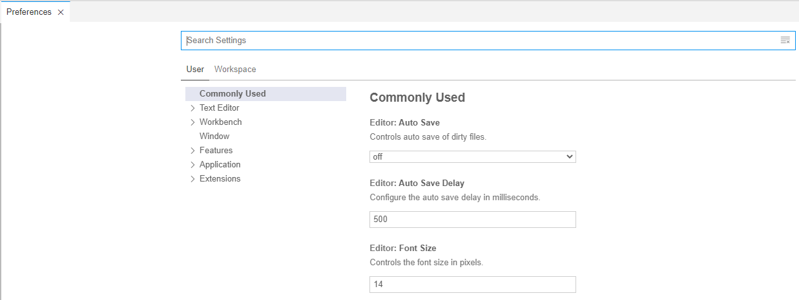
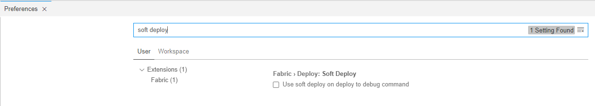
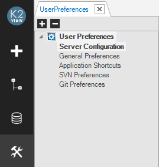
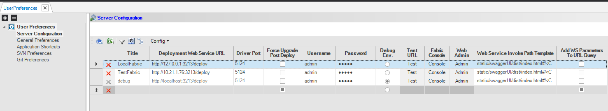
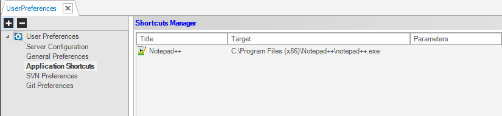

# User Preferences

User Preferences are used to define key operational functionalities for development, debugging, deployment and runtime execution activities.

<web>

To open the User Preference, click the  icon >in the left lower corner of the Web Studio, then click **Open Settings (UI)**. The **Preferences** window opens and it includes various types of settings.

You can use the **Search Settings** bar to search and set the required setting.

For example, to check and update the **Soft Deploy** setting, type "soft deploy" in the field as indicated:

</web>

<studio>

To open the User Preferences options, click the  icon in the Fabric Studio to display the default General Preferences folder and its configuration items.

User Preferences are saved in: [Fabric Studio Installation Dir]\Preferences. 

### What Is the Purpose of the Server Configuration Tab?

The Server Configuration tab is used to define Fabric server deployment URLs. Each Fabric server can be accessed to deploy an implementation, to debug and to validate Web Services. 

The following is a list of server configuration items: 

<table>
<tbody>
<tr>
<td width="200">

<strong>Title</strong>

</td>
<td width="500">

K2View Fabric logical name of the server.

</td>
</tr>
<tr>
<td width="133">

<strong>Deployment Web Service URL</strong>

</td>
<td width="467">

Displays a generic URL for the deployment in the following format: http://&lt;host&gt;:3213/deploy.

Edit the Hostname or Host IP Address in the &lt;host&gt; field to deploy your project or its components such as a <a href="/articles/03_logical_units/01_LU_overview.md">Logical Unit</a> or Web Services to the configured server.

</td>
</tr>
<tr>
<td width="133">

<strong>Driver Port</strong>

</td>
<td width="467">

The JDBC driver port to connect to the Fabric in this environment.

</td>
</tr>
<tr>
<td width="133">

<strong>Force Upgrade Post Deploy</strong>

</td>
<td width="467">

<strong>Checked</strong>: performs a forced <a href="/articles/14_sync_LU_instance/01_sync_LUI_overview.md">sync</a> after deployment whereby the LU is always synchronized regardless of the Sync Method defined for the LU.  Note that when a <a href="/articles/07_table_population/08_project_functions.md#project-function-types">Decision Function</a> is defined for a <a href="/articles/14_sync_LU_instance/04_sync_methods.md">Sync Method</a>, the function takes precedence.

<strong>Unchecked</strong>: performs a sync on schema changes only.

Note that each LU undergoes one forced sync the first time it is retrieved, regardless whether this option is checked / unchecked.

</td>
</tr>
<tr>
<td>

<strong>Soft Deploy</strong>

</td>
<td>

<strong>Checked:</strong> performs the deployment without automatic processes: user jobs, parsers and interface listener.

</td>
</tr>
<tr>
<td width="133">

<strong>Username</strong>

</td>
<td width="467">

Username for database access authentication.

</td>
</tr>
<tr>
<td width="133">

<strong>Password</strong>

</td>
<td width="467">

Password for database access authentication.

</td>
</tr>
<tr>
<td width="133">

<strong>Debug Env</strong>

</td>
<td width="467">

Indicates the debug environment. Only one environment can be marked as debug.

</td>
</tr>
<tr>
<td width="133">

<strong>Test URL</strong>

</td>
<td width="467">

Click to test the connection to the server and to validate the URL.

</td>
</tr>
<tr>
<td width="133">

<strong>Fabric Console</strong>

</td>
<td width="467">

Click to open the Fabric Console using the selected server info: host, JDBC port, user and password.

</td>
</tr>
<tr>
<td width="133">

<strong>Web Admin</strong>

</td>
<td width="467">

Click to open the Web Admin using the selected server info: host and web server port.

</td>
</tr>
<tr>
<td width="133">

<strong>Web Service Invoke Path Template</strong>

</td>
<td width="467">

By default, Web Services are invoked using Swagger. For example: static/swaggerUI/dist/index.html#/&lt;CATEGORY&gt;/&lt;WS_VERB&gt;_&lt;WS_PATH&gt;

</td>
</tr>
<tr>
<td width="133">

<strong>Add WS Parameters to URL Query</strong>

</td>
<td width="467">

When checked, this option enables adding parameters to the Web Service (WS) URL body.

</td>
</tr>
</tbody>
</table>

Note that the Delete button of the special debug environment is disabled to support running a debug on a remote server.

[Click for more information about Deployment from the Fabric Studio](/articles/16_deploy_fabric/02_deploy_from_Fabric_Studio.md).

[Click for more information about the Sync Method.](/articles/14_sync_LU_instance/04_sync_methods.md)

[Click for more information about Invoking a Web Service from the Studio](/articles/15_web_services_and_graphit/09_swagger.md#invoking-and-testing-web-services-using-fabric-studio).

Note that once defined, both General Preferences and Server Configurations continue to apply after the Fabric Studio is upgraded.

### What Is the Purpose of the General Preferences Tab?

The General Preferences tab is used to define the system’s Projects Directory folder which is by default saved in:

C:\users\\[username]\documents\K2View Fabric Studio\Projects.

To update the location of the folder or to edit it, click **Browse**.

### How Do I Add Application Shortcuts?

Application shortcuts enable you to define shortcuts to other applications directly from the Fabric Studio without exiting the application. Once defined, the new shortcut is displayed in the upper left corner of the window.

1. Go to **Application Shortcuts** and click Add **New Shortcut**.  
2. Enter the **Application Name** in the **Title** field.
3. Enter the **Path** to the application file in the **Target Path** field.
4. Enter any **Settings** for the application in the **Parameters** field.
5. Click **OK** and then click **Save** or press **CTRL+S** to save the updated shortcuts. 

### How Do I Configure GIT Preferences?

GIT preferences can be used to enable the following:
* Creating new projects in GIT.
* Checking projects out of GIT: 
  * **Auto Update Gif Status**, automatically refreshes the Git’s status in the Project Tree, for example, to show if a file is modified. By default, this option is checked. If this is not checked, the Project Tree will not fetch the status of each file.
  * **Auto Add Files to Git**, when checked adds the project’s new files to Git which can then be committed. If this is not checked, you can add the files manually using the Git **add** command and then commit them. By default, this option is not set.

Note that TortoiseGit enables adding un-versioned files when performing the Commit process. These files do not need to be added beforehand. 

[Click for more information about SVN and GIT Best Practices.](/articles/04_fabric_studio/07_best_practices_for_working_with_GIT_and_SVN.md)

### How Do I Configure SVN Preferences?
The following SVN preferences can be configured:

<table>
<tbody>
<tr>
<td width="200">

<strong>Auto-update SVN status</strong>

</td>
<td width="500">

Check to display the SVN Status icon for each component in the Project Tree.

</td>
</tr>
<tr>
<td width="236">

<strong>Auto add files to SVN</strong>

</td>
<td width="368">

Check to disable adding files automatically to the SVN in the User Preferences window.

</td>
</tr>
<tr>
<td width="236">

<strong>Auto Check SVN out-of-date files</strong>

</td>
<td width="368">

Fabric Studio checks this option each time an open window is saved or closed. A message is also displayed to indicate that there is a newer revision of the Project in the SVN repository whereby an update is required.

</td>
</tr>
</tbody>
</table>

</studio>

### 

