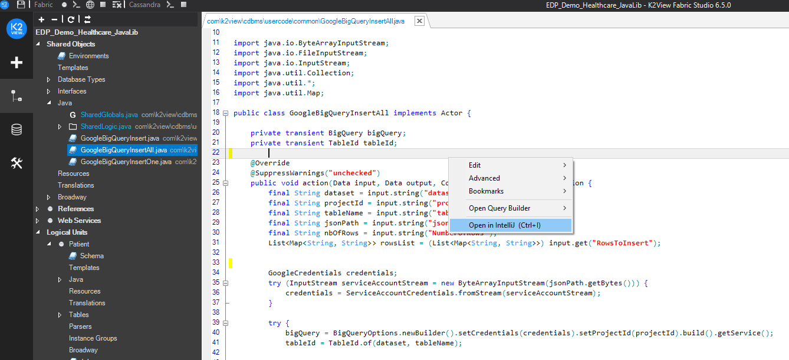

# Fabric Studio - Starting IntelliJ

## Access IntelliJ from Fabric studio
Once installed on your windows environment, IntelliJ can be easily accessed from Fabric Studio.
To do so:
1. Right click on any Java file in your project tree,
2. Select the *Open in IntelliJ* option.

Note that you can also start IntelliJ on any java file by typint ***ctrl I***.

 

IntelliJ will start in the background and open-up on the selected file:

  

As you can see in the picture above, all Fabric-related Java files and resources for your project will be accessible from the left-hand project tree panel.
In cases where both Fabric Studio Java Editor and IntelliJ IDE are opened on your machine, any manual code update in either environment will be instanteneously reflected in the other.

In addition, all the libraries and dependencies featured in your project will also be exposed in the project tree.

