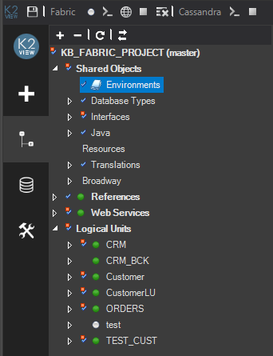

# Fabric Project Tree

A Fabric project has a tree-like structure known as the Project Tree which displays components in a hierarchical order. Each entity in the tree initiates different actions.

The Project Tree is displayed on the left side of the Fabric Studio window.

To initiate an action, right click a component and select the action. For example, to create a new flow right click Broadway in the Project Tree.

<studio>

The name of the currently active project in the Studio is displayed at the top of the project’s tree and the related Git/SVN branch. In the example above the main branch is used.

[Click for more information about Creating a New Project.](05_creating_a_new_project.md) 

### Project Tree Components

Each project has the following main components: 

* [Shared Objects](/articles/04_fabric_studio/12_shared_objects.md) used by all Logical Units and project references and may include the following sub-branches:
  * [Broadway](/articles/19_Broadway/01_broadway_overview.md)

  * [Database types](/articles/05_DB_interfaces/03_DB_interfaces_overview.md), [Interfaces](/articles/05_DB_interfaces/01_interfaces_overview.md) 

  * [Java Functions](/articles/07_table_population/08_project_functions.md), [Globals](/articles/08_globals/01_globals_overview.md) 

  * Resources, files that can be saved as part of a project. 

  * Environments 

  * Templates

  * [Translations](/articles/09_translations/01_translations_overview_and_use_cases.md) 

* **Logical Units**, a collection of all [Logical Units](/articles/03_logical_units/01_LU_overview.md) defined in the project.

* **References**, reference information that can be used throughout the LU instances and may include the following sub-branches:
  * Broadway

  * Java, Functions, Globals, Resources

  * [Tables](/articles/07_table_population/01_table_population_overview.md)

  * Translation

  * IID Finder

* **Web Services**, a collection of functions that can be exposed through Fabric’s Web Service layer which may include the following sub-components:

  * Broadway
  * Java
  * Resource files and Graphit objects.

</studio>

<web>

In addition to the context menu (right click) at the project tree, to initiate an action you can use the **Fabric** item at top menu bar and also via **View > command Pallete...** top menu bar item. 

### Project Tree Components

Each project has the following main components (under Project > Implementation): 

* **Logical Units/Data Products**, a collection of all [Logical Units /Data Products](/articles/03_logical_units/01_LU_overview.md) defined in the project, where two of them are *system* logical units and exist in any project:
  * **References**, reference information that can be used throughout the logical units, such as [reference common tables](/articles/22_reference(commonDB)_tables/01_fabric_commonDB_overview.md).
  * **[Web Services](/articles/15_web_services_and_graphit/01_web_services_overview.md)**, a collection of functions that can be exposed through Fabric’s Web Service layer which may include [Java WS](), [Graphit WS]() and supportive [Broadway](/articles/19_Broadway/01_broadway_overview.md) flows.

* **[Shared Objects](/articles/04_fabric_studio/12_shared_objects.md)** used by all Logical Units and project references and may include the following sub-branches:
  * Broadway
  * [Interfaces](/articles/05_DB_interfaces/01_interfaces_overview.md)
  * [Custom Interface Types](/articles/05_DB_interfaces/03_DB_interfaces_overview.md)
  * [Java Functions](/articles/07_table_population/08_project_functions.md), [Globals](/articles/08_globals/01_globals_overview.md) 
  * Resources, files that can be saved as part of a project. 

* **lib**, Java libraries files which required by this project, such as utility JARs or JDBC drivers which are not provided as part of the product. 

> Note: The *project-resources* folder resides at the project tree is not part of the Fabric project but it is a useful folder you can use at your workspace.

</web>

[Click for more information about UI Components and Menus.](01_UI_components_and_menus.md)

### Project Components Prefix Conventions 

Using a common prefix for each project component improves maintenance throughout a shared implementation.

The following lists the recommended project component prefixes conventions:

<table>
<tbody>
<tr>
<td width="200">

<Strong>Component</Strong>

</td>
<td width="250">

<Strong>Recommended Prefix</Strong>

</td>
</tr>
<tr>
<td width="166">

Function

</td>
<td width="136">

fn%

</td>
</tr>
<tr>
<td width="166">

Input Parameter

</td>
<td width="136">

i_%

</td>
</tr>
<tr>
<td width="166">

Output Parameters

</td>
<td width="136">

o_%

</td>
</tr>
<tr>
<td width="166">

Web Services

</td>
<td width="136">

ws%

</td>
</tr>
<tr>
<td width="166">

Table Population

</td>
<td width="136">

pop%

</td>
</tr>
<tr>
<td width="166">

Instance Group

</td>
<td width="136">

Ig%

</td>
</tr>
</tbody>
</table>

Note that when using the above prefix conventions, it is also recommended to use meaningful names for the project’s components.

<studio>

</studio>

<web>

</web>

